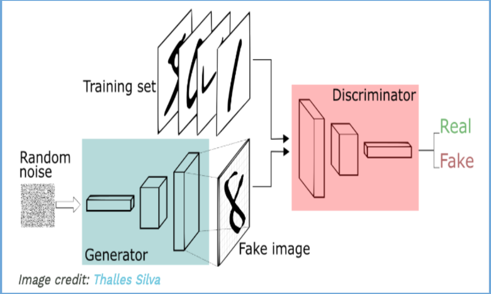
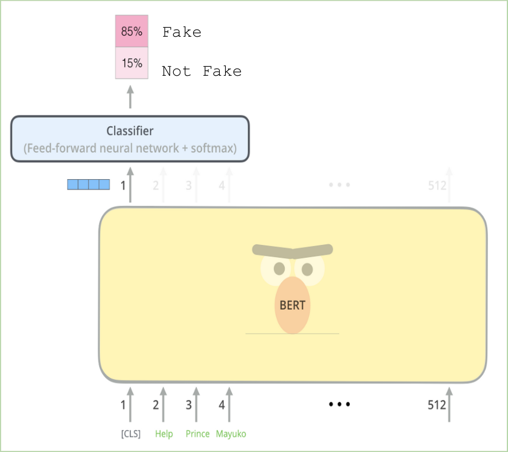
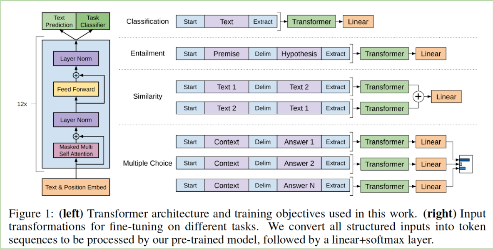
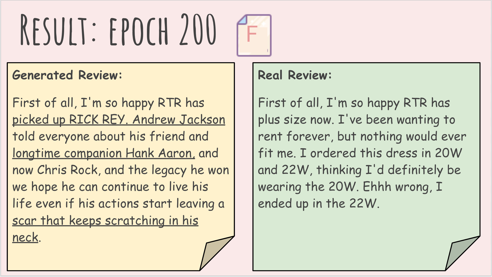
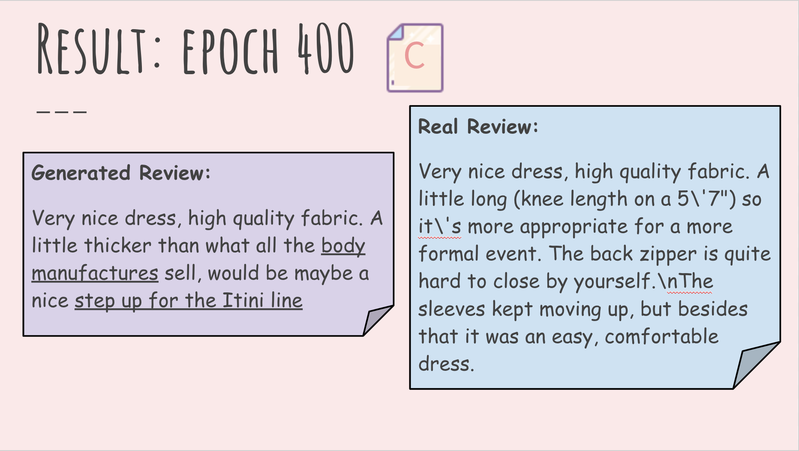

<h1><center>Cognitive Computing Final Project</center></h1>
<h2><center>Automated Word-based Product Review/Testimonial Generation using Google BERT and OpenAI GPT-2</center></h2>
<h4><center>Jinming Li, Tianxin Huang, Qin Shan, Guanhua Zhang</center></h4>
<h4><center>Master of Science in Business Analytics, The University of Texas at Austin</center></h4>

---

<h3>Project Overview:</h3>

Automatically generated fake reviews are a great threat to e-commerce businesses. As the machine learning algorithms become more and more powerful, It is hard for users to detect machines-generated fake reviews.In order to detect the fake reviews, it is important to understand the mechanism of generating fake news. In this project, we would like to explore the mechanism of the existence generate methods. 


**Problem Statement:**

In this project, we are going to explore the state-of-art mechanism of Google BERT & OpenAI GPT-2 and build a testimonial generator to generate stay-on-topic product reviews automatically.


**Data Description:**

We get our customer review data from http://cseweb.ucsd.edu/~jmcauley/datasets.html#google_local, which includes 185147 customer reviews on clothing fit from ModCloth and RentTheRunaway after data cleaning and data integration. The data contained variables such as clothing mega data, clothing size and customer reviews. Here, we only extract the customer review data for building NLP model.

**Business Value:**

Customer reviews are very important. True opinions could help companies to discover the preferences of the customer, the strengths and weaknesses of the product, and to study the market conditions. Additionally, reviews are also the consumption guidances for the customer. Great reviews will bring a significant financial gains to the company. In that case, some companies even hire the spammers to write fake positive reviews for them and write fake negative reviews for their competitors. Since it is expensive for them to hire real people to write fake reviews, they choose the automatic fake review generator to generate fake reviews. Researches show that it’s getting harder for people to detect the fake reviews from real reviews. 

Due to the flooded machines-generated fake reviews, the Internet is no longer the source of reliable information it once was. Thus, bring integrity to the e-commerce business, and detect fake reviews to bring to surface the true product opinion will minimize the loss caused by the fake information. Therefore, the purpose of our model is to not only generate fake product reviews that look like real, but most importantly to understand how these fake reviews are generated, so that we can analyze the mechanism behind the review generation process of some customer-oriented companies. What's more, we not only trained our model to generate fake news but also trained our model to detect fake review effectively and therefore might provide hugh amount of business insights into the business industry.

**Tools:**

   - Pytorch
    
   - GPU (8 x NVIDIA Tesla K80)
    
   - Googld Cloud Platform

**Models (pretrained):**

   - GANs: <b>G</b>enerative <b>A</b>dversarial <b>N</b>etworks
    
   - Google BERT: <b>B</b>idirectional <b>E</b>ncoder <b>R</b>epresentations from <b>T</b>ransformers
    
   - OpenAI GPT-2: <b>G</b>enerative <b>P</b>re-<b>T</b>raining version <b>2</b>

**Tokenizer (pretrained):**

   - Pretrained Google BERT tokenizer (Word Piece Encoding)
    
   - Pretrained OpenAI GPT-2 tokenizer (Byte-Pair-Encoding)


```python
import os
import copy
import random
import torch
from torch import nn
from torch.nn import functional as F
from torch.nn import CrossEntropyLoss
from pytorch_pretrained_bert import BertTokenizer, BertModel, BertAdam, BertForSequenceClassification, GPT2Tokenizer, OpenAIAdam, GPT2LMHeadModel
from datetime import datetime
import numpy as np
import pandas as pd
from pandas import Series, DataFrame
import warnings
from matplotlib import pyplot as plt
%matplotlib inline
warnings.filterwarnings('ignore')

# bert_base_uncased_model = BertForSequenceClassification.from_pretrained('bert-base-uncased', num_labels = 2)
# bert_tokenizer = BertTokenizer.from_pretrained('bert-base-uncased')
# gpt2_tokenizer = GPT2Tokenizer.from_pretrained('gpt2')
# gpt2_model = GPT2LMHeadModel.from_pretrained('gpt2')
```

    Better speed can be achieved with apex installed from https://www.github.com/nvidia/apex.


---

<h3>Part 1: Generative Adversarial Networks (GANs) with Google BERT & OpenAI GPT-2</h3>

<h4>1) Model Introduction:</h4>

- **GANs** (<b>G</b>enerative <b>A</b>dversarial <b>N</b>etworks)

The main model we are going to use is GAN. GAN stands for generative adversarial networks. It comprises of two nets: a generator net and a discriminator net. GAN is genreative because the generator can create fake inputs for the discriminator. It's adversarial becasue the generator and the discriminator are fighting one against the other. You can think of the generator as a spammer. It takes random noise as input and output a fake review. The discriminator acts like a police. It takes both the real reviews from the training set and the fake review outputs from the generator, and learns to classify whether the review is fake or real.



- **BERT** (<b>B</b>idirectional <b>E</b>ncoder <b>R</b>epresentations from <b>T</b>ransformers: <b>BERT</b>)

BERT takes an input with length up to 512. The input starts with a special token [CLS] and ends with [SEP]. BERT then maps the tokens into word embeddings, and pass the embeddings to a transformer encorder. For classification task, a linear classification layer is added on top of the pooled output in BERT base model. This layer takes the first output which is [CLS] token and decides whether this is fake or real review. The BERT pretrained model we are going to use is called BERT-base-uncase model. It has 12 layers, 768 states, 12 heads, and 110M parameters. Here, we only needs to train 201 weights for transfer learning in this case.

You might be thinking why we are choose BERT-base rather than BERT-large. BERT large is a larger and more powerful pretrained model than BERT base as the name suggested. The reason we choose BERT base over BERT large is for fine-tunning purpose. In order to train BERT large, we need a TPU. However, we only have a GPU with a RAM of 16 GB. Therefore, BERT base is a more feasible choice for this project.



- **OpenAI GPT-2** (<b>G</b>enerative <b>P</b>re-<b>T</b>raining version <b>2</b>)

GPT-2 is a state-of-the-art language model designed to improve on the realism and coherence of generated text. It is the largest language model ever, with 1.542 billion parameters. However, Open AI last week made the controversial decision to not release their language model’s code and training dataset due to concerns it might be used for malicious purposes such as generating fake news. The decision challenged the AI community’s open-source philosophy and has divided researchers. Facebook Chief AI Scientist Yann LeCun — who never shies from controversy — mocked the decision in a tweet: “Every new human can potentially be used to generate fake news, disseminate conspiracy theories, and influence people. Should we stop making babies then?”

Github developer Hugging Face has updated its repository with a PyTorch reimplementation of the GPT-2 language model small version that OpenAI open-sourced last week, along with pretrained models and fine-tuning examples. Here, we mainly used the source code from Hugging Face's pytorch_pretrained_bert library and built our generator model with a language head model on top of the base GPT-2 model. We only needs to train 148 weights for transfer learning in this case.



<h4>2) Model Architecture</h4>

**GAN**:

- **Discriminator: Google BERT** base uncased pretrained model (<b>B</b>idirectional <b>E</b>ncoder <b>R</b>epresentations from <b>T</b>ransformers: <b>BERT</b>)

 *Pytorch Reimplementation:* The discriminator we use is Google BERT-base-uncased pretrained model and it has the pytorch reimplementation by huggingface
 
 *Sentence Classification:* The Google pretrained BERT-base-uncase model is added with a linear classification layer on top of the pooled output
 
 *Architecture:* 12-layer, 768-hidden states, 12-heads, 110M parameters, only transfer learning with 201 trainable weights

- **Generator: OpenAI GPT-2** pretrained model (<b>G</b>enerative <b>P</b>re-<b>T</b>raining: <b>GPT-2</b>)

  *Pytorch Reimplementation:* The generator we use is OpenAI pretrained GPT-2 model and it has the pytorch reimplementation by huggingface
  
  *Architecture:* 1.5B parameters of GPT-2 base model and a language head model is added on top of the base model, only tranfer learning with 148 trainable weights


```python
class TextGAN(object):
    def __init__(self, dataframe, bert_pretrained_model = 'bert-base-uncased', gpt_pretrained_model = 'gpt2', num_labels = 2):
        # Read in datafram
        self.dataframe = dataframe
        
        # Setting GPU device where discriminator is trained in GPU0, generator is trained in GPU1
        self.device_default = torch.device('cuda:0')
        
        # Build discriminator and tokenizer from BertForSequenceClassification
        self.bert_tokenizer = BertTokenizer.from_pretrained(bert_pretrained_model)
        self.discriminator = nn.DataParallel(BertForSequenceClassification.from_pretrained(bert_pretrained_model, num_labels = num_labels)).to(self.device_default)
        self.bert_optimizer = BertAdam(self.discriminator.parameters(), lr = 0.00005, warmup = 0.1, t_total = 1000)
        
        # Build the generator, tokenizer, optimizer from OpenAIGPT2
        self.gpt2_tokenizer = GPT2Tokenizer.from_pretrained(gpt_pretrained_model)
        self.generator = GPT2LMHeadModel.from_pretrained(gpt_pretrained_model).to(self.device_default)
        self.gpt2_optimizer = OpenAIAdam(self.generator.parameters(), lr = 0.0001, warmup = 0.1, t_total = 1000)
        
        # Free all GPU memory
        torch.cuda.empty_cache()

    def textGeneration(self, generator_input):
        text_id = generator_input
        input, past = torch.tensor([text_id]).to(self.device_default), None
        for _ in range(random.randint(30, 100)):
            logits, past = self.generator(input, past = past)
            input = torch.multinomial(F.softmax(logits[:, -1]), 1)
            text_id.append(input.item())
        return self.gpt2_tokenizer.decode(text_id)
    
    def dataGenerator(self, batch_size = 16):
        # Randomly fetch traning data bunch
        sample_text_ss = self.dataframe['Review'].iloc[random.sample(range(len(self.dataframe)), batch_size)]
        
        # Tokenize training data bunch with GPT2 tokenizer and take top 10 words
        sample_text_encode_top10 = sample_text_ss.map(lambda x : self.gpt2_tokenizer.encode(x)[:10])
        
        # Generate text using GPT2 generator
        sample_text_generate_ss = sample_text_encode_top10.map(self.textGeneration)
        return sample_text_generate_ss, sample_text_ss
    
    def discriminatorInput(self, text):
        input_token = ['[CLS]'] + self.bert_tokenizer.tokenize(text) + ['[SEP]']
        input_id = self.bert_tokenizer.convert_tokens_to_ids(input_token)
        return [input_id]
    
    def saveGeneratedReview(self):
        content = self.dataframe['Review'].values[random.randint(0, len(self.dataframe))]
        content_id = self.gpt2_tokenizer.encode(content)[:10]
        return self.textGeneration(content_id), content
        
    def train(self, num_epochs = 1000, save_interval = 100):
        start = datetime.now()
        generated_review_list = []
        real_review_list = []
        d_loss_list = []
        g_loss_list = []

        for epoch in range(num_epochs):
            try:
                print('Epoch {}/{}'.format(epoch + 1, num_epochs))
                print('-' * 10)

                # Load in data
                sample_text_generate_ss, sample_text_ss = self.dataGenerator(batch_size = 16)

                # Convert generated text and real text bunch to WorkPiece encode ID as discriminator input
                discriminator_input_ss = pd.concat([sample_text_generate_ss, sample_text_ss], axis = 0, ignore_index = True).map(self.discriminatorInput)
                discriminator_input = torch.LongTensor(np.array(DataFrame(discriminator_input_ss.sum()).fillna(0).astype('int32'))).to(self.device_default)
                discriminator_input_generate = discriminator_input[:len(sample_text_generate_ss)].to(self.device_default)

                # Create labels for training discriminator and generator
                labels = torch.LongTensor([0] * len(sample_text_generate_ss) + [1] * len(sample_text_ss)).to(self.device_default)
                valid = torch.LongTensor([1] * len(sample_text_ss)).to(self.device_default)

                # Each epoch has a train_discriminator and train_generator phase
                for phase in ['train_discriminator', 'train_generator']:
                    if phase == 'train_discriminator':
                        # Set discriminator to training mode
                        self.discriminator.train()

                        # Freeze all trainable parameters
                        for param in self.discriminator.parameters():
                            param.requires_grad = True

                        # Zero the discriminator parameter gradients
                        self.bert_optimizer.zero_grad()

                        # Forward propagation
                        d_loss = self.discriminator(input_ids = discriminator_input, labels = labels).mean()

                        # Backward propagation
                        d_loss.backward()
                        self.bert_optimizer.step()

                    else:
                        # Set discriminator to evaluate mode
                        self.discriminator.eval()

                        # Zero the generator parameter gradients
                        self.gpt2_optimizer.zero_grad()

                        # Forward propagation
                        g_loss = self.discriminator(input_ids = discriminator_input_generate, labels = valid).mean()

                        # Backward propagation
                        g_loss.backward()
                        self.gpt2_optimizer.step()                    

                # Plot the progress
                print('Discriminator Loss:', d_loss)
                print('Generator Loss:', g_loss)
                print()
                d_loss_list.append(d_loss)
                g_loss_list.append(g_loss)

                # If at save interval, then save generated review samples
                if epoch % save_interval == 0:
                    generated_review, real_review = self.saveGeneratedReview()
                    generated_review_list.append(generated_review)
                    real_review_list.append(real_review)
            except RuntimeError:
                pass

        # Counting time elapsed
        time_delta = datetime.now() - start
        print('Training completed time:', time_delta)

        return self.generator, self.discriminator, d_loss_list, g_loss_list, generated_review_list, real_review_list, 
```

---

<h3>Part 2: Traning Process</h3>

- **Training pipeline: Google BERT**
  
  1. Raw input text

  2. Add [CLS] token to the front and [SEP] token to the tail

  3. Pretrained BERT tokenizer to tokenize the text

  4. Convert text to Word Piece ids

  5. Train pretrained BERT sequence classifier (CrossEntropy)

  6. Output Real(1) or Fake(0) Review
  
- **Training pipeline: OpenAI GPT-2**
  
  1. Raw input text

  2. Pretrained GPT-2 tokenizer to tokenize the text

  3. GPT-2 tokenizer encodes text to Byte-Pair-Encoding (BPE)

  4. Generate text using first 10 encoding words

  5. Feed as input to discriminator and compute loss (CrossEntropy)
  
  
- **Training Loss: Google BERT & OpenAI GPT-2**

    During the training process, the training loss of Google BERT decreases significantly to zero during 1000 epochs while the loss of OpenAI GPT-2 increases.
    
    **Reason:** 
    1. Discriminator (BERT) learns very fast while the generator (GPT-2) learns too slow
    
    2. Warm up process for optimizers of both model starts late, should have started earlier
    
    3. We only choose mini batch size = 16, the maximum number a GPU (NVIDIA Tesla K80) can support. As a result, using bathc size = 16 might be too small loop over the entire data
    
    


```python
if __name__ == '__main__':
    amazon_clothingfit_df = pd.read_csv('Amazon_Clothing_Fit_Data_Review.csv', index_col = 0)
    model = TextGAN(bert_pretrained_model = 'bert-base-uncased', gpt_pretrained_model = 'gpt2', num_labels = 2, dataframe = amazon_clothingfit_df)
    OpenAIGPT2_generator, BERT_discriminator, d_loss_list, g_loss_list, generated_review_list, real_review_list = model.train()
```

    Epoch 1/1000
    ----------
    Discriminator Loss: tensor(0.6871, device='cuda:0', grad_fn=<MeanBackward1>)
    Generator Loss: tensor(0.6005, device='cuda:0', grad_fn=<MeanBackward1>)
    
    Epoch 2/1000
    ----------
    Discriminator Loss: tensor(0.7371, device='cuda:0', grad_fn=<MeanBackward1>)
    Generator Loss: tensor(0.6042, device='cuda:0', grad_fn=<MeanBackward1>)
    
    Epoch 3/1000
    ----------
    Discriminator Loss: tensor(0.6707, device='cuda:0', grad_fn=<MeanBackward1>)
    Generator Loss: tensor(0.7075, device='cuda:0', grad_fn=<MeanBackward1>)
    
    Epoch 4/1000
    ----------
    Discriminator Loss: tensor(0.7073, device='cuda:0', grad_fn=<MeanBackward1>)
    Generator Loss: tensor(0.9370, device='cuda:0', grad_fn=<MeanBackward1>)
    
    Epoch 5/1000
    ----------
    Discriminator Loss: tensor(0.6685, device='cuda:0', grad_fn=<MeanBackward1>)
    Generator Loss: tensor(1.0688, device='cuda:0', grad_fn=<MeanBackward1>)
    
    Epoch 6/1000
    ----------
    Discriminator Loss: tensor(0.6976, device='cuda:0', grad_fn=<MeanBackward1>)
    Generator Loss: tensor(0.9109, device='cuda:0', grad_fn=<MeanBackward1>)
    
    Epoch 7/1000
    ----------
    Discriminator Loss: tensor(0.6517, device='cuda:0', grad_fn=<MeanBackward1>)
    Generator Loss: tensor(0.5904, device='cuda:0', grad_fn=<MeanBackward1>)
    
    Epoch 8/1000
    ----------
    Discriminator Loss: tensor(0.6535, device='cuda:0', grad_fn=<MeanBackward1>)
    Generator Loss: tensor(0.5917, device='cuda:0', grad_fn=<MeanBackward1>)
    
    Epoch 9/1000
    ----------
    Discriminator Loss: tensor(0.6197, device='cuda:0', grad_fn=<MeanBackward1>)
    Generator Loss: tensor(0.9492, device='cuda:0', grad_fn=<MeanBackward1>)
    
    Epoch 10/1000
    ----------
    Discriminator Loss: tensor(0.6232, device='cuda:0', grad_fn=<MeanBackward1>)
    Generator Loss: tensor(1.1497, device='cuda:0', grad_fn=<MeanBackward1>)
    
    Epoch 11/1000
    ----------
    Discriminator Loss: tensor(0.6014, device='cuda:0', grad_fn=<MeanBackward1>)
    Generator Loss: tensor(1.1906, device='cuda:0', grad_fn=<MeanBackward1>)
    
    Epoch 12/1000
    ----------
    Discriminator Loss: tensor(0.6741, device='cuda:0', grad_fn=<MeanBackward1>)
    Generator Loss: tensor(1.0625, device='cuda:0', grad_fn=<MeanBackward1>)
    
    Epoch 13/1000
    ----------
    Discriminator Loss: tensor(0.5940, device='cuda:0', grad_fn=<MeanBackward1>)
    Generator Loss: tensor(0.6235, device='cuda:0', grad_fn=<MeanBackward1>)
    
    Epoch 14/1000
    ----------
    Discriminator Loss: tensor(0.7177, device='cuda:0', grad_fn=<MeanBackward1>)
    Generator Loss: tensor(0.5451, device='cuda:0', grad_fn=<MeanBackward1>)
    
    Epoch 15/1000
    ----------
    Discriminator Loss: tensor(0.7875, device='cuda:0', grad_fn=<MeanBackward1>)
    Generator Loss: tensor(0.5369, device='cuda:0', grad_fn=<MeanBackward1>)
    
    Epoch 16/1000
    ----------
    Discriminator Loss: tensor(0.7124, device='cuda:0', grad_fn=<MeanBackward1>)
    Generator Loss: tensor(0.9025, device='cuda:0', grad_fn=<MeanBackward1>)
    
    Epoch 17/1000
    ----------
    Discriminator Loss: tensor(0.6071, device='cuda:0', grad_fn=<MeanBackward1>)
    Generator Loss: tensor(0.9978, device='cuda:0', grad_fn=<MeanBackward1>)
    
    Epoch 18/1000
    ----------
    Discriminator Loss: tensor(0.6310, device='cuda:0', grad_fn=<MeanBackward1>)
    Generator Loss: tensor(0.9937, device='cuda:0', grad_fn=<MeanBackward1>)
    
    Epoch 19/1000
    ----------
    Discriminator Loss: tensor(0.6229, device='cuda:0', grad_fn=<MeanBackward1>)
    Generator Loss: tensor(0.8480, device='cuda:0', grad_fn=<MeanBackward1>)
    
    Epoch 20/1000
    ----------
    Discriminator Loss: tensor(0.5665, device='cuda:0', grad_fn=<MeanBackward1>)
    Generator Loss: tensor(0.6156, device='cuda:0', grad_fn=<MeanBackward1>)
    
    Epoch 21/1000
    ----------
    Discriminator Loss: tensor(0.5878, device='cuda:0', grad_fn=<MeanBackward1>)
    Generator Loss: tensor(0.6775, device='cuda:0', grad_fn=<MeanBackward1>)
    
    Epoch 22/1000
    ----------
    Discriminator Loss: tensor(0.6217, device='cuda:0', grad_fn=<MeanBackward1>)
    Generator Loss: tensor(0.9352, device='cuda:0', grad_fn=<MeanBackward1>)
    
    Epoch 23/1000
    ----------
    Discriminator Loss: tensor(0.4954, device='cuda:0', grad_fn=<MeanBackward1>)
    Generator Loss: tensor(0.9624, device='cuda:0', grad_fn=<MeanBackward1>)
    
    Epoch 24/1000
    ----------
    Discriminator Loss: tensor(0.4918, device='cuda:0', grad_fn=<MeanBackward1>)
    Generator Loss: tensor(1.0033, device='cuda:0', grad_fn=<MeanBackward1>)
    
    Epoch 25/1000
    ----------
    Discriminator Loss: tensor(0.3895, device='cuda:0', grad_fn=<MeanBackward1>)
    Generator Loss: tensor(0.9718, device='cuda:0', grad_fn=<MeanBackward1>)
    
    Epoch 26/1000
    ----------
    Discriminator Loss: tensor(0.4156, device='cuda:0', grad_fn=<MeanBackward1>)
    Generator Loss: tensor(1.5512, device='cuda:0', grad_fn=<MeanBackward1>)
    
    Epoch 27/1000
    ----------
    Discriminator Loss: tensor(0.2858, device='cuda:0', grad_fn=<MeanBackward1>)
    Generator Loss: tensor(2.2216, device='cuda:0', grad_fn=<MeanBackward1>)
    
    Epoch 28/1000
    ----------
    Discriminator Loss: tensor(0.3665, device='cuda:0', grad_fn=<MeanBackward1>)
    Generator Loss: tensor(2.2107, device='cuda:0', grad_fn=<MeanBackward1>)
    
    Epoch 29/1000
    ----------
    Discriminator Loss: tensor(0.4149, device='cuda:0', grad_fn=<MeanBackward1>)
    Generator Loss: tensor(1.7124, device='cuda:0', grad_fn=<MeanBackward1>)
    
    Epoch 30/1000
    ----------
    Discriminator Loss: tensor(0.1438, device='cuda:0', grad_fn=<MeanBackward1>)
    Generator Loss: tensor(1.5083, device='cuda:0', grad_fn=<MeanBackward1>)
    
    Epoch 31/1000
    ----------
    Discriminator Loss: tensor(0.6008, device='cuda:0', grad_fn=<MeanBackward1>)
    Generator Loss: tensor(1.2573, device='cuda:0', grad_fn=<MeanBackward1>)
    
    Epoch 32/1000
    ----------
    Discriminator Loss: tensor(0.4135, device='cuda:0', grad_fn=<MeanBackward1>)
    Generator Loss: tensor(2.4137, device='cuda:0', grad_fn=<MeanBackward1>)
    
    Epoch 33/1000
    ----------
    Discriminator Loss: tensor(0.4638, device='cuda:0', grad_fn=<MeanBackward1>)
    Generator Loss: tensor(2.8095, device='cuda:0', grad_fn=<MeanBackward1>)
    
    Epoch 34/1000
    ----------
    Discriminator Loss: tensor(0.2455, device='cuda:0', grad_fn=<MeanBackward1>)
    Generator Loss: tensor(2.6301, device='cuda:0', grad_fn=<MeanBackward1>)
    
    Epoch 35/1000
    ----------
    Discriminator Loss: tensor(0.0844, device='cuda:0', grad_fn=<MeanBackward1>)
    Generator Loss: tensor(2.1802, device='cuda:0', grad_fn=<MeanBackward1>)
    
    Epoch 36/1000
    ----------
    Discriminator Loss: tensor(0.2962, device='cuda:0', grad_fn=<MeanBackward1>)
    Generator Loss: tensor(3.2772, device='cuda:0', grad_fn=<MeanBackward1>)
    
    Epoch 37/1000
    ----------
    Discriminator Loss: tensor(0.2417, device='cuda:0', grad_fn=<MeanBackward1>)
    Generator Loss: tensor(3.7204, device='cuda:0', grad_fn=<MeanBackward1>)
    
    Epoch 38/1000
    ----------
    Discriminator Loss: tensor(0.3121, device='cuda:0', grad_fn=<MeanBackward1>)
    Generator Loss: tensor(3.8321, device='cuda:0', grad_fn=<MeanBackward1>)
    
    Epoch 39/1000
    ----------
    Discriminator Loss: tensor(0.3962, device='cuda:0', grad_fn=<MeanBackward1>)
    Generator Loss: tensor(3.2776, device='cuda:0', grad_fn=<MeanBackward1>)
    
    Epoch 40/1000
    ----------
    Discriminator Loss: tensor(0.6320, device='cuda:0', grad_fn=<MeanBackward1>)
    Generator Loss: tensor(1.9470, device='cuda:0', grad_fn=<MeanBackward1>)
    
    Epoch 41/1000
    ----------
    Discriminator Loss: tensor(0.1740, device='cuda:0', grad_fn=<MeanBackward1>)
    Generator Loss: tensor(1.5360, device='cuda:0', grad_fn=<MeanBackward1>)
    
    Epoch 42/1000
    ----------
    Discriminator Loss: tensor(0.2111, device='cuda:0', grad_fn=<MeanBackward1>)
    Generator Loss: tensor(2.2193, device='cuda:0', grad_fn=<MeanBackward1>)
    
    Epoch 43/1000
    ----------
    Discriminator Loss: tensor(0.1510, device='cuda:0', grad_fn=<MeanBackward1>)
    Generator Loss: tensor(2.6170, device='cuda:0', grad_fn=<MeanBackward1>)
    
    Epoch 44/1000
    ----------
    Discriminator Loss: tensor(0.1924, device='cuda:0', grad_fn=<MeanBackward1>)
    Generator Loss: tensor(2.8480, device='cuda:0', grad_fn=<MeanBackward1>)
    
    Epoch 45/1000
    ----------
    Discriminator Loss: tensor(0.1496, device='cuda:0', grad_fn=<MeanBackward1>)
    Generator Loss: tensor(2.8818, device='cuda:0', grad_fn=<MeanBackward1>)
    
    Epoch 46/1000
    ----------
    Discriminator Loss: tensor(0.2095, device='cuda:0', grad_fn=<MeanBackward1>)
    Generator Loss: tensor(3.2054, device='cuda:0', grad_fn=<MeanBackward1>)
    
    Epoch 47/1000
    ----------
    Discriminator Loss: tensor(0.2418, device='cuda:0', grad_fn=<MeanBackward1>)
    Generator Loss: tensor(3.1984, device='cuda:0', grad_fn=<MeanBackward1>)
    
    Epoch 48/1000
    ----------
    Discriminator Loss: tensor(0.2681, device='cuda:0', grad_fn=<MeanBackward1>)
    Generator Loss: tensor(3.2808, device='cuda:0', grad_fn=<MeanBackward1>)
    
    Epoch 49/1000
    ----------
    Discriminator Loss: tensor(0.1014, device='cuda:0', grad_fn=<MeanBackward1>)
    Generator Loss: tensor(2.9640, device='cuda:0', grad_fn=<MeanBackward1>)
    
    Epoch 50/1000
    ----------
    Discriminator Loss: tensor(0.0687, device='cuda:0', grad_fn=<MeanBackward1>)
    Generator Loss: tensor(2.9374, device='cuda:0', grad_fn=<MeanBackward1>)
    
    Epoch 51/1000
    ----------
    Discriminator Loss: tensor(0.1170, device='cuda:0', grad_fn=<MeanBackward1>)
    Generator Loss: tensor(3.5230, device='cuda:0', grad_fn=<MeanBackward1>)
    
    Epoch 52/1000
    ----------
    Discriminator Loss: tensor(0.0550, device='cuda:0', grad_fn=<MeanBackward1>)
    Generator Loss: tensor(3.1043, device='cuda:0', grad_fn=<MeanBackward1>)
    
    Epoch 53/1000
    ----------
    Discriminator Loss: tensor(0.0609, device='cuda:0', grad_fn=<MeanBackward1>)
    Generator Loss: tensor(4.0222, device='cuda:0', grad_fn=<MeanBackward1>)
    
    Epoch 54/1000
    ----------
    Discriminator Loss: tensor(0.1631, device='cuda:0', grad_fn=<MeanBackward1>)
    Generator Loss: tensor(3.6853, device='cuda:0', grad_fn=<MeanBackward1>)
    
    Epoch 55/1000
    ----------
    Discriminator Loss: tensor(0.1202, device='cuda:0', grad_fn=<MeanBackward1>)
    Generator Loss: tensor(4.1229, device='cuda:0', grad_fn=<MeanBackward1>)
    
    Epoch 56/1000
    ----------
    Discriminator Loss: tensor(0.0224, device='cuda:0', grad_fn=<MeanBackward1>)
    Generator Loss: tensor(3.8989, device='cuda:0', grad_fn=<MeanBackward1>)
    
    Epoch 57/1000
    ----------
    Discriminator Loss: tensor(0.1143, device='cuda:0', grad_fn=<MeanBackward1>)
    Generator Loss: tensor(2.9324, device='cuda:0', grad_fn=<MeanBackward1>)
    
    Epoch 58/1000
    ----------
    Discriminator Loss: tensor(0.7096, device='cuda:0', grad_fn=<MeanBackward1>)
    Generator Loss: tensor(2.5252, device='cuda:0', grad_fn=<MeanBackward1>)
    
    Epoch 59/1000
    ----------
    Discriminator Loss: tensor(0.4897, device='cuda:0', grad_fn=<MeanBackward1>)
    Generator Loss: tensor(4.0926, device='cuda:0', grad_fn=<MeanBackward1>)
    
    Epoch 60/1000
    ----------
    Discriminator Loss: tensor(0.1186, device='cuda:0', grad_fn=<MeanBackward1>)
    Generator Loss: tensor(4.9491, device='cuda:0', grad_fn=<MeanBackward1>)
    
    Epoch 61/1000
    ----------
    Discriminator Loss: tensor(0.0445, device='cuda:0', grad_fn=<MeanBackward1>)
    Generator Loss: tensor(4.7280, device='cuda:0', grad_fn=<MeanBackward1>)
    
    Epoch 62/1000
    ----------
    Discriminator Loss: tensor(0.2555, device='cuda:0', grad_fn=<MeanBackward1>)
    Generator Loss: tensor(4.4763, device='cuda:0', grad_fn=<MeanBackward1>)
    
    Epoch 63/1000
    ----------
    Discriminator Loss: tensor(0.0733, device='cuda:0', grad_fn=<MeanBackward1>)
    Generator Loss: tensor(4.5307, device='cuda:0', grad_fn=<MeanBackward1>)
    
    Epoch 64/1000
    ----------
    Discriminator Loss: tensor(0.0219, device='cuda:0', grad_fn=<MeanBackward1>)
    Generator Loss: tensor(4.3651, device='cuda:0', grad_fn=<MeanBackward1>)
    
    Epoch 65/1000
    ----------
    Discriminator Loss: tensor(0.0334, device='cuda:0', grad_fn=<MeanBackward1>)
    Generator Loss: tensor(3.6200, device='cuda:0', grad_fn=<MeanBackward1>)
    
    Epoch 66/1000
    ----------
    Discriminator Loss: tensor(0.0355, device='cuda:0', grad_fn=<MeanBackward1>)
    Generator Loss: tensor(2.9355, device='cuda:0', grad_fn=<MeanBackward1>)
    
    Epoch 67/1000
    ----------
    Discriminator Loss: tensor(0.1020, device='cuda:0', grad_fn=<MeanBackward1>)
    Generator Loss: tensor(4.1593, device='cuda:0', grad_fn=<MeanBackward1>)
    
    Epoch 68/1000
    ----------
    Discriminator Loss: tensor(0.1172, device='cuda:0', grad_fn=<MeanBackward1>)
    Generator Loss: tensor(4.2500, device='cuda:0', grad_fn=<MeanBackward1>)
    
    Epoch 69/1000
    ----------
    Discriminator Loss: tensor(0.1339, device='cuda:0', grad_fn=<MeanBackward1>)
    Generator Loss: tensor(4.8691, device='cuda:0', grad_fn=<MeanBackward1>)
    
    Epoch 70/1000
    ----------
    Discriminator Loss: tensor(0.2257, device='cuda:0', grad_fn=<MeanBackward1>)
    Generator Loss: tensor(4.8247, device='cuda:0', grad_fn=<MeanBackward1>)
    
    Epoch 71/1000
    ----------
    Discriminator Loss: tensor(0.2641, device='cuda:0', grad_fn=<MeanBackward1>)
    Generator Loss: tensor(3.3134, device='cuda:0', grad_fn=<MeanBackward1>)
    
    Epoch 72/1000
    ----------
    Discriminator Loss: tensor(0.1132, device='cuda:0', grad_fn=<MeanBackward1>)
    Generator Loss: tensor(2.9810, device='cuda:0', grad_fn=<MeanBackward1>)
    
    Epoch 73/1000
    ----------
    Discriminator Loss: tensor(0.1504, device='cuda:0', grad_fn=<MeanBackward1>)
    Generator Loss: tensor(3.0896, device='cuda:0', grad_fn=<MeanBackward1>)
    
    Epoch 74/1000
    ----------
    Discriminator Loss: tensor(0.2129, device='cuda:0', grad_fn=<MeanBackward1>)
    Generator Loss: tensor(3.3541, device='cuda:0', grad_fn=<MeanBackward1>)
    
    Epoch 75/1000
    ----------
    Discriminator Loss: tensor(0.0542, device='cuda:0', grad_fn=<MeanBackward1>)
    Generator Loss: tensor(4.4059, device='cuda:0', grad_fn=<MeanBackward1>)
    
    Epoch 76/1000
    ----------
    Discriminator Loss: tensor(0.0153, device='cuda:0', grad_fn=<MeanBackward1>)
    Generator Loss: tensor(4.9267, device='cuda:0', grad_fn=<MeanBackward1>)
    
    Epoch 77/1000
    ----------
    Discriminator Loss: tensor(0.2124, device='cuda:0', grad_fn=<MeanBackward1>)
    Generator Loss: tensor(4.6039, device='cuda:0', grad_fn=<MeanBackward1>)
    
    Epoch 78/1000
    ----------
    Discriminator Loss: tensor(0.1819, device='cuda:0', grad_fn=<MeanBackward1>)
    Generator Loss: tensor(4.1680, device='cuda:0', grad_fn=<MeanBackward1>)
    
    Epoch 79/1000
    ----------
    Discriminator Loss: tensor(0.0619, device='cuda:0', grad_fn=<MeanBackward1>)
    Generator Loss: tensor(4.6881, device='cuda:0', grad_fn=<MeanBackward1>)
    
    Epoch 80/1000
    ----------
    Discriminator Loss: tensor(0.2085, device='cuda:0', grad_fn=<MeanBackward1>)
    Generator Loss: tensor(3.9977, device='cuda:0', grad_fn=<MeanBackward1>)
    
    Epoch 81/1000
    ----------
    Discriminator Loss: tensor(0.0164, device='cuda:0', grad_fn=<MeanBackward1>)
    Generator Loss: tensor(4.8613, device='cuda:0', grad_fn=<MeanBackward1>)
    
    Epoch 82/1000
    ----------
    Discriminator Loss: tensor(0.0744, device='cuda:0', grad_fn=<MeanBackward1>)
    Generator Loss: tensor(4.2668, device='cuda:0', grad_fn=<MeanBackward1>)
    
    Epoch 83/1000
    ----------
    Discriminator Loss: tensor(0.0159, device='cuda:0', grad_fn=<MeanBackward1>)
    Generator Loss: tensor(4.6861, device='cuda:0', grad_fn=<MeanBackward1>)
    
    Epoch 84/1000
    ----------
    Discriminator Loss: tensor(0.0249, device='cuda:0', grad_fn=<MeanBackward1>)
    Generator Loss: tensor(4.5528, device='cuda:0', grad_fn=<MeanBackward1>)
    
    Epoch 85/1000
    ----------
    Discriminator Loss: tensor(0.0545, device='cuda:0', grad_fn=<MeanBackward1>)
    Generator Loss: tensor(4.2116, device='cuda:0', grad_fn=<MeanBackward1>)
    
    Epoch 86/1000
    ----------
    Discriminator Loss: tensor(0.0569, device='cuda:0', grad_fn=<MeanBackward1>)
    Generator Loss: tensor(4.4473, device='cuda:0', grad_fn=<MeanBackward1>)
    
    Epoch 87/1000
    ----------
    Discriminator Loss: tensor(0.0221, device='cuda:0', grad_fn=<MeanBackward1>)
    Generator Loss: tensor(4.7356, device='cuda:0', grad_fn=<MeanBackward1>)
    
    Epoch 88/1000
    ----------
    Discriminator Loss: tensor(0.1142, device='cuda:0', grad_fn=<MeanBackward1>)
    Generator Loss: tensor(5.1136, device='cuda:0', grad_fn=<MeanBackward1>)
    
    Epoch 89/1000
    ----------
    Discriminator Loss: tensor(0.1826, device='cuda:0', grad_fn=<MeanBackward1>)
    Generator Loss: tensor(4.6972, device='cuda:0', grad_fn=<MeanBackward1>)
    
    Epoch 90/1000
    ----------
    Discriminator Loss: tensor(0.0349, device='cuda:0', grad_fn=<MeanBackward1>)
    Generator Loss: tensor(4.9916, device='cuda:0', grad_fn=<MeanBackward1>)
    
    Epoch 91/1000
    ----------
    Discriminator Loss: tensor(0.0486, device='cuda:0', grad_fn=<MeanBackward1>)
    Generator Loss: tensor(4.6960, device='cuda:0', grad_fn=<MeanBackward1>)
    
    Epoch 92/1000
    ----------
    Discriminator Loss: tensor(0.0172, device='cuda:0', grad_fn=<MeanBackward1>)
    Generator Loss: tensor(4.4305, device='cuda:0', grad_fn=<MeanBackward1>)
    
    Epoch 93/1000
    ----------
    Discriminator Loss: tensor(0.0157, device='cuda:0', grad_fn=<MeanBackward1>)
    Generator Loss: tensor(4.7036, device='cuda:0', grad_fn=<MeanBackward1>)
    
    Epoch 94/1000
    ----------
    Discriminator Loss: tensor(0.1733, device='cuda:0', grad_fn=<MeanBackward1>)
    Generator Loss: tensor(4.2032, device='cuda:0', grad_fn=<MeanBackward1>)
    
    Epoch 95/1000
    ----------
    Discriminator Loss: tensor(0.2298, device='cuda:0', grad_fn=<MeanBackward1>)
    Generator Loss: tensor(3.8219, device='cuda:0', grad_fn=<MeanBackward1>)
    
    Epoch 96/1000
    ----------
    Discriminator Loss: tensor(0.0246, device='cuda:0', grad_fn=<MeanBackward1>)
    Generator Loss: tensor(3.2304, device='cuda:0', grad_fn=<MeanBackward1>)
    
    Epoch 97/1000
    ----------
    Discriminator Loss: tensor(0.0463, device='cuda:0', grad_fn=<MeanBackward1>)
    Generator Loss: tensor(3.2239, device='cuda:0', grad_fn=<MeanBackward1>)
    
    Epoch 98/1000
    ----------
    Discriminator Loss: tensor(0.0493, device='cuda:0', grad_fn=<MeanBackward1>)
    Generator Loss: tensor(3.4007, device='cuda:0', grad_fn=<MeanBackward1>)
    
    Epoch 99/1000
    ----------
    Discriminator Loss: tensor(0.1633, device='cuda:0', grad_fn=<MeanBackward1>)
    Generator Loss: tensor(3.9291, device='cuda:0', grad_fn=<MeanBackward1>)
    
    Epoch 100/1000
    ----------
    Discriminator Loss: tensor(0.0178, device='cuda:0', grad_fn=<MeanBackward1>)
    Generator Loss: tensor(4.4386, device='cuda:0', grad_fn=<MeanBackward1>)
    
    Epoch 101/1000
    ----------
    Discriminator Loss: tensor(0.0212, device='cuda:0', grad_fn=<MeanBackward1>)
    Generator Loss: tensor(4.9542, device='cuda:0', grad_fn=<MeanBackward1>)
    
    Epoch 102/1000
    ----------
    Discriminator Loss: tensor(0.0154, device='cuda:0', grad_fn=<MeanBackward1>)
    Generator Loss: tensor(5.3398, device='cuda:0', grad_fn=<MeanBackward1>)
    
    Epoch 103/1000
    ----------
    Discriminator Loss: tensor(0.0529, device='cuda:0', grad_fn=<MeanBackward1>)
    Generator Loss: tensor(5.5539, device='cuda:0', grad_fn=<MeanBackward1>)
    
    Epoch 104/1000
    ----------
    Discriminator Loss: tensor(0.0291, device='cuda:0', grad_fn=<MeanBackward1>)
    Generator Loss: tensor(4.0965, device='cuda:0', grad_fn=<MeanBackward1>)
    
    Epoch 105/1000
    ----------
    Discriminator Loss: tensor(0.1401, device='cuda:0', grad_fn=<MeanBackward1>)
    Generator Loss: tensor(4.9054, device='cuda:0', grad_fn=<MeanBackward1>)
    
    Epoch 106/1000
    ----------
    Discriminator Loss: tensor(0.0686, device='cuda:0', grad_fn=<MeanBackward1>)
    Generator Loss: tensor(5.4076, device='cuda:0', grad_fn=<MeanBackward1>)
    
    Epoch 107/1000
    ----------
    Discriminator Loss: tensor(0.0048, device='cuda:0', grad_fn=<MeanBackward1>)
    Generator Loss: tensor(6.1744, device='cuda:0', grad_fn=<MeanBackward1>)
    
    Epoch 108/1000
    ----------
    Discriminator Loss: tensor(0.0251, device='cuda:0', grad_fn=<MeanBackward1>)
    Generator Loss: tensor(6.2074, device='cuda:0', grad_fn=<MeanBackward1>)
    
    Epoch 109/1000
    ----------
    Discriminator Loss: tensor(0.0402, device='cuda:0', grad_fn=<MeanBackward1>)
    Generator Loss: tensor(5.6638, device='cuda:0', grad_fn=<MeanBackward1>)
    
    Epoch 110/1000
    ----------
    Discriminator Loss: tensor(0.0753, device='cuda:0', grad_fn=<MeanBackward1>)
    Generator Loss: tensor(5.6281, device='cuda:0', grad_fn=<MeanBackward1>)
    
    Epoch 111/1000
    ----------
    Discriminator Loss: tensor(0.0034, device='cuda:0', grad_fn=<MeanBackward1>)
    Generator Loss: tensor(5.0275, device='cuda:0', grad_fn=<MeanBackward1>)
    
    Epoch 112/1000
    ----------
    Discriminator Loss: tensor(0.2151, device='cuda:0', grad_fn=<MeanBackward1>)
    Generator Loss: tensor(5.4622, device='cuda:0', grad_fn=<MeanBackward1>)
    
    Epoch 113/1000
    ----------
    Discriminator Loss: tensor(0.0069, device='cuda:0', grad_fn=<MeanBackward1>)
    Generator Loss: tensor(5.9682, device='cuda:0', grad_fn=<MeanBackward1>)
    
    Epoch 114/1000
    ----------
    Discriminator Loss: tensor(0.0733, device='cuda:0', grad_fn=<MeanBackward1>)
    Generator Loss: tensor(6.2514, device='cuda:0', grad_fn=<MeanBackward1>)
    
    Epoch 115/1000
    ----------
    Discriminator Loss: tensor(0.0109, device='cuda:0', grad_fn=<MeanBackward1>)
    Generator Loss: tensor(5.7162, device='cuda:0', grad_fn=<MeanBackward1>)
    
    Epoch 116/1000
    ----------
    Discriminator Loss: tensor(0.0058, device='cuda:0', grad_fn=<MeanBackward1>)
    Generator Loss: tensor(5.4621, device='cuda:0', grad_fn=<MeanBackward1>)
    
    Epoch 117/1000
    ----------
    Discriminator Loss: tensor(0.0151, device='cuda:0', grad_fn=<MeanBackward1>)
    Generator Loss: tensor(5.7308, device='cuda:0', grad_fn=<MeanBackward1>)
    
    Epoch 118/1000
    ----------
    Discriminator Loss: tensor(0.0025, device='cuda:0', grad_fn=<MeanBackward1>)
    Generator Loss: tensor(5.9600, device='cuda:0', grad_fn=<MeanBackward1>)
    
    Epoch 119/1000
    ----------
    Discriminator Loss: tensor(0.0559, device='cuda:0', grad_fn=<MeanBackward1>)
    Generator Loss: tensor(5.9257, device='cuda:0', grad_fn=<MeanBackward1>)
    
    Epoch 120/1000
    ----------
    Discriminator Loss: tensor(0.0028, device='cuda:0', grad_fn=<MeanBackward1>)
    Generator Loss: tensor(6.4560, device='cuda:0', grad_fn=<MeanBackward1>)
    
    Epoch 121/1000
    ----------
    Discriminator Loss: tensor(0.0188, device='cuda:0', grad_fn=<MeanBackward1>)
    Generator Loss: tensor(6.0796, device='cuda:0', grad_fn=<MeanBackward1>)
    
    Epoch 122/1000
    ----------
    Discriminator Loss: tensor(0.0778, device='cuda:0', grad_fn=<MeanBackward1>)
    Generator Loss: tensor(6.1392, device='cuda:0', grad_fn=<MeanBackward1>)
    
    Epoch 123/1000
    ----------
    Discriminator Loss: tensor(0.0466, device='cuda:0', grad_fn=<MeanBackward1>)
    Generator Loss: tensor(5.9884, device='cuda:0', grad_fn=<MeanBackward1>)
    
    Epoch 124/1000
    ----------
    Discriminator Loss: tensor(0.0366, device='cuda:0', grad_fn=<MeanBackward1>)
    Generator Loss: tensor(5.9226, device='cuda:0', grad_fn=<MeanBackward1>)
    
    Epoch 125/1000
    ----------
    Discriminator Loss: tensor(0.1464, device='cuda:0', grad_fn=<MeanBackward1>)
    Generator Loss: tensor(5.8411, device='cuda:0', grad_fn=<MeanBackward1>)
    
    Epoch 126/1000
    ----------
    Discriminator Loss: tensor(0.1089, device='cuda:0', grad_fn=<MeanBackward1>)
    Generator Loss: tensor(5.3553, device='cuda:0', grad_fn=<MeanBackward1>)
    
    Epoch 127/1000
    ----------
    Discriminator Loss: tensor(0.0162, device='cuda:0', grad_fn=<MeanBackward1>)
    Generator Loss: tensor(5.7457, device='cuda:0', grad_fn=<MeanBackward1>)
    
    Epoch 128/1000
    ----------
    Discriminator Loss: tensor(0.0642, device='cuda:0', grad_fn=<MeanBackward1>)
    Generator Loss: tensor(4.6269, device='cuda:0', grad_fn=<MeanBackward1>)
    
    Epoch 129/1000
    ----------
    Discriminator Loss: tensor(0.1211, device='cuda:0', grad_fn=<MeanBackward1>)
    Generator Loss: tensor(5.8121, device='cuda:0', grad_fn=<MeanBackward1>)
    
    Epoch 130/1000
    ----------
    Discriminator Loss: tensor(0.0666, device='cuda:0', grad_fn=<MeanBackward1>)
    Generator Loss: tensor(6.1684, device='cuda:0', grad_fn=<MeanBackward1>)
    
    Epoch 131/1000
    ----------
    Discriminator Loss: tensor(0.0050, device='cuda:0', grad_fn=<MeanBackward1>)
    Generator Loss: tensor(6.5941, device='cuda:0', grad_fn=<MeanBackward1>)
    
    Epoch 132/1000
    ----------
    Discriminator Loss: tensor(0.0349, device='cuda:0', grad_fn=<MeanBackward1>)
    Generator Loss: tensor(6.3798, device='cuda:0', grad_fn=<MeanBackward1>)
    
    Epoch 133/1000
    ----------
    Discriminator Loss: tensor(0.0920, device='cuda:0', grad_fn=<MeanBackward1>)
    Generator Loss: tensor(6.8134, device='cuda:0', grad_fn=<MeanBackward1>)
    
    Epoch 134/1000
    ----------
    Discriminator Loss: tensor(0.1715, device='cuda:0', grad_fn=<MeanBackward1>)
    Generator Loss: tensor(5.4819, device='cuda:0', grad_fn=<MeanBackward1>)
    
    Epoch 135/1000
    ----------
    Discriminator Loss: tensor(0.3334, device='cuda:0', grad_fn=<MeanBackward1>)
    Generator Loss: tensor(5.4264, device='cuda:0', grad_fn=<MeanBackward1>)
    
    Epoch 136/1000
    ----------
    Discriminator Loss: tensor(0.0356, device='cuda:0', grad_fn=<MeanBackward1>)
    Generator Loss: tensor(5.9403, device='cuda:0', grad_fn=<MeanBackward1>)
    
    Epoch 137/1000
    ----------
    Discriminator Loss: tensor(0.1139, device='cuda:0', grad_fn=<MeanBackward1>)
    Generator Loss: tensor(5.9544, device='cuda:0', grad_fn=<MeanBackward1>)
    
    Epoch 138/1000
    ----------
    Discriminator Loss: tensor(0.0059, device='cuda:0', grad_fn=<MeanBackward1>)
    Generator Loss: tensor(6.4248, device='cuda:0', grad_fn=<MeanBackward1>)
    
    Epoch 139/1000
    ----------
    Discriminator Loss: tensor(0.0595, device='cuda:0', grad_fn=<MeanBackward1>)
    Generator Loss: tensor(6.2196, device='cuda:0', grad_fn=<MeanBackward1>)
    
    Epoch 140/1000
    ----------
    Discriminator Loss: tensor(0.0240, device='cuda:0', grad_fn=<MeanBackward1>)
    Generator Loss: tensor(5.3502, device='cuda:0', grad_fn=<MeanBackward1>)
    
    Epoch 141/1000
    ----------
    Discriminator Loss: tensor(0.0157, device='cuda:0', grad_fn=<MeanBackward1>)
    Generator Loss: tensor(5.5268, device='cuda:0', grad_fn=<MeanBackward1>)
    
    Epoch 142/1000
    ----------
    Discriminator Loss: tensor(0.2211, device='cuda:0', grad_fn=<MeanBackward1>)
    Generator Loss: tensor(5.1709, device='cuda:0', grad_fn=<MeanBackward1>)
    
    Epoch 143/1000
    ----------
    Discriminator Loss: tensor(0.0498, device='cuda:0', grad_fn=<MeanBackward1>)
    Generator Loss: tensor(3.5571, device='cuda:0', grad_fn=<MeanBackward1>)
    
    Epoch 144/1000
    ----------
    Discriminator Loss: tensor(0.0160, device='cuda:0', grad_fn=<MeanBackward1>)
    Generator Loss: tensor(2.8898, device='cuda:0', grad_fn=<MeanBackward1>)
    
    Epoch 145/1000
    ----------
    Discriminator Loss: tensor(0.4177, device='cuda:0', grad_fn=<MeanBackward1>)
    Generator Loss: tensor(2.9441, device='cuda:0', grad_fn=<MeanBackward1>)
    
    Epoch 146/1000
    ----------
    Discriminator Loss: tensor(0.0374, device='cuda:0', grad_fn=<MeanBackward1>)
    Generator Loss: tensor(4.8898, device='cuda:0', grad_fn=<MeanBackward1>)
    
    Epoch 147/1000
    ----------
    Discriminator Loss: tensor(0.0791, device='cuda:0', grad_fn=<MeanBackward1>)
    Generator Loss: tensor(5.1220, device='cuda:0', grad_fn=<MeanBackward1>)
    
    Epoch 148/1000
    ----------
    Discriminator Loss: tensor(0.0077, device='cuda:0', grad_fn=<MeanBackward1>)
    Generator Loss: tensor(5.9272, device='cuda:0', grad_fn=<MeanBackward1>)
    
    Epoch 149/1000
    ----------
    Discriminator Loss: tensor(0.1925, device='cuda:0', grad_fn=<MeanBackward1>)
    Generator Loss: tensor(5.4884, device='cuda:0', grad_fn=<MeanBackward1>)
    
    Epoch 150/1000
    ----------
    Discriminator Loss: tensor(0.0056, device='cuda:0', grad_fn=<MeanBackward1>)
    Generator Loss: tensor(6.1970, device='cuda:0', grad_fn=<MeanBackward1>)
    
    Epoch 151/1000
    ----------
    Discriminator Loss: tensor(0.0874, device='cuda:0', grad_fn=<MeanBackward1>)
    Generator Loss: tensor(5.3512, device='cuda:0', grad_fn=<MeanBackward1>)
    
    Epoch 152/1000
    ----------
    Discriminator Loss: tensor(0.1075, device='cuda:0', grad_fn=<MeanBackward1>)
    Generator Loss: tensor(4.6478, device='cuda:0', grad_fn=<MeanBackward1>)
    
    Epoch 153/1000
    ----------
    Discriminator Loss: tensor(0.0139, device='cuda:0', grad_fn=<MeanBackward1>)
    Generator Loss: tensor(5.1995, device='cuda:0', grad_fn=<MeanBackward1>)
    
    Epoch 154/1000
    ----------
    Discriminator Loss: tensor(0.0081, device='cuda:0', grad_fn=<MeanBackward1>)
    Generator Loss: tensor(5.4018, device='cuda:0', grad_fn=<MeanBackward1>)
    
    Epoch 155/1000
    ----------
    Discriminator Loss: tensor(0.0065, device='cuda:0', grad_fn=<MeanBackward1>)
    Generator Loss: tensor(5.9215, device='cuda:0', grad_fn=<MeanBackward1>)
    
    Epoch 156/1000
    ----------
    Discriminator Loss: tensor(0.0096, device='cuda:0', grad_fn=<MeanBackward1>)
    Generator Loss: tensor(6.0222, device='cuda:0', grad_fn=<MeanBackward1>)
    
    Epoch 157/1000
    ----------
    Discriminator Loss: tensor(0.0249, device='cuda:0', grad_fn=<MeanBackward1>)
    Generator Loss: tensor(6.0845, device='cuda:0', grad_fn=<MeanBackward1>)
    
    Epoch 158/1000
    ----------
    Discriminator Loss: tensor(0.0083, device='cuda:0', grad_fn=<MeanBackward1>)
    Generator Loss: tensor(5.8169, device='cuda:0', grad_fn=<MeanBackward1>)
    
    Epoch 159/1000
    ----------
    Discriminator Loss: tensor(0.0620, device='cuda:0', grad_fn=<MeanBackward1>)
    Generator Loss: tensor(5.6047, device='cuda:0', grad_fn=<MeanBackward1>)
    
    Epoch 160/1000
    ----------
    Discriminator Loss: tensor(0.0390, device='cuda:0', grad_fn=<MeanBackward1>)
    Generator Loss: tensor(6.4013, device='cuda:0', grad_fn=<MeanBackward1>)
    
    Epoch 161/1000
    ----------
    Discriminator Loss: tensor(0.0085, device='cuda:0', grad_fn=<MeanBackward1>)
    Generator Loss: tensor(6.0947, device='cuda:0', grad_fn=<MeanBackward1>)
    
    Epoch 162/1000
    ----------
    Discriminator Loss: tensor(0.0159, device='cuda:0', grad_fn=<MeanBackward1>)
    Generator Loss: tensor(6.0139, device='cuda:0', grad_fn=<MeanBackward1>)
    
    Epoch 163/1000
    ----------
    Discriminator Loss: tensor(0.0606, device='cuda:0', grad_fn=<MeanBackward1>)
    Generator Loss: tensor(4.8722, device='cuda:0', grad_fn=<MeanBackward1>)
    
    Epoch 164/1000
    ----------
    Discriminator Loss: tensor(0.0100, device='cuda:0', grad_fn=<MeanBackward1>)
    Generator Loss: tensor(6.3702, device='cuda:0', grad_fn=<MeanBackward1>)
    
    Epoch 165/1000
    ----------
    Discriminator Loss: tensor(0.0094, device='cuda:0', grad_fn=<MeanBackward1>)
    Generator Loss: tensor(6.5302, device='cuda:0', grad_fn=<MeanBackward1>)
    
    Epoch 166/1000
    ----------
    Discriminator Loss: tensor(0.0115, device='cuda:0', grad_fn=<MeanBackward1>)
    Generator Loss: tensor(6.6479, device='cuda:0', grad_fn=<MeanBackward1>)
    
    Epoch 167/1000
    ----------
    Discriminator Loss: tensor(0.2102, device='cuda:0', grad_fn=<MeanBackward1>)
    Generator Loss: tensor(6.7457, device='cuda:0', grad_fn=<MeanBackward1>)
    
    Epoch 168/1000
    ----------
    Discriminator Loss: tensor(0.0034, device='cuda:0', grad_fn=<MeanBackward1>)
    Generator Loss: tensor(5.9548, device='cuda:0', grad_fn=<MeanBackward1>)
    
    Epoch 169/1000
    ----------
    Discriminator Loss: tensor(0.0391, device='cuda:0', grad_fn=<MeanBackward1>)
    Generator Loss: tensor(5.2448, device='cuda:0', grad_fn=<MeanBackward1>)
    
    Epoch 170/1000
    ----------
    Discriminator Loss: tensor(0.1674, device='cuda:0', grad_fn=<MeanBackward1>)
    Generator Loss: tensor(5.4970, device='cuda:0', grad_fn=<MeanBackward1>)
    
    Epoch 171/1000
    ----------
    Discriminator Loss: tensor(0.2021, device='cuda:0', grad_fn=<MeanBackward1>)
    Generator Loss: tensor(4.4907, device='cuda:0', grad_fn=<MeanBackward1>)
    
    Epoch 172/1000
    ----------
    Discriminator Loss: tensor(0.3471, device='cuda:0', grad_fn=<MeanBackward1>)
    Generator Loss: tensor(5.3527, device='cuda:0', grad_fn=<MeanBackward1>)
    
    Epoch 173/1000
    ----------
    Discriminator Loss: tensor(0.0068, device='cuda:0', grad_fn=<MeanBackward1>)
    Generator Loss: tensor(5.9498, device='cuda:0', grad_fn=<MeanBackward1>)
    
    Epoch 174/1000
    ----------
    Discriminator Loss: tensor(0.1208, device='cuda:0', grad_fn=<MeanBackward1>)
    Generator Loss: tensor(6.1176, device='cuda:0', grad_fn=<MeanBackward1>)
    
    Epoch 175/1000
    ----------
    Discriminator Loss: tensor(0.0230, device='cuda:0', grad_fn=<MeanBackward1>)
    Generator Loss: tensor(6.1281, device='cuda:0', grad_fn=<MeanBackward1>)
    
    Epoch 176/1000
    ----------
    Discriminator Loss: tensor(0.0376, device='cuda:0', grad_fn=<MeanBackward1>)
    Generator Loss: tensor(6.2367, device='cuda:0', grad_fn=<MeanBackward1>)
    
    Epoch 177/1000
    ----------
    Discriminator Loss: tensor(0.1792, device='cuda:0', grad_fn=<MeanBackward1>)
    Generator Loss: tensor(6.6434, device='cuda:0', grad_fn=<MeanBackward1>)
    
    Epoch 178/1000
    ----------
    Discriminator Loss: tensor(0.2986, device='cuda:0', grad_fn=<MeanBackward1>)
    Generator Loss: tensor(5.8124, device='cuda:0', grad_fn=<MeanBackward1>)
    
    Epoch 179/1000
    ----------
    Discriminator Loss: tensor(0.0097, device='cuda:0', grad_fn=<MeanBackward1>)
    Generator Loss: tensor(5.9626, device='cuda:0', grad_fn=<MeanBackward1>)
    
    Epoch 180/1000
    ----------
    Discriminator Loss: tensor(0.1162, device='cuda:0', grad_fn=<MeanBackward1>)
    Generator Loss: tensor(5.2076, device='cuda:0', grad_fn=<MeanBackward1>)
    
    Epoch 181/1000
    ----------
    Discriminator Loss: tensor(0.0080, device='cuda:0', grad_fn=<MeanBackward1>)
    Generator Loss: tensor(5.2383, device='cuda:0', grad_fn=<MeanBackward1>)
    
    Epoch 182/1000
    ----------
    Discriminator Loss: tensor(0.1343, device='cuda:0', grad_fn=<MeanBackward1>)
    Generator Loss: tensor(4.1042, device='cuda:0', grad_fn=<MeanBackward1>)
    
    Epoch 183/1000
    ----------
    Discriminator Loss: tensor(0.0680, device='cuda:0', grad_fn=<MeanBackward1>)
    Generator Loss: tensor(3.7945, device='cuda:0', grad_fn=<MeanBackward1>)
    
    Epoch 184/1000
    ----------
    Discriminator Loss: tensor(0.2591, device='cuda:0', grad_fn=<MeanBackward1>)
    Generator Loss: tensor(3.8776, device='cuda:0', grad_fn=<MeanBackward1>)
    
    Epoch 185/1000
    ----------
    Discriminator Loss: tensor(0.0357, device='cuda:0', grad_fn=<MeanBackward1>)
    Generator Loss: tensor(4.3467, device='cuda:0', grad_fn=<MeanBackward1>)
    
    Epoch 186/1000
    ----------
    Discriminator Loss: tensor(0.2907, device='cuda:0', grad_fn=<MeanBackward1>)
    Generator Loss: tensor(4.1231, device='cuda:0', grad_fn=<MeanBackward1>)
    
    Epoch 187/1000
    ----------
    Discriminator Loss: tensor(0.0353, device='cuda:0', grad_fn=<MeanBackward1>)
    Generator Loss: tensor(4.8174, device='cuda:0', grad_fn=<MeanBackward1>)
    
    Epoch 188/1000
    ----------
    Discriminator Loss: tensor(0.0409, device='cuda:0', grad_fn=<MeanBackward1>)
    Generator Loss: tensor(4.7790, device='cuda:0', grad_fn=<MeanBackward1>)
    
    Epoch 189/1000
    ----------
    Discriminator Loss: tensor(0.1235, device='cuda:0', grad_fn=<MeanBackward1>)
    Generator Loss: tensor(5.5714, device='cuda:0', grad_fn=<MeanBackward1>)
    
    Epoch 190/1000
    ----------
    Discriminator Loss: tensor(0.0485, device='cuda:0', grad_fn=<MeanBackward1>)
    Generator Loss: tensor(5.1732, device='cuda:0', grad_fn=<MeanBackward1>)
    
    Epoch 191/1000
    ----------
    Discriminator Loss: tensor(0.0370, device='cuda:0', grad_fn=<MeanBackward1>)
    Generator Loss: tensor(4.6786, device='cuda:0', grad_fn=<MeanBackward1>)
    
    Epoch 192/1000
    ----------
    Discriminator Loss: tensor(0.0649, device='cuda:0', grad_fn=<MeanBackward1>)
    Generator Loss: tensor(4.7994, device='cuda:0', grad_fn=<MeanBackward1>)
    
    Epoch 193/1000
    ----------
    Discriminator Loss: tensor(0.0190, device='cuda:0', grad_fn=<MeanBackward1>)
    Generator Loss: tensor(4.9962, device='cuda:0', grad_fn=<MeanBackward1>)
    
    Epoch 194/1000
    ----------
    Discriminator Loss: tensor(0.0134, device='cuda:0', grad_fn=<MeanBackward1>)
    Generator Loss: tensor(4.8905, device='cuda:0', grad_fn=<MeanBackward1>)
    
    Epoch 195/1000
    ----------
    Discriminator Loss: tensor(0.0189, device='cuda:0', grad_fn=<MeanBackward1>)
    Generator Loss: tensor(4.8010, device='cuda:0', grad_fn=<MeanBackward1>)
    
    Epoch 196/1000
    ----------
    Discriminator Loss: tensor(0.1235, device='cuda:0', grad_fn=<MeanBackward1>)
    Generator Loss: tensor(4.7883, device='cuda:0', grad_fn=<MeanBackward1>)
    
    Epoch 197/1000
    ----------
    Discriminator Loss: tensor(0.0603, device='cuda:0', grad_fn=<MeanBackward1>)
    Generator Loss: tensor(5.4015, device='cuda:0', grad_fn=<MeanBackward1>)
    
    Epoch 198/1000
    ----------
    Discriminator Loss: tensor(0.0176, device='cuda:0', grad_fn=<MeanBackward1>)
    Generator Loss: tensor(6.1263, device='cuda:0', grad_fn=<MeanBackward1>)
    
    Epoch 199/1000
    ----------
    Discriminator Loss: tensor(0.0193, device='cuda:0', grad_fn=<MeanBackward1>)
    Generator Loss: tensor(5.9594, device='cuda:0', grad_fn=<MeanBackward1>)
    
    Epoch 200/1000
    ----------
    Discriminator Loss: tensor(0.0135, device='cuda:0', grad_fn=<MeanBackward1>)
    Generator Loss: tensor(5.9714, device='cuda:0', grad_fn=<MeanBackward1>)
    
    Epoch 201/1000
    ----------
    Discriminator Loss: tensor(0.1450, device='cuda:0', grad_fn=<MeanBackward1>)
    Generator Loss: tensor(6.0097, device='cuda:0', grad_fn=<MeanBackward1>)
    
    Epoch 202/1000
    ----------
    Discriminator Loss: tensor(0.0135, device='cuda:0', grad_fn=<MeanBackward1>)
    Generator Loss: tensor(6.2935, device='cuda:0', grad_fn=<MeanBackward1>)
    
    Epoch 203/1000
    ----------
    Discriminator Loss: tensor(0.0129, device='cuda:0', grad_fn=<MeanBackward1>)
    Generator Loss: tensor(6.0544, device='cuda:0', grad_fn=<MeanBackward1>)
    
    Epoch 204/1000
    ----------
    Discriminator Loss: tensor(0.0048, device='cuda:0', grad_fn=<MeanBackward1>)
    Generator Loss: tensor(5.8408, device='cuda:0', grad_fn=<MeanBackward1>)
    
    Epoch 205/1000
    ----------
    Discriminator Loss: tensor(0.0185, device='cuda:0', grad_fn=<MeanBackward1>)
    Generator Loss: tensor(5.8860, device='cuda:0', grad_fn=<MeanBackward1>)
    
    Epoch 206/1000
    ----------
    Discriminator Loss: tensor(0.0143, device='cuda:0', grad_fn=<MeanBackward1>)
    Generator Loss: tensor(5.7327, device='cuda:0', grad_fn=<MeanBackward1>)
    
    Epoch 207/1000
    ----------
    Discriminator Loss: tensor(0.1701, device='cuda:0', grad_fn=<MeanBackward1>)
    Generator Loss: tensor(5.4799, device='cuda:0', grad_fn=<MeanBackward1>)
    
    Epoch 208/1000
    ----------
    Discriminator Loss: tensor(0.1861, device='cuda:0', grad_fn=<MeanBackward1>)
    Generator Loss: tensor(5.3901, device='cuda:0', grad_fn=<MeanBackward1>)
    
    Epoch 209/1000
    ----------
    Discriminator Loss: tensor(0.0477, device='cuda:0', grad_fn=<MeanBackward1>)
    Generator Loss: tensor(5.9459, device='cuda:0', grad_fn=<MeanBackward1>)
    
    Epoch 210/1000
    ----------
    Discriminator Loss: tensor(0.0646, device='cuda:0', grad_fn=<MeanBackward1>)
    Generator Loss: tensor(5.7625, device='cuda:0', grad_fn=<MeanBackward1>)
    
    Epoch 211/1000
    ----------
    Discriminator Loss: tensor(0.1800, device='cuda:0', grad_fn=<MeanBackward1>)
    Generator Loss: tensor(5.6326, device='cuda:0', grad_fn=<MeanBackward1>)
    
    Epoch 212/1000
    ----------
    Discriminator Loss: tensor(0.2442, device='cuda:0', grad_fn=<MeanBackward1>)
    Generator Loss: tensor(6.2962, device='cuda:0', grad_fn=<MeanBackward1>)
    
    Epoch 213/1000
    ----------
    Discriminator Loss: tensor(0.0044, device='cuda:0', grad_fn=<MeanBackward1>)
    Generator Loss: tensor(6.3930, device='cuda:0', grad_fn=<MeanBackward1>)
    
    Epoch 214/1000
    ----------
    Discriminator Loss: tensor(0.0420, device='cuda:0', grad_fn=<MeanBackward1>)
    Generator Loss: tensor(6.4837, device='cuda:0', grad_fn=<MeanBackward1>)
    
    Epoch 215/1000
    ----------
    Discriminator Loss: tensor(0.0095, device='cuda:0', grad_fn=<MeanBackward1>)
    Generator Loss: tensor(6.5788, device='cuda:0', grad_fn=<MeanBackward1>)
    
    Epoch 216/1000
    ----------
    Discriminator Loss: tensor(0.0685, device='cuda:0', grad_fn=<MeanBackward1>)
    Generator Loss: tensor(6.3635, device='cuda:0', grad_fn=<MeanBackward1>)
    
    Epoch 217/1000
    ----------
    Discriminator Loss: tensor(0.2327, device='cuda:0', grad_fn=<MeanBackward1>)
    Generator Loss: tensor(6.0739, device='cuda:0', grad_fn=<MeanBackward1>)
    
    Epoch 218/1000
    ----------
    Discriminator Loss: tensor(0.0938, device='cuda:0', grad_fn=<MeanBackward1>)
    Generator Loss: tensor(5.2232, device='cuda:0', grad_fn=<MeanBackward1>)
    
    Epoch 219/1000
    ----------
    Discriminator Loss: tensor(0.0304, device='cuda:0', grad_fn=<MeanBackward1>)
    Generator Loss: tensor(5.2195, device='cuda:0', grad_fn=<MeanBackward1>)
    
    Epoch 220/1000
    ----------
    Discriminator Loss: tensor(0.0264, device='cuda:0', grad_fn=<MeanBackward1>)
    Generator Loss: tensor(5.3043, device='cuda:0', grad_fn=<MeanBackward1>)
    
    Epoch 221/1000
    ----------
    Discriminator Loss: tensor(0.0285, device='cuda:0', grad_fn=<MeanBackward1>)
    Generator Loss: tensor(4.6058, device='cuda:0', grad_fn=<MeanBackward1>)
    
    Epoch 222/1000
    ----------
    Discriminator Loss: tensor(0.0068, device='cuda:0', grad_fn=<MeanBackward1>)
    Generator Loss: tensor(4.8274, device='cuda:0', grad_fn=<MeanBackward1>)
    
    Epoch 223/1000
    ----------
    Discriminator Loss: tensor(0.0340, device='cuda:0', grad_fn=<MeanBackward1>)
    Generator Loss: tensor(3.8034, device='cuda:0', grad_fn=<MeanBackward1>)
    
    Epoch 224/1000
    ----------
    Discriminator Loss: tensor(0.0459, device='cuda:0', grad_fn=<MeanBackward1>)
    Generator Loss: tensor(4.4346, device='cuda:0', grad_fn=<MeanBackward1>)
    
    Epoch 225/1000
    ----------
    Discriminator Loss: tensor(0.0478, device='cuda:0', grad_fn=<MeanBackward1>)
    Generator Loss: tensor(4.6375, device='cuda:0', grad_fn=<MeanBackward1>)
    
    Epoch 226/1000
    ----------
    Discriminator Loss: tensor(0.1023, device='cuda:0', grad_fn=<MeanBackward1>)
    Generator Loss: tensor(4.3053, device='cuda:0', grad_fn=<MeanBackward1>)
    
    Epoch 227/1000
    ----------
    Discriminator Loss: tensor(0.1693, device='cuda:0', grad_fn=<MeanBackward1>)
    Generator Loss: tensor(4.7659, device='cuda:0', grad_fn=<MeanBackward1>)
    
    Epoch 228/1000
    ----------
    Discriminator Loss: tensor(0.1189, device='cuda:0', grad_fn=<MeanBackward1>)
    Generator Loss: tensor(5.2579, device='cuda:0', grad_fn=<MeanBackward1>)
    
    Epoch 229/1000
    ----------
    Discriminator Loss: tensor(0.2268, device='cuda:0', grad_fn=<MeanBackward1>)
    Generator Loss: tensor(6.0584, device='cuda:0', grad_fn=<MeanBackward1>)
    
    Epoch 230/1000
    ----------
    Discriminator Loss: tensor(0.0054, device='cuda:0', grad_fn=<MeanBackward1>)
    Generator Loss: tensor(5.8904, device='cuda:0', grad_fn=<MeanBackward1>)
    
    Epoch 231/1000
    ----------
    Discriminator Loss: tensor(0.0124, device='cuda:0', grad_fn=<MeanBackward1>)
    Generator Loss: tensor(5.8907, device='cuda:0', grad_fn=<MeanBackward1>)
    
    Epoch 232/1000
    ----------
    Discriminator Loss: tensor(0.0124, device='cuda:0', grad_fn=<MeanBackward1>)
    Generator Loss: tensor(5.7884, device='cuda:0', grad_fn=<MeanBackward1>)
    
    Epoch 233/1000
    ----------
    Discriminator Loss: tensor(0.0066, device='cuda:0', grad_fn=<MeanBackward1>)
    Generator Loss: tensor(6.0349, device='cuda:0', grad_fn=<MeanBackward1>)
    
    Epoch 234/1000
    ----------
    Discriminator Loss: tensor(0.0133, device='cuda:0', grad_fn=<MeanBackward1>)
    Generator Loss: tensor(5.9750, device='cuda:0', grad_fn=<MeanBackward1>)
    
    Epoch 235/1000
    ----------
    Discriminator Loss: tensor(0.1438, device='cuda:0', grad_fn=<MeanBackward1>)
    Generator Loss: tensor(5.6085, device='cuda:0', grad_fn=<MeanBackward1>)
    
    Epoch 236/1000
    ----------
    Discriminator Loss: tensor(0.0147, device='cuda:0', grad_fn=<MeanBackward1>)
    Generator Loss: tensor(5.7890, device='cuda:0', grad_fn=<MeanBackward1>)
    
    Epoch 237/1000
    ----------
    Discriminator Loss: tensor(0.0590, device='cuda:0', grad_fn=<MeanBackward1>)
    Generator Loss: tensor(5.7096, device='cuda:0', grad_fn=<MeanBackward1>)
    
    Epoch 238/1000
    ----------
    Discriminator Loss: tensor(0.0531, device='cuda:0', grad_fn=<MeanBackward1>)
    Generator Loss: tensor(5.6263, device='cuda:0', grad_fn=<MeanBackward1>)
    
    Epoch 239/1000
    ----------
    Discriminator Loss: tensor(0.0068, device='cuda:0', grad_fn=<MeanBackward1>)
    Generator Loss: tensor(6.0627, device='cuda:0', grad_fn=<MeanBackward1>)
    
    Epoch 240/1000
    ----------
    Discriminator Loss: tensor(0.0679, device='cuda:0', grad_fn=<MeanBackward1>)
    Generator Loss: tensor(5.4671, device='cuda:0', grad_fn=<MeanBackward1>)
    
    Epoch 241/1000
    ----------
    Discriminator Loss: tensor(0.0117, device='cuda:0', grad_fn=<MeanBackward1>)
    Generator Loss: tensor(5.5597, device='cuda:0', grad_fn=<MeanBackward1>)
    
    Epoch 242/1000
    ----------
    Discriminator Loss: tensor(0.0121, device='cuda:0', grad_fn=<MeanBackward1>)
    Generator Loss: tensor(5.8948, device='cuda:0', grad_fn=<MeanBackward1>)
    
    Epoch 243/1000
    ----------
    Discriminator Loss: tensor(0.0105, device='cuda:0', grad_fn=<MeanBackward1>)
    Generator Loss: tensor(5.8542, device='cuda:0', grad_fn=<MeanBackward1>)
    
    Epoch 244/1000
    ----------
    Discriminator Loss: tensor(0.0080, device='cuda:0', grad_fn=<MeanBackward1>)
    Generator Loss: tensor(6.0725, device='cuda:0', grad_fn=<MeanBackward1>)
    
    Epoch 245/1000
    ----------
    Discriminator Loss: tensor(0.0044, device='cuda:0', grad_fn=<MeanBackward1>)
    Generator Loss: tensor(5.9697, device='cuda:0', grad_fn=<MeanBackward1>)
    
    Epoch 246/1000
    ----------
    Discriminator Loss: tensor(0.1076, device='cuda:0', grad_fn=<MeanBackward1>)
    Generator Loss: tensor(5.5023, device='cuda:0', grad_fn=<MeanBackward1>)
    
    Epoch 247/1000
    ----------
    Discriminator Loss: tensor(0.0566, device='cuda:0', grad_fn=<MeanBackward1>)
    Generator Loss: tensor(5.2514, device='cuda:0', grad_fn=<MeanBackward1>)
    
    Epoch 248/1000
    ----------
    Discriminator Loss: tensor(0.0185, device='cuda:0', grad_fn=<MeanBackward1>)
    Generator Loss: tensor(6.3625, device='cuda:0', grad_fn=<MeanBackward1>)
    
    Epoch 249/1000
    ----------
    Discriminator Loss: tensor(0.0042, device='cuda:0', grad_fn=<MeanBackward1>)
    Generator Loss: tensor(6.2923, device='cuda:0', grad_fn=<MeanBackward1>)
    
    Epoch 250/1000
    ----------
    Discriminator Loss: tensor(0.0901, device='cuda:0', grad_fn=<MeanBackward1>)
    Generator Loss: tensor(5.9986, device='cuda:0', grad_fn=<MeanBackward1>)
    
    Epoch 251/1000
    ----------
    Discriminator Loss: tensor(0.0097, device='cuda:0', grad_fn=<MeanBackward1>)
    Generator Loss: tensor(6.0104, device='cuda:0', grad_fn=<MeanBackward1>)
    
    Epoch 252/1000
    ----------
    Discriminator Loss: tensor(0.0044, device='cuda:0', grad_fn=<MeanBackward1>)
    Generator Loss: tensor(6.2315, device='cuda:0', grad_fn=<MeanBackward1>)
    
    Epoch 253/1000
    ----------
    Discriminator Loss: tensor(0.0137, device='cuda:0', grad_fn=<MeanBackward1>)
    Generator Loss: tensor(5.4731, device='cuda:0', grad_fn=<MeanBackward1>)
    
    Epoch 254/1000
    ----------
    Discriminator Loss: tensor(0.0115, device='cuda:0', grad_fn=<MeanBackward1>)
    Generator Loss: tensor(5.4789, device='cuda:0', grad_fn=<MeanBackward1>)
    
    Epoch 255/1000
    ----------
    Discriminator Loss: tensor(0.0129, device='cuda:0', grad_fn=<MeanBackward1>)
    Generator Loss: tensor(5.5467, device='cuda:0', grad_fn=<MeanBackward1>)
    
    Epoch 256/1000
    ----------
    Discriminator Loss: tensor(0.0332, device='cuda:0', grad_fn=<MeanBackward1>)
    Generator Loss: tensor(5.6042, device='cuda:0', grad_fn=<MeanBackward1>)
    
    Epoch 257/1000
    ----------
    Discriminator Loss: tensor(0.0100, device='cuda:0', grad_fn=<MeanBackward1>)
    Generator Loss: tensor(6.3794, device='cuda:0', grad_fn=<MeanBackward1>)
    
    Epoch 258/1000
    ----------
    Discriminator Loss: tensor(0.0034, device='cuda:0', grad_fn=<MeanBackward1>)
    Generator Loss: tensor(6.3154, device='cuda:0', grad_fn=<MeanBackward1>)
    
    Epoch 259/1000
    ----------
    Discriminator Loss: tensor(0.0601, device='cuda:0', grad_fn=<MeanBackward1>)
    Generator Loss: tensor(6.3066, device='cuda:0', grad_fn=<MeanBackward1>)
    
    Epoch 260/1000
    ----------
    Discriminator Loss: tensor(0.0185, device='cuda:0', grad_fn=<MeanBackward1>)
    Generator Loss: tensor(6.3081, device='cuda:0', grad_fn=<MeanBackward1>)
    
    Epoch 261/1000
    ----------
    Discriminator Loss: tensor(0.0284, device='cuda:0', grad_fn=<MeanBackward1>)
    Generator Loss: tensor(6.7164, device='cuda:0', grad_fn=<MeanBackward1>)
    
    Epoch 262/1000
    ----------
    Discriminator Loss: tensor(0.0019, device='cuda:0', grad_fn=<MeanBackward1>)
    Generator Loss: tensor(6.6445, device='cuda:0', grad_fn=<MeanBackward1>)
    
    Epoch 263/1000
    ----------
    Discriminator Loss: tensor(0.0020, device='cuda:0', grad_fn=<MeanBackward1>)
    Generator Loss: tensor(6.9534, device='cuda:0', grad_fn=<MeanBackward1>)
    
    Epoch 264/1000
    ----------
    Discriminator Loss: tensor(0.0056, device='cuda:0', grad_fn=<MeanBackward1>)
    Generator Loss: tensor(6.2717, device='cuda:0', grad_fn=<MeanBackward1>)
    
    Epoch 265/1000
    ----------
    Discriminator Loss: tensor(0.0032, device='cuda:0', grad_fn=<MeanBackward1>)
    Generator Loss: tensor(6.7069, device='cuda:0', grad_fn=<MeanBackward1>)
    
    Epoch 266/1000
    ----------
    Discriminator Loss: tensor(0.0128, device='cuda:0', grad_fn=<MeanBackward1>)
    Generator Loss: tensor(6.4348, device='cuda:0', grad_fn=<MeanBackward1>)
    
    Epoch 267/1000
    ----------
    Discriminator Loss: tensor(0.0049, device='cuda:0', grad_fn=<MeanBackward1>)
    Generator Loss: tensor(6.9469, device='cuda:0', grad_fn=<MeanBackward1>)
    
    Epoch 268/1000
    ----------
    Discriminator Loss: tensor(0.0014, device='cuda:0', grad_fn=<MeanBackward1>)
    Generator Loss: tensor(7.0046, device='cuda:0', grad_fn=<MeanBackward1>)
    
    Epoch 269/1000
    ----------
    Discriminator Loss: tensor(0.0031, device='cuda:0', grad_fn=<MeanBackward1>)
    Generator Loss: tensor(6.9002, device='cuda:0', grad_fn=<MeanBackward1>)
    
    Epoch 270/1000
    ----------
    Discriminator Loss: tensor(0.0013, device='cuda:0', grad_fn=<MeanBackward1>)
    Generator Loss: tensor(6.8392, device='cuda:0', grad_fn=<MeanBackward1>)
    
    Epoch 271/1000
    ----------
    Discriminator Loss: tensor(0.0114, device='cuda:0', grad_fn=<MeanBackward1>)
    Generator Loss: tensor(6.7998, device='cuda:0', grad_fn=<MeanBackward1>)
    
    Epoch 272/1000
    ----------
    Discriminator Loss: tensor(0.0094, device='cuda:0', grad_fn=<MeanBackward1>)
    Generator Loss: tensor(7.1745, device='cuda:0', grad_fn=<MeanBackward1>)
    
    Epoch 273/1000
    ----------
    Discriminator Loss: tensor(0.0018, device='cuda:0', grad_fn=<MeanBackward1>)
    Generator Loss: tensor(6.8175, device='cuda:0', grad_fn=<MeanBackward1>)
    
    Epoch 274/1000
    ----------
    Discriminator Loss: tensor(0.0019, device='cuda:0', grad_fn=<MeanBackward1>)
    Generator Loss: tensor(6.9523, device='cuda:0', grad_fn=<MeanBackward1>)
    
    Epoch 275/1000
    ----------
    Discriminator Loss: tensor(0.0033, device='cuda:0', grad_fn=<MeanBackward1>)
    Generator Loss: tensor(6.8222, device='cuda:0', grad_fn=<MeanBackward1>)
    
    Epoch 276/1000
    ----------
    Discriminator Loss: tensor(0.0089, device='cuda:0', grad_fn=<MeanBackward1>)
    Generator Loss: tensor(6.5321, device='cuda:0', grad_fn=<MeanBackward1>)
    
    Epoch 277/1000
    ----------
    Discriminator Loss: tensor(0.0079, device='cuda:0', grad_fn=<MeanBackward1>)
    Generator Loss: tensor(6.7005, device='cuda:0', grad_fn=<MeanBackward1>)
    
    Epoch 278/1000
    ----------
    Discriminator Loss: tensor(0.0028, device='cuda:0', grad_fn=<MeanBackward1>)
    Generator Loss: tensor(7.1186, device='cuda:0', grad_fn=<MeanBackward1>)
    
    Epoch 279/1000
    ----------
    Discriminator Loss: tensor(0.0124, device='cuda:0', grad_fn=<MeanBackward1>)
    Generator Loss: tensor(6.6126, device='cuda:0', grad_fn=<MeanBackward1>)
    
    Epoch 280/1000
    ----------
    Discriminator Loss: tensor(0.0011, device='cuda:0', grad_fn=<MeanBackward1>)
    Generator Loss: tensor(6.9832, device='cuda:0', grad_fn=<MeanBackward1>)
    
    Epoch 281/1000
    ----------
    Discriminator Loss: tensor(0.3552, device='cuda:0', grad_fn=<MeanBackward1>)
    Generator Loss: tensor(6.1101, device='cuda:0', grad_fn=<MeanBackward1>)
    
    Epoch 282/1000
    ----------
    Discriminator Loss: tensor(0.0016, device='cuda:0', grad_fn=<MeanBackward1>)
    Generator Loss: tensor(6.8933, device='cuda:0', grad_fn=<MeanBackward1>)
    
    Epoch 283/1000
    ----------
    Discriminator Loss: tensor(0.0011, device='cuda:0', grad_fn=<MeanBackward1>)
    Generator Loss: tensor(6.9211, device='cuda:0', grad_fn=<MeanBackward1>)
    
    Epoch 284/1000
    ----------
    Discriminator Loss: tensor(0.0692, device='cuda:0', grad_fn=<MeanBackward1>)
    Generator Loss: tensor(6.6855, device='cuda:0', grad_fn=<MeanBackward1>)
    
    Epoch 285/1000
    ----------
    Discriminator Loss: tensor(0.0011, device='cuda:0', grad_fn=<MeanBackward1>)
    Generator Loss: tensor(7.2286, device='cuda:0', grad_fn=<MeanBackward1>)
    
    Epoch 286/1000
    ----------
    Discriminator Loss: tensor(0.0018, device='cuda:0', grad_fn=<MeanBackward1>)
    Generator Loss: tensor(7.0550, device='cuda:0', grad_fn=<MeanBackward1>)
    
    Epoch 287/1000
    ----------
    Discriminator Loss: tensor(0.0010, device='cuda:0', grad_fn=<MeanBackward1>)
    Generator Loss: tensor(7.2985, device='cuda:0', grad_fn=<MeanBackward1>)
    
    Epoch 288/1000
    ----------
    Discriminator Loss: tensor(0.0009, device='cuda:0', grad_fn=<MeanBackward1>)
    Generator Loss: tensor(7.3615, device='cuda:0', grad_fn=<MeanBackward1>)
    
    Epoch 289/1000
    ----------
    Discriminator Loss: tensor(0.0136, device='cuda:0', grad_fn=<MeanBackward1>)
    Generator Loss: tensor(7.1013, device='cuda:0', grad_fn=<MeanBackward1>)
    
    Epoch 290/1000
    ----------
    Discriminator Loss: tensor(0.0022, device='cuda:0', grad_fn=<MeanBackward1>)
    Generator Loss: tensor(7.4399, device='cuda:0', grad_fn=<MeanBackward1>)
    
    Epoch 291/1000
    ----------
    Discriminator Loss: tensor(0.0554, device='cuda:0', grad_fn=<MeanBackward1>)
    Generator Loss: tensor(7.3426, device='cuda:0', grad_fn=<MeanBackward1>)
    
    Epoch 292/1000
    ----------
    Discriminator Loss: tensor(0.1880, device='cuda:0', grad_fn=<MeanBackward1>)
    Generator Loss: tensor(7.1685, device='cuda:0', grad_fn=<MeanBackward1>)
    
    Epoch 293/1000
    ----------
    Discriminator Loss: tensor(0.0966, device='cuda:0', grad_fn=<MeanBackward1>)
    Generator Loss: tensor(6.8890, device='cuda:0', grad_fn=<MeanBackward1>)
    
    Epoch 294/1000
    ----------
    Discriminator Loss: tensor(0.0072, device='cuda:0', grad_fn=<MeanBackward1>)
    Generator Loss: tensor(6.0640, device='cuda:0', grad_fn=<MeanBackward1>)
    
    Epoch 295/1000
    ----------
    Discriminator Loss: tensor(0.0236, device='cuda:0', grad_fn=<MeanBackward1>)
    Generator Loss: tensor(6.3410, device='cuda:0', grad_fn=<MeanBackward1>)
    
    Epoch 296/1000
    ----------
    Discriminator Loss: tensor(0.1464, device='cuda:0', grad_fn=<MeanBackward1>)
    Generator Loss: tensor(5.6886, device='cuda:0', grad_fn=<MeanBackward1>)
    
    Epoch 297/1000
    ----------
    Discriminator Loss: tensor(0.0149, device='cuda:0', grad_fn=<MeanBackward1>)
    Generator Loss: tensor(5.9032, device='cuda:0', grad_fn=<MeanBackward1>)
    
    Epoch 298/1000
    ----------
    Discriminator Loss: tensor(0.0030, device='cuda:0', grad_fn=<MeanBackward1>)
    Generator Loss: tensor(6.1945, device='cuda:0', grad_fn=<MeanBackward1>)
    
    Epoch 299/1000
    ----------
    Discriminator Loss: tensor(0.3409, device='cuda:0', grad_fn=<MeanBackward1>)
    Generator Loss: tensor(5.8934, device='cuda:0', grad_fn=<MeanBackward1>)
    
    Epoch 300/1000
    ----------
    Discriminator Loss: tensor(0.0300, device='cuda:0', grad_fn=<MeanBackward1>)
    Generator Loss: tensor(6.3732, device='cuda:0', grad_fn=<MeanBackward1>)
    
    Epoch 301/1000
    ----------
    Discriminator Loss: tensor(0.0059, device='cuda:0', grad_fn=<MeanBackward1>)
    Generator Loss: tensor(6.9832, device='cuda:0', grad_fn=<MeanBackward1>)
    
    Epoch 302/1000
    ----------
    Discriminator Loss: tensor(0.0042, device='cuda:0', grad_fn=<MeanBackward1>)
    Generator Loss: tensor(6.4965, device='cuda:0', grad_fn=<MeanBackward1>)
    
    Epoch 303/1000
    ----------
    Discriminator Loss: tensor(0.0169, device='cuda:0', grad_fn=<MeanBackward1>)
    Generator Loss: tensor(6.7184, device='cuda:0', grad_fn=<MeanBackward1>)
    
    Epoch 304/1000
    ----------
    Discriminator Loss: tensor(0.0059, device='cuda:0', grad_fn=<MeanBackward1>)
    Generator Loss: tensor(6.6537, device='cuda:0', grad_fn=<MeanBackward1>)
    
    Epoch 305/1000
    ----------
    Discriminator Loss: tensor(0.0557, device='cuda:0', grad_fn=<MeanBackward1>)
    Generator Loss: tensor(6.4284, device='cuda:0', grad_fn=<MeanBackward1>)
    
    Epoch 306/1000
    ----------
    Discriminator Loss: tensor(0.0765, device='cuda:0', grad_fn=<MeanBackward1>)
    Generator Loss: tensor(6.3921, device='cuda:0', grad_fn=<MeanBackward1>)
    
    Epoch 307/1000
    ----------
    Discriminator Loss: tensor(0.0039, device='cuda:0', grad_fn=<MeanBackward1>)
    Generator Loss: tensor(6.5173, device='cuda:0', grad_fn=<MeanBackward1>)
    
    Epoch 308/1000
    ----------
    Discriminator Loss: tensor(0.0107, device='cuda:0', grad_fn=<MeanBackward1>)
    Generator Loss: tensor(6.7004, device='cuda:0', grad_fn=<MeanBackward1>)
    
    Epoch 309/1000
    ----------
    Discriminator Loss: tensor(0.0080, device='cuda:0', grad_fn=<MeanBackward1>)
    Generator Loss: tensor(6.6862, device='cuda:0', grad_fn=<MeanBackward1>)
    
    Epoch 310/1000
    ----------
    Discriminator Loss: tensor(0.0055, device='cuda:0', grad_fn=<MeanBackward1>)
    Generator Loss: tensor(7.0150, device='cuda:0', grad_fn=<MeanBackward1>)
    
    Epoch 311/1000
    ----------
    Discriminator Loss: tensor(0.0055, device='cuda:0', grad_fn=<MeanBackward1>)
    Generator Loss: tensor(6.7396, device='cuda:0', grad_fn=<MeanBackward1>)
    
    Epoch 312/1000
    ----------
    Discriminator Loss: tensor(0.2156, device='cuda:0', grad_fn=<MeanBackward1>)
    Generator Loss: tensor(6.5025, device='cuda:0', grad_fn=<MeanBackward1>)
    
    Epoch 313/1000
    ----------
    Discriminator Loss: tensor(0.0059, device='cuda:0', grad_fn=<MeanBackward1>)
    Generator Loss: tensor(6.0358, device='cuda:0', grad_fn=<MeanBackward1>)
    
    Epoch 314/1000
    ----------
    Discriminator Loss: tensor(0.0160, device='cuda:0', grad_fn=<MeanBackward1>)
    Generator Loss: tensor(6.1086, device='cuda:0', grad_fn=<MeanBackward1>)
    
    Epoch 315/1000
    ----------
    Discriminator Loss: tensor(0.0325, device='cuda:0', grad_fn=<MeanBackward1>)
    Generator Loss: tensor(4.7454, device='cuda:0', grad_fn=<MeanBackward1>)
    
    Epoch 316/1000
    ----------
    Discriminator Loss: tensor(0.0195, device='cuda:0', grad_fn=<MeanBackward1>)
    Generator Loss: tensor(5.7140, device='cuda:0', grad_fn=<MeanBackward1>)
    
    Epoch 317/1000
    ----------
    Discriminator Loss: tensor(0.0070, device='cuda:0', grad_fn=<MeanBackward1>)
    Generator Loss: tensor(5.4220, device='cuda:0', grad_fn=<MeanBackward1>)
    
    Epoch 318/1000
    ----------
    Discriminator Loss: tensor(0.0510, device='cuda:0', grad_fn=<MeanBackward1>)
    Generator Loss: tensor(6.0469, device='cuda:0', grad_fn=<MeanBackward1>)
    
    Epoch 319/1000
    ----------
    Discriminator Loss: tensor(0.1411, device='cuda:0', grad_fn=<MeanBackward1>)
    Generator Loss: tensor(6.0477, device='cuda:0', grad_fn=<MeanBackward1>)
    
    Epoch 320/1000
    ----------
    Discriminator Loss: tensor(0.0025, device='cuda:0', grad_fn=<MeanBackward1>)
    Generator Loss: tensor(6.5101, device='cuda:0', grad_fn=<MeanBackward1>)
    
    Epoch 321/1000
    ----------
    Discriminator Loss: tensor(0.0188, device='cuda:0', grad_fn=<MeanBackward1>)
    Generator Loss: tensor(6.5805, device='cuda:0', grad_fn=<MeanBackward1>)
    
    Epoch 322/1000
    ----------
    Discriminator Loss: tensor(0.0078, device='cuda:0', grad_fn=<MeanBackward1>)
    Generator Loss: tensor(5.9046, device='cuda:0', grad_fn=<MeanBackward1>)
    
    Epoch 323/1000
    ----------
    Discriminator Loss: tensor(0.0054, device='cuda:0', grad_fn=<MeanBackward1>)
    Generator Loss: tensor(6.6594, device='cuda:0', grad_fn=<MeanBackward1>)
    
    Epoch 324/1000
    ----------
    Discriminator Loss: tensor(0.0057, device='cuda:0', grad_fn=<MeanBackward1>)
    Generator Loss: tensor(6.2624, device='cuda:0', grad_fn=<MeanBackward1>)
    
    Epoch 325/1000
    ----------
    Discriminator Loss: tensor(0.0627, device='cuda:0', grad_fn=<MeanBackward1>)
    Generator Loss: tensor(6.6299, device='cuda:0', grad_fn=<MeanBackward1>)
    
    Epoch 326/1000
    ----------
    Discriminator Loss: tensor(0.0568, device='cuda:0', grad_fn=<MeanBackward1>)
    Generator Loss: tensor(6.4787, device='cuda:0', grad_fn=<MeanBackward1>)
    
    Epoch 327/1000
    ----------
    Discriminator Loss: tensor(0.0388, device='cuda:0', grad_fn=<MeanBackward1>)
    Generator Loss: tensor(6.5671, device='cuda:0', grad_fn=<MeanBackward1>)
    
    Epoch 328/1000
    ----------
    Discriminator Loss: tensor(0.0041, device='cuda:0', grad_fn=<MeanBackward1>)
    Generator Loss: tensor(6.5504, device='cuda:0', grad_fn=<MeanBackward1>)
    
    Epoch 329/1000
    ----------
    Discriminator Loss: tensor(0.0055, device='cuda:0', grad_fn=<MeanBackward1>)
    Generator Loss: tensor(6.4495, device='cuda:0', grad_fn=<MeanBackward1>)
    
    Epoch 330/1000
    ----------
    Discriminator Loss: tensor(0.0033, device='cuda:0', grad_fn=<MeanBackward1>)
    Generator Loss: tensor(6.5325, device='cuda:0', grad_fn=<MeanBackward1>)
    
    Epoch 331/1000
    ----------
    Discriminator Loss: tensor(0.0017, device='cuda:0', grad_fn=<MeanBackward1>)
    Generator Loss: tensor(6.9591, device='cuda:0', grad_fn=<MeanBackward1>)
    
    Epoch 332/1000
    ----------
    Discriminator Loss: tensor(0.0041, device='cuda:0', grad_fn=<MeanBackward1>)
    Generator Loss: tensor(6.2300, device='cuda:0', grad_fn=<MeanBackward1>)
    
    Epoch 333/1000
    ----------
    Discriminator Loss: tensor(0.0083, device='cuda:0', grad_fn=<MeanBackward1>)
    Generator Loss: tensor(6.1414, device='cuda:0', grad_fn=<MeanBackward1>)
    
    Epoch 334/1000
    ----------
    Discriminator Loss: tensor(0.0229, device='cuda:0', grad_fn=<MeanBackward1>)
    Generator Loss: tensor(6.5951, device='cuda:0', grad_fn=<MeanBackward1>)
    
    Epoch 335/1000
    ----------
    Discriminator Loss: tensor(0.0039, device='cuda:0', grad_fn=<MeanBackward1>)
    Generator Loss: tensor(6.2636, device='cuda:0', grad_fn=<MeanBackward1>)
    
    Epoch 336/1000
    ----------
    Discriminator Loss: tensor(0.0227, device='cuda:0', grad_fn=<MeanBackward1>)
    Generator Loss: tensor(6.1709, device='cuda:0', grad_fn=<MeanBackward1>)
    
    Epoch 337/1000
    ----------
    Discriminator Loss: tensor(0.0026, device='cuda:0', grad_fn=<MeanBackward1>)
    Generator Loss: tensor(6.4827, device='cuda:0', grad_fn=<MeanBackward1>)
    
    Epoch 338/1000
    ----------
    Discriminator Loss: tensor(0.1518, device='cuda:0', grad_fn=<MeanBackward1>)
    Generator Loss: tensor(6.0461, device='cuda:0', grad_fn=<MeanBackward1>)
    
    Epoch 339/1000
    ----------
    Discriminator Loss: tensor(0.0026, device='cuda:0', grad_fn=<MeanBackward1>)
    Generator Loss: tensor(7.4014, device='cuda:0', grad_fn=<MeanBackward1>)
    
    Epoch 340/1000
    ----------
    Discriminator Loss: tensor(0.0058, device='cuda:0', grad_fn=<MeanBackward1>)
    Generator Loss: tensor(7.3861, device='cuda:0', grad_fn=<MeanBackward1>)
    
    Epoch 341/1000
    ----------
    Discriminator Loss: tensor(0.0020, device='cuda:0', grad_fn=<MeanBackward1>)
    Generator Loss: tensor(7.4050, device='cuda:0', grad_fn=<MeanBackward1>)
    
    Epoch 342/1000
    ----------
    Discriminator Loss: tensor(0.0034, device='cuda:0', grad_fn=<MeanBackward1>)
    Generator Loss: tensor(7.2040, device='cuda:0', grad_fn=<MeanBackward1>)
    
    Epoch 343/1000
    ----------
    Discriminator Loss: tensor(0.0550, device='cuda:0', grad_fn=<MeanBackward1>)
    Generator Loss: tensor(6.8116, device='cuda:0', grad_fn=<MeanBackward1>)
    
    Epoch 344/1000
    ----------
    Discriminator Loss: tensor(0.0848, device='cuda:0', grad_fn=<MeanBackward1>)
    Generator Loss: tensor(7.2400, device='cuda:0', grad_fn=<MeanBackward1>)
    
    Epoch 345/1000
    ----------
    Discriminator Loss: tensor(0.0242, device='cuda:0', grad_fn=<MeanBackward1>)
    Generator Loss: tensor(7.5452, device='cuda:0', grad_fn=<MeanBackward1>)
    
    Epoch 346/1000
    ----------
    Discriminator Loss: tensor(0.0018, device='cuda:0', grad_fn=<MeanBackward1>)
    Generator Loss: tensor(7.5877, device='cuda:0', grad_fn=<MeanBackward1>)
    
    Epoch 347/1000
    ----------
    Discriminator Loss: tensor(0.0037, device='cuda:0', grad_fn=<MeanBackward1>)
    Generator Loss: tensor(6.9921, device='cuda:0', grad_fn=<MeanBackward1>)
    
    Epoch 348/1000
    ----------
    Discriminator Loss: tensor(0.0045, device='cuda:0', grad_fn=<MeanBackward1>)
    Generator Loss: tensor(6.9312, device='cuda:0', grad_fn=<MeanBackward1>)
    
    Epoch 349/1000
    ----------
    Discriminator Loss: tensor(0.0113, device='cuda:0', grad_fn=<MeanBackward1>)
    Generator Loss: tensor(6.5653, device='cuda:0', grad_fn=<MeanBackward1>)
    
    Epoch 350/1000
    ----------
    Discriminator Loss: tensor(0.0161, device='cuda:0', grad_fn=<MeanBackward1>)
    Generator Loss: tensor(6.0355, device='cuda:0', grad_fn=<MeanBackward1>)
    
    Epoch 351/1000
    ----------
    Discriminator Loss: tensor(0.0233, device='cuda:0', grad_fn=<MeanBackward1>)
    Generator Loss: tensor(6.7680, device='cuda:0', grad_fn=<MeanBackward1>)
    
    Epoch 352/1000
    ----------
    Discriminator Loss: tensor(0.0520, device='cuda:0', grad_fn=<MeanBackward1>)
    Generator Loss: tensor(6.9768, device='cuda:0', grad_fn=<MeanBackward1>)
    
    Epoch 353/1000
    ----------
    Discriminator Loss: tensor(0.0012, device='cuda:0', grad_fn=<MeanBackward1>)
    Generator Loss: tensor(7.5803, device='cuda:0', grad_fn=<MeanBackward1>)
    
    Epoch 354/1000
    ----------
    Discriminator Loss: tensor(0.0059, device='cuda:0', grad_fn=<MeanBackward1>)
    Generator Loss: tensor(7.0311, device='cuda:0', grad_fn=<MeanBackward1>)
    
    Epoch 355/1000
    ----------
    Discriminator Loss: tensor(0.0110, device='cuda:0', grad_fn=<MeanBackward1>)
    Generator Loss: tensor(7.0141, device='cuda:0', grad_fn=<MeanBackward1>)
    
    Epoch 356/1000
    ----------
    Discriminator Loss: tensor(0.0055, device='cuda:0', grad_fn=<MeanBackward1>)
    Generator Loss: tensor(6.8237, device='cuda:0', grad_fn=<MeanBackward1>)
    
    Epoch 357/1000
    ----------
    Discriminator Loss: tensor(0.0042, device='cuda:0', grad_fn=<MeanBackward1>)
    Generator Loss: tensor(7.5201, device='cuda:0', grad_fn=<MeanBackward1>)
    
    Epoch 358/1000
    ----------
    Discriminator Loss: tensor(0.0043, device='cuda:0', grad_fn=<MeanBackward1>)
    Generator Loss: tensor(6.5974, device='cuda:0', grad_fn=<MeanBackward1>)
    
    Epoch 359/1000
    ----------
    Discriminator Loss: tensor(0.0940, device='cuda:0', grad_fn=<MeanBackward1>)
    Generator Loss: tensor(7.5921, device='cuda:0', grad_fn=<MeanBackward1>)
    
    Epoch 360/1000
    ----------
    Discriminator Loss: tensor(0.0028, device='cuda:0', grad_fn=<MeanBackward1>)
    Generator Loss: tensor(7.5557, device='cuda:0', grad_fn=<MeanBackward1>)
    
    Epoch 361/1000
    ----------
    Discriminator Loss: tensor(0.0396, device='cuda:0', grad_fn=<MeanBackward1>)
    Generator Loss: tensor(7.0299, device='cuda:0', grad_fn=<MeanBackward1>)
    
    Epoch 362/1000
    ----------
    Discriminator Loss: tensor(0.0061, device='cuda:0', grad_fn=<MeanBackward1>)
    Generator Loss: tensor(7.0741, device='cuda:0', grad_fn=<MeanBackward1>)
    
    Epoch 363/1000
    ----------
    Discriminator Loss: tensor(0.0253, device='cuda:0', grad_fn=<MeanBackward1>)
    Generator Loss: tensor(7.2885, device='cuda:0', grad_fn=<MeanBackward1>)
    
    Epoch 364/1000
    ----------
    Discriminator Loss: tensor(0.0621, device='cuda:0', grad_fn=<MeanBackward1>)
    Generator Loss: tensor(6.6277, device='cuda:0', grad_fn=<MeanBackward1>)
    
    Epoch 365/1000
    ----------
    Discriminator Loss: tensor(0.0246, device='cuda:0', grad_fn=<MeanBackward1>)
    Generator Loss: tensor(6.4331, device='cuda:0', grad_fn=<MeanBackward1>)
    
    Epoch 366/1000
    ----------
    Discriminator Loss: tensor(0.0383, device='cuda:0', grad_fn=<MeanBackward1>)
    Generator Loss: tensor(6.3435, device='cuda:0', grad_fn=<MeanBackward1>)
    
    Epoch 367/1000
    ----------
    Discriminator Loss: tensor(0.0012, device='cuda:0', grad_fn=<MeanBackward1>)
    Generator Loss: tensor(7.2504, device='cuda:0', grad_fn=<MeanBackward1>)
    
    Epoch 368/1000
    ----------
    Discriminator Loss: tensor(0.0060, device='cuda:0', grad_fn=<MeanBackward1>)
    Generator Loss: tensor(6.7702, device='cuda:0', grad_fn=<MeanBackward1>)
    
    Epoch 369/1000
    ----------
    Discriminator Loss: tensor(0.0016, device='cuda:0', grad_fn=<MeanBackward1>)
    Generator Loss: tensor(7.5840, device='cuda:0', grad_fn=<MeanBackward1>)
    
    Epoch 370/1000
    ----------
    Discriminator Loss: tensor(0.1291, device='cuda:0', grad_fn=<MeanBackward1>)
    Generator Loss: tensor(6.7260, device='cuda:0', grad_fn=<MeanBackward1>)
    
    Epoch 371/1000
    ----------
    Discriminator Loss: tensor(0.1591, device='cuda:0', grad_fn=<MeanBackward1>)
    Generator Loss: tensor(7.4577, device='cuda:0', grad_fn=<MeanBackward1>)
    
    Epoch 372/1000
    ----------
    Discriminator Loss: tensor(0.0011, device='cuda:0', grad_fn=<MeanBackward1>)
    Generator Loss: tensor(7.5242, device='cuda:0', grad_fn=<MeanBackward1>)
    
    Epoch 373/1000
    ----------
    Discriminator Loss: tensor(0.0071, device='cuda:0', grad_fn=<MeanBackward1>)
    Generator Loss: tensor(6.7468, device='cuda:0', grad_fn=<MeanBackward1>)
    
    Epoch 374/1000
    ----------
    Discriminator Loss: tensor(0.0017, device='cuda:0', grad_fn=<MeanBackward1>)
    Generator Loss: tensor(7.1371, device='cuda:0', grad_fn=<MeanBackward1>)
    
    Epoch 375/1000
    ----------
    Discriminator Loss: tensor(0.0935, device='cuda:0', grad_fn=<MeanBackward1>)
    Generator Loss: tensor(6.8568, device='cuda:0', grad_fn=<MeanBackward1>)
    
    Epoch 376/1000
    ----------
    Discriminator Loss: tensor(0.0019, device='cuda:0', grad_fn=<MeanBackward1>)
    Generator Loss: tensor(7.1537, device='cuda:0', grad_fn=<MeanBackward1>)
    
    Epoch 377/1000
    ----------
    Discriminator Loss: tensor(0.0020, device='cuda:0', grad_fn=<MeanBackward1>)
    Generator Loss: tensor(6.7229, device='cuda:0', grad_fn=<MeanBackward1>)
    
    Epoch 378/1000
    ----------
    Discriminator Loss: tensor(0.0031, device='cuda:0', grad_fn=<MeanBackward1>)
    Generator Loss: tensor(6.8133, device='cuda:0', grad_fn=<MeanBackward1>)
    
    Epoch 379/1000
    ----------
    Discriminator Loss: tensor(0.0054, device='cuda:0', grad_fn=<MeanBackward1>)
    Generator Loss: tensor(6.6258, device='cuda:0', grad_fn=<MeanBackward1>)
    
    Epoch 380/1000
    ----------
    Discriminator Loss: tensor(0.0088, device='cuda:0', grad_fn=<MeanBackward1>)
    Generator Loss: tensor(6.5867, device='cuda:0', grad_fn=<MeanBackward1>)
    
    Epoch 381/1000
    ----------
    Discriminator Loss: tensor(0.0158, device='cuda:0', grad_fn=<MeanBackward1>)
    Generator Loss: tensor(6.4312, device='cuda:0', grad_fn=<MeanBackward1>)
    
    Epoch 382/1000
    ----------
    Discriminator Loss: tensor(0.0181, device='cuda:0', grad_fn=<MeanBackward1>)
    Generator Loss: tensor(6.3617, device='cuda:0', grad_fn=<MeanBackward1>)
    
    Epoch 383/1000
    ----------
    Discriminator Loss: tensor(0.0698, device='cuda:0', grad_fn=<MeanBackward1>)
    Generator Loss: tensor(6.2552, device='cuda:0', grad_fn=<MeanBackward1>)
    
    Epoch 384/1000
    ----------
    Discriminator Loss: tensor(0.1444, device='cuda:0', grad_fn=<MeanBackward1>)
    Generator Loss: tensor(6.9329, device='cuda:0', grad_fn=<MeanBackward1>)
    
    Epoch 385/1000
    ----------
    Discriminator Loss: tensor(0.1482, device='cuda:0', grad_fn=<MeanBackward1>)
    Generator Loss: tensor(5.9752, device='cuda:0', grad_fn=<MeanBackward1>)
    
    Epoch 386/1000
    ----------
    Discriminator Loss: tensor(0.0064, device='cuda:0', grad_fn=<MeanBackward1>)
    Generator Loss: tensor(5.9958, device='cuda:0', grad_fn=<MeanBackward1>)
    
    Epoch 387/1000
    ----------
    Discriminator Loss: tensor(0.0580, device='cuda:0', grad_fn=<MeanBackward1>)
    Generator Loss: tensor(5.2482, device='cuda:0', grad_fn=<MeanBackward1>)
    
    Epoch 388/1000
    ----------
    Discriminator Loss: tensor(0.0091, device='cuda:0', grad_fn=<MeanBackward1>)
    Generator Loss: tensor(5.0136, device='cuda:0', grad_fn=<MeanBackward1>)
    
    Epoch 389/1000
    ----------
    Discriminator Loss: tensor(0.0247, device='cuda:0', grad_fn=<MeanBackward1>)
    Generator Loss: tensor(5.0617, device='cuda:0', grad_fn=<MeanBackward1>)
    
    Epoch 390/1000
    ----------
    Discriminator Loss: tensor(0.0049, device='cuda:0', grad_fn=<MeanBackward1>)
    Generator Loss: tensor(5.7108, device='cuda:0', grad_fn=<MeanBackward1>)
    
    Epoch 391/1000
    ----------
    Discriminator Loss: tensor(0.0097, device='cuda:0', grad_fn=<MeanBackward1>)
    Generator Loss: tensor(5.4254, device='cuda:0', grad_fn=<MeanBackward1>)
    
    Epoch 392/1000
    ----------
    Discriminator Loss: tensor(0.0743, device='cuda:0', grad_fn=<MeanBackward1>)
    Generator Loss: tensor(5.7158, device='cuda:0', grad_fn=<MeanBackward1>)
    
    Epoch 393/1000
    ----------
    Discriminator Loss: tensor(0.0096, device='cuda:0', grad_fn=<MeanBackward1>)
    Generator Loss: tensor(5.0693, device='cuda:0', grad_fn=<MeanBackward1>)
    
    Epoch 394/1000
    ----------
    Discriminator Loss: tensor(0.0126, device='cuda:0', grad_fn=<MeanBackward1>)
    Generator Loss: tensor(5.7894, device='cuda:0', grad_fn=<MeanBackward1>)
    
    Epoch 395/1000
    ----------
    Discriminator Loss: tensor(0.0123, device='cuda:0', grad_fn=<MeanBackward1>)
    Generator Loss: tensor(5.4587, device='cuda:0', grad_fn=<MeanBackward1>)
    
    Epoch 396/1000
    ----------
    Discriminator Loss: tensor(0.0408, device='cuda:0', grad_fn=<MeanBackward1>)
    Generator Loss: tensor(5.3446, device='cuda:0', grad_fn=<MeanBackward1>)
    
    Epoch 397/1000
    ----------
    Discriminator Loss: tensor(0.0058, device='cuda:0', grad_fn=<MeanBackward1>)
    Generator Loss: tensor(5.5603, device='cuda:0', grad_fn=<MeanBackward1>)
    
    Epoch 398/1000
    ----------
    Discriminator Loss: tensor(0.0674, device='cuda:0', grad_fn=<MeanBackward1>)
    Generator Loss: tensor(5.3594, device='cuda:0', grad_fn=<MeanBackward1>)
    
    Epoch 399/1000
    ----------
    Discriminator Loss: tensor(0.0032, device='cuda:0', grad_fn=<MeanBackward1>)
    Generator Loss: tensor(6.1138, device='cuda:0', grad_fn=<MeanBackward1>)
    
    Epoch 400/1000
    ----------
    Discriminator Loss: tensor(0.0214, device='cuda:0', grad_fn=<MeanBackward1>)
    Generator Loss: tensor(6.0312, device='cuda:0', grad_fn=<MeanBackward1>)
    
    Epoch 401/1000
    ----------
    Discriminator Loss: tensor(0.0102, device='cuda:0', grad_fn=<MeanBackward1>)
    Generator Loss: tensor(6.1188, device='cuda:0', grad_fn=<MeanBackward1>)
    
    Epoch 402/1000
    ----------
    Discriminator Loss: tensor(0.0096, device='cuda:0', grad_fn=<MeanBackward1>)
    Generator Loss: tensor(6.4474, device='cuda:0', grad_fn=<MeanBackward1>)
    
    Epoch 403/1000
    ----------
    Discriminator Loss: tensor(0.0958, device='cuda:0', grad_fn=<MeanBackward1>)
    Generator Loss: tensor(5.6766, device='cuda:0', grad_fn=<MeanBackward1>)
    
    Epoch 404/1000
    ----------
    Discriminator Loss: tensor(0.0018, device='cuda:0', grad_fn=<MeanBackward1>)
    Generator Loss: tensor(6.5162, device='cuda:0', grad_fn=<MeanBackward1>)
    
    Epoch 405/1000
    ----------
    Discriminator Loss: tensor(0.0130, device='cuda:0', grad_fn=<MeanBackward1>)
    Generator Loss: tensor(6.2146, device='cuda:0', grad_fn=<MeanBackward1>)
    
    Epoch 406/1000
    ----------
    Discriminator Loss: tensor(0.0054, device='cuda:0', grad_fn=<MeanBackward1>)
    Generator Loss: tensor(6.4966, device='cuda:0', grad_fn=<MeanBackward1>)
    
    Epoch 407/1000
    ----------
    Discriminator Loss: tensor(0.0350, device='cuda:0', grad_fn=<MeanBackward1>)
    Generator Loss: tensor(6.2151, device='cuda:0', grad_fn=<MeanBackward1>)
    
    Epoch 408/1000
    ----------
    Discriminator Loss: tensor(0.0012, device='cuda:0', grad_fn=<MeanBackward1>)
    Generator Loss: tensor(6.8450, device='cuda:0', grad_fn=<MeanBackward1>)
    
    Epoch 409/1000
    ----------
    Discriminator Loss: tensor(0.0155, device='cuda:0', grad_fn=<MeanBackward1>)
    Generator Loss: tensor(5.8462, device='cuda:0', grad_fn=<MeanBackward1>)
    
    Epoch 410/1000
    ----------
    Discriminator Loss: tensor(0.0063, device='cuda:0', grad_fn=<MeanBackward1>)
    Generator Loss: tensor(5.5946, device='cuda:0', grad_fn=<MeanBackward1>)
    
    Epoch 411/1000
    ----------
    Discriminator Loss: tensor(0.0147, device='cuda:0', grad_fn=<MeanBackward1>)
    Generator Loss: tensor(6.2151, device='cuda:0', grad_fn=<MeanBackward1>)
    
    Epoch 412/1000
    ----------
    Discriminator Loss: tensor(0.0017, device='cuda:0', grad_fn=<MeanBackward1>)
    Generator Loss: tensor(6.9125, device='cuda:0', grad_fn=<MeanBackward1>)
    
    Epoch 413/1000
    ----------
    Discriminator Loss: tensor(0.0032, device='cuda:0', grad_fn=<MeanBackward1>)
    Generator Loss: tensor(6.6563, device='cuda:0', grad_fn=<MeanBackward1>)
    
    Epoch 414/1000
    ----------
    Discriminator Loss: tensor(0.1623, device='cuda:0', grad_fn=<MeanBackward1>)
    Generator Loss: tensor(5.7921, device='cuda:0', grad_fn=<MeanBackward1>)
    
    Epoch 415/1000
    ----------
    Discriminator Loss: tensor(0.0023, device='cuda:0', grad_fn=<MeanBackward1>)
    Generator Loss: tensor(7.2045, device='cuda:0', grad_fn=<MeanBackward1>)
    
    Epoch 416/1000
    ----------
    Discriminator Loss: tensor(0.0913, device='cuda:0', grad_fn=<MeanBackward1>)
    Generator Loss: tensor(6.9556, device='cuda:0', grad_fn=<MeanBackward1>)
    
    Epoch 417/1000
    ----------
    Discriminator Loss: tensor(0.0022, device='cuda:0', grad_fn=<MeanBackward1>)
    Generator Loss: tensor(7.1238, device='cuda:0', grad_fn=<MeanBackward1>)
    
    Epoch 418/1000
    ----------
    Discriminator Loss: tensor(0.1252, device='cuda:0', grad_fn=<MeanBackward1>)
    Generator Loss: tensor(6.8995, device='cuda:0', grad_fn=<MeanBackward1>)
    
    Epoch 419/1000
    ----------
    Discriminator Loss: tensor(0.0035, device='cuda:0', grad_fn=<MeanBackward1>)
    Generator Loss: tensor(6.8137, device='cuda:0', grad_fn=<MeanBackward1>)
    
    Epoch 420/1000
    ----------
    Discriminator Loss: tensor(0.0243, device='cuda:0', grad_fn=<MeanBackward1>)
    Generator Loss: tensor(7.0354, device='cuda:0', grad_fn=<MeanBackward1>)
    
    Epoch 421/1000
    ----------
    Discriminator Loss: tensor(0.0096, device='cuda:0', grad_fn=<MeanBackward1>)
    Generator Loss: tensor(7.0692, device='cuda:0', grad_fn=<MeanBackward1>)
    
    Epoch 422/1000
    ----------
    Discriminator Loss: tensor(0.0014, device='cuda:0', grad_fn=<MeanBackward1>)
    Generator Loss: tensor(7.0815, device='cuda:0', grad_fn=<MeanBackward1>)
    
    Epoch 423/1000
    ----------
    Discriminator Loss: tensor(0.0625, device='cuda:0', grad_fn=<MeanBackward1>)
    Generator Loss: tensor(6.8172, device='cuda:0', grad_fn=<MeanBackward1>)
    
    Epoch 424/1000
    ----------
    Discriminator Loss: tensor(0.0275, device='cuda:0', grad_fn=<MeanBackward1>)
    Generator Loss: tensor(5.5518, device='cuda:0', grad_fn=<MeanBackward1>)
    
    Epoch 425/1000
    ----------
    Discriminator Loss: tensor(0.0027, device='cuda:0', grad_fn=<MeanBackward1>)
    Generator Loss: tensor(6.5163, device='cuda:0', grad_fn=<MeanBackward1>)
    
    Epoch 426/1000
    ----------
    Discriminator Loss: tensor(0.0037, device='cuda:0', grad_fn=<MeanBackward1>)
    Generator Loss: tensor(6.6306, device='cuda:0', grad_fn=<MeanBackward1>)
    
    Epoch 427/1000
    ----------
    Discriminator Loss: tensor(0.0125, device='cuda:0', grad_fn=<MeanBackward1>)
    Generator Loss: tensor(6.8061, device='cuda:0', grad_fn=<MeanBackward1>)
    
    Epoch 428/1000
    ----------
    Discriminator Loss: tensor(0.0054, device='cuda:0', grad_fn=<MeanBackward1>)
    Generator Loss: tensor(6.5835, device='cuda:0', grad_fn=<MeanBackward1>)
    
    Epoch 429/1000
    ----------
    Discriminator Loss: tensor(0.0051, device='cuda:0', grad_fn=<MeanBackward1>)
    Generator Loss: tensor(6.8181, device='cuda:0', grad_fn=<MeanBackward1>)
    
    Epoch 430/1000
    ----------
    Discriminator Loss: tensor(0.0310, device='cuda:0', grad_fn=<MeanBackward1>)
    Generator Loss: tensor(6.5576, device='cuda:0', grad_fn=<MeanBackward1>)
    
    Epoch 431/1000
    ----------
    Discriminator Loss: tensor(0.0066, device='cuda:0', grad_fn=<MeanBackward1>)
    Generator Loss: tensor(6.5318, device='cuda:0', grad_fn=<MeanBackward1>)
    
    Epoch 432/1000
    ----------
    Discriminator Loss: tensor(0.0137, device='cuda:0', grad_fn=<MeanBackward1>)
    Generator Loss: tensor(6.6644, device='cuda:0', grad_fn=<MeanBackward1>)
    
    Epoch 433/1000
    ----------
    Discriminator Loss: tensor(0.0092, device='cuda:0', grad_fn=<MeanBackward1>)
    Generator Loss: tensor(6.7840, device='cuda:0', grad_fn=<MeanBackward1>)
    
    Epoch 434/1000
    ----------
    Discriminator Loss: tensor(0.0146, device='cuda:0', grad_fn=<MeanBackward1>)
    Generator Loss: tensor(6.7127, device='cuda:0', grad_fn=<MeanBackward1>)
    
    Epoch 435/1000
    ----------
    Discriminator Loss: tensor(0.0290, device='cuda:0', grad_fn=<MeanBackward1>)
    Generator Loss: tensor(6.6247, device='cuda:0', grad_fn=<MeanBackward1>)
    
    Epoch 436/1000
    ----------
    Discriminator Loss: tensor(0.0075, device='cuda:0', grad_fn=<MeanBackward1>)
    Generator Loss: tensor(6.4286, device='cuda:0', grad_fn=<MeanBackward1>)
    
    Epoch 437/1000
    ----------
    Discriminator Loss: tensor(0.0074, device='cuda:0', grad_fn=<MeanBackward1>)
    Generator Loss: tensor(7.0098, device='cuda:0', grad_fn=<MeanBackward1>)
    
    Epoch 438/1000
    ----------
    Discriminator Loss: tensor(0.0025, device='cuda:0', grad_fn=<MeanBackward1>)
    Generator Loss: tensor(7.2056, device='cuda:0', grad_fn=<MeanBackward1>)
    
    Epoch 439/1000
    ----------
    Discriminator Loss: tensor(0.0009, device='cuda:0', grad_fn=<MeanBackward1>)
    Generator Loss: tensor(7.3508, device='cuda:0', grad_fn=<MeanBackward1>)
    
    Epoch 440/1000
    ----------
    Discriminator Loss: tensor(0.0084, device='cuda:0', grad_fn=<MeanBackward1>)
    Generator Loss: tensor(7.0577, device='cuda:0', grad_fn=<MeanBackward1>)
    
    Epoch 441/1000
    ----------
    Discriminator Loss: tensor(0.0109, device='cuda:0', grad_fn=<MeanBackward1>)
    Generator Loss: tensor(6.3712, device='cuda:0', grad_fn=<MeanBackward1>)
    
    Epoch 442/1000
    ----------
    Discriminator Loss: tensor(0.0272, device='cuda:0', grad_fn=<MeanBackward1>)
    Generator Loss: tensor(6.0285, device='cuda:0', grad_fn=<MeanBackward1>)
    
    Epoch 443/1000
    ----------
    Discriminator Loss: tensor(0.0042, device='cuda:0', grad_fn=<MeanBackward1>)
    Generator Loss: tensor(7.0609, device='cuda:0', grad_fn=<MeanBackward1>)
    
    Epoch 444/1000
    ----------
    Discriminator Loss: tensor(0.1613, device='cuda:0', grad_fn=<MeanBackward1>)
    Generator Loss: tensor(7.1662, device='cuda:0', grad_fn=<MeanBackward1>)
    
    Epoch 445/1000
    ----------
    Discriminator Loss: tensor(0.0035, device='cuda:0', grad_fn=<MeanBackward1>)
    Generator Loss: tensor(7.1086, device='cuda:0', grad_fn=<MeanBackward1>)
    
    Epoch 446/1000
    ----------
    Discriminator Loss: tensor(0.0015, device='cuda:0', grad_fn=<MeanBackward1>)
    Generator Loss: tensor(7.3698, device='cuda:0', grad_fn=<MeanBackward1>)
    
    Epoch 447/1000
    ----------
    Discriminator Loss: tensor(0.0054, device='cuda:0', grad_fn=<MeanBackward1>)
    Generator Loss: tensor(7.5624, device='cuda:0', grad_fn=<MeanBackward1>)
    
    Epoch 448/1000
    ----------
    Discriminator Loss: tensor(0.0125, device='cuda:0', grad_fn=<MeanBackward1>)
    Generator Loss: tensor(6.8740, device='cuda:0', grad_fn=<MeanBackward1>)
    
    Epoch 449/1000
    ----------
    Discriminator Loss: tensor(0.0232, device='cuda:0', grad_fn=<MeanBackward1>)
    Generator Loss: tensor(7.0260, device='cuda:0', grad_fn=<MeanBackward1>)
    
    Epoch 450/1000
    ----------
    Discriminator Loss: tensor(0.0034, device='cuda:0', grad_fn=<MeanBackward1>)
    Generator Loss: tensor(6.9499, device='cuda:0', grad_fn=<MeanBackward1>)
    
    Epoch 451/1000
    ----------
    Discriminator Loss: tensor(0.0094, device='cuda:0', grad_fn=<MeanBackward1>)
    Generator Loss: tensor(6.8159, device='cuda:0', grad_fn=<MeanBackward1>)
    
    Epoch 452/1000
    ----------
    Discriminator Loss: tensor(0.0013, device='cuda:0', grad_fn=<MeanBackward1>)
    Generator Loss: tensor(7.6669, device='cuda:0', grad_fn=<MeanBackward1>)
    
    Epoch 453/1000
    ----------
    Discriminator Loss: tensor(0.0157, device='cuda:0', grad_fn=<MeanBackward1>)
    Generator Loss: tensor(7.2745, device='cuda:0', grad_fn=<MeanBackward1>)
    
    Epoch 454/1000
    ----------
    Discriminator Loss: tensor(0.0089, device='cuda:0', grad_fn=<MeanBackward1>)
    Generator Loss: tensor(7.3716, device='cuda:0', grad_fn=<MeanBackward1>)
    
    Epoch 455/1000
    ----------
    Discriminator Loss: tensor(0.0102, device='cuda:0', grad_fn=<MeanBackward1>)
    Generator Loss: tensor(6.7202, device='cuda:0', grad_fn=<MeanBackward1>)
    
    Epoch 456/1000
    ----------
    Discriminator Loss: tensor(0.0079, device='cuda:0', grad_fn=<MeanBackward1>)
    Generator Loss: tensor(7.6827, device='cuda:0', grad_fn=<MeanBackward1>)
    
    Epoch 457/1000
    ----------
    Discriminator Loss: tensor(0.0071, device='cuda:0', grad_fn=<MeanBackward1>)
    Generator Loss: tensor(7.7108, device='cuda:0', grad_fn=<MeanBackward1>)
    
    Epoch 458/1000
    ----------
    Discriminator Loss: tensor(0.0018, device='cuda:0', grad_fn=<MeanBackward1>)
    Generator Loss: tensor(7.4359, device='cuda:0', grad_fn=<MeanBackward1>)
    
    Epoch 459/1000
    ----------
    Discriminator Loss: tensor(0.0224, device='cuda:0', grad_fn=<MeanBackward1>)
    Generator Loss: tensor(7.2554, device='cuda:0', grad_fn=<MeanBackward1>)
    
    Epoch 460/1000
    ----------
    Discriminator Loss: tensor(0.1157, device='cuda:0', grad_fn=<MeanBackward1>)
    Generator Loss: tensor(7.8434, device='cuda:0', grad_fn=<MeanBackward1>)
    
    Epoch 461/1000
    ----------
    Discriminator Loss: tensor(0.0025, device='cuda:0', grad_fn=<MeanBackward1>)
    Generator Loss: tensor(7.5068, device='cuda:0', grad_fn=<MeanBackward1>)
    
    Epoch 462/1000
    ----------
    Discriminator Loss: tensor(0.0565, device='cuda:0', grad_fn=<MeanBackward1>)
    Generator Loss: tensor(7.5254, device='cuda:0', grad_fn=<MeanBackward1>)
    
    Epoch 463/1000
    ----------
    Discriminator Loss: tensor(0.0038, device='cuda:0', grad_fn=<MeanBackward1>)
    Generator Loss: tensor(7.6113, device='cuda:0', grad_fn=<MeanBackward1>)
    
    Epoch 464/1000
    ----------
    Discriminator Loss: tensor(0.0101, device='cuda:0', grad_fn=<MeanBackward1>)
    Generator Loss: tensor(6.5131, device='cuda:0', grad_fn=<MeanBackward1>)
    
    Epoch 465/1000
    ----------
    Discriminator Loss: tensor(0.0023, device='cuda:0', grad_fn=<MeanBackward1>)
    Generator Loss: tensor(6.1130, device='cuda:0', grad_fn=<MeanBackward1>)
    
    Epoch 466/1000
    ----------
    Discriminator Loss: tensor(0.0020, device='cuda:0', grad_fn=<MeanBackward1>)
    Generator Loss: tensor(6.8054, device='cuda:0', grad_fn=<MeanBackward1>)
    
    Epoch 467/1000
    ----------
    Discriminator Loss: tensor(0.0063, device='cuda:0', grad_fn=<MeanBackward1>)
    Generator Loss: tensor(6.0373, device='cuda:0', grad_fn=<MeanBackward1>)
    
    Epoch 468/1000
    ----------
    Discriminator Loss: tensor(0.0412, device='cuda:0', grad_fn=<MeanBackward1>)
    Generator Loss: tensor(5.6866, device='cuda:0', grad_fn=<MeanBackward1>)
    
    Epoch 469/1000
    ----------
    Discriminator Loss: tensor(0.1184, device='cuda:0', grad_fn=<MeanBackward1>)
    Generator Loss: tensor(6.6143, device='cuda:0', grad_fn=<MeanBackward1>)
    
    Epoch 470/1000
    ----------
    Discriminator Loss: tensor(0.0480, device='cuda:0', grad_fn=<MeanBackward1>)
    Generator Loss: tensor(6.2654, device='cuda:0', grad_fn=<MeanBackward1>)
    
    Epoch 471/1000
    ----------
    Discriminator Loss: tensor(0.0215, device='cuda:0', grad_fn=<MeanBackward1>)
    Generator Loss: tensor(7.0777, device='cuda:0', grad_fn=<MeanBackward1>)
    
    Epoch 472/1000
    ----------
    Discriminator Loss: tensor(0.1332, device='cuda:0', grad_fn=<MeanBackward1>)
    Generator Loss: tensor(6.8140, device='cuda:0', grad_fn=<MeanBackward1>)
    
    Epoch 473/1000
    ----------
    Discriminator Loss: tensor(0.0087, device='cuda:0', grad_fn=<MeanBackward1>)
    Generator Loss: tensor(7.7646, device='cuda:0', grad_fn=<MeanBackward1>)
    
    Epoch 474/1000
    ----------
    Discriminator Loss: tensor(0.0362, device='cuda:0', grad_fn=<MeanBackward1>)
    Generator Loss: tensor(7.3366, device='cuda:0', grad_fn=<MeanBackward1>)
    
    Epoch 475/1000
    ----------
    Discriminator Loss: tensor(0.0030, device='cuda:0', grad_fn=<MeanBackward1>)
    Generator Loss: tensor(7.5235, device='cuda:0', grad_fn=<MeanBackward1>)
    
    Epoch 476/1000
    ----------
    Discriminator Loss: tensor(0.0898, device='cuda:0', grad_fn=<MeanBackward1>)
    Generator Loss: tensor(7.6528, device='cuda:0', grad_fn=<MeanBackward1>)
    
    Epoch 477/1000
    ----------
    Discriminator Loss: tensor(0.1607, device='cuda:0', grad_fn=<MeanBackward1>)
    Generator Loss: tensor(7.5846, device='cuda:0', grad_fn=<MeanBackward1>)
    
    Epoch 478/1000
    ----------
    Discriminator Loss: tensor(0.0470, device='cuda:0', grad_fn=<MeanBackward1>)
    Generator Loss: tensor(7.5612, device='cuda:0', grad_fn=<MeanBackward1>)
    
    Epoch 479/1000
    ----------
    Discriminator Loss: tensor(0.1388, device='cuda:0', grad_fn=<MeanBackward1>)
    Generator Loss: tensor(7.6722, device='cuda:0', grad_fn=<MeanBackward1>)
    
    Epoch 480/1000
    ----------
    Discriminator Loss: tensor(0.1745, device='cuda:0', grad_fn=<MeanBackward1>)
    Generator Loss: tensor(7.4554, device='cuda:0', grad_fn=<MeanBackward1>)
    
    Epoch 481/1000
    ----------
    Discriminator Loss: tensor(0.0140, device='cuda:0', grad_fn=<MeanBackward1>)
    Generator Loss: tensor(7.0248, device='cuda:0', grad_fn=<MeanBackward1>)
    
    Epoch 482/1000
    ----------
    Discriminator Loss: tensor(0.0019, device='cuda:0', grad_fn=<MeanBackward1>)
    Generator Loss: tensor(7.3296, device='cuda:0', grad_fn=<MeanBackward1>)
    
    Epoch 483/1000
    ----------
    Discriminator Loss: tensor(0.0036, device='cuda:0', grad_fn=<MeanBackward1>)
    Generator Loss: tensor(6.8898, device='cuda:0', grad_fn=<MeanBackward1>)
    
    Epoch 484/1000
    ----------
    Discriminator Loss: tensor(0.0306, device='cuda:0', grad_fn=<MeanBackward1>)
    Generator Loss: tensor(5.5027, device='cuda:0', grad_fn=<MeanBackward1>)
    
    Epoch 485/1000
    ----------
    Discriminator Loss: tensor(0.0063, device='cuda:0', grad_fn=<MeanBackward1>)
    Generator Loss: tensor(6.0519, device='cuda:0', grad_fn=<MeanBackward1>)
    
    Epoch 486/1000
    ----------
    Discriminator Loss: tensor(0.3277, device='cuda:0', grad_fn=<MeanBackward1>)
    Generator Loss: tensor(4.4580, device='cuda:0', grad_fn=<MeanBackward1>)
    
    Epoch 487/1000
    ----------
    Discriminator Loss: tensor(0.1450, device='cuda:0', grad_fn=<MeanBackward1>)
    Generator Loss: tensor(5.4900, device='cuda:0', grad_fn=<MeanBackward1>)
    
    Epoch 488/1000
    ----------
    Discriminator Loss: tensor(0.0070, device='cuda:0', grad_fn=<MeanBackward1>)
    Generator Loss: tensor(5.8894, device='cuda:0', grad_fn=<MeanBackward1>)
    
    Epoch 489/1000
    ----------
    Discriminator Loss: tensor(0.0600, device='cuda:0', grad_fn=<MeanBackward1>)
    Generator Loss: tensor(5.5249, device='cuda:0', grad_fn=<MeanBackward1>)
    
    Epoch 490/1000
    ----------
    Discriminator Loss: tensor(0.0473, device='cuda:0', grad_fn=<MeanBackward1>)
    Generator Loss: tensor(6.0878, device='cuda:0', grad_fn=<MeanBackward1>)
    
    Epoch 491/1000
    ----------
    Discriminator Loss: tensor(0.0285, device='cuda:0', grad_fn=<MeanBackward1>)
    Generator Loss: tensor(6.3154, device='cuda:0', grad_fn=<MeanBackward1>)
    
    Epoch 492/1000
    ----------
    Discriminator Loss: tensor(0.0013, device='cuda:0', grad_fn=<MeanBackward1>)
    Generator Loss: tensor(7.4845, device='cuda:0', grad_fn=<MeanBackward1>)
    
    Epoch 493/1000
    ----------
    Discriminator Loss: tensor(0.0030, device='cuda:0', grad_fn=<MeanBackward1>)
    Generator Loss: tensor(7.4388, device='cuda:0', grad_fn=<MeanBackward1>)
    
    Epoch 494/1000
    ----------
    Discriminator Loss: tensor(0.0656, device='cuda:0', grad_fn=<MeanBackward1>)
    Generator Loss: tensor(7.6440, device='cuda:0', grad_fn=<MeanBackward1>)
    
    Epoch 495/1000
    ----------
    Discriminator Loss: tensor(0.0806, device='cuda:0', grad_fn=<MeanBackward1>)
    Generator Loss: tensor(7.2684, device='cuda:0', grad_fn=<MeanBackward1>)
    
    Epoch 496/1000
    ----------
    Discriminator Loss: tensor(0.0748, device='cuda:0', grad_fn=<MeanBackward1>)
    Generator Loss: tensor(7.1837, device='cuda:0', grad_fn=<MeanBackward1>)
    
    Epoch 497/1000
    ----------
    Discriminator Loss: tensor(0.0060, device='cuda:0', grad_fn=<MeanBackward1>)
    Generator Loss: tensor(7.0225, device='cuda:0', grad_fn=<MeanBackward1>)
    
    Epoch 498/1000
    ----------
    Discriminator Loss: tensor(0.0317, device='cuda:0', grad_fn=<MeanBackward1>)
    Generator Loss: tensor(7.1499, device='cuda:0', grad_fn=<MeanBackward1>)
    
    Epoch 499/1000
    ----------
    Discriminator Loss: tensor(0.0070, device='cuda:0', grad_fn=<MeanBackward1>)
    Generator Loss: tensor(7.4849, device='cuda:0', grad_fn=<MeanBackward1>)
    
    Epoch 500/1000
    ----------
    Discriminator Loss: tensor(0.0280, device='cuda:0', grad_fn=<MeanBackward1>)
    Generator Loss: tensor(6.8977, device='cuda:0', grad_fn=<MeanBackward1>)
    
    Epoch 501/1000
    ----------
    Discriminator Loss: tensor(0.0255, device='cuda:0', grad_fn=<MeanBackward1>)
    Generator Loss: tensor(7.1783, device='cuda:0', grad_fn=<MeanBackward1>)
    
    Epoch 502/1000
    ----------
    Discriminator Loss: tensor(0.0686, device='cuda:0', grad_fn=<MeanBackward1>)
    Generator Loss: tensor(7.2831, device='cuda:0', grad_fn=<MeanBackward1>)
    
    Epoch 503/1000
    ----------
    Discriminator Loss: tensor(0.1742, device='cuda:0', grad_fn=<MeanBackward1>)
    Generator Loss: tensor(5.9852, device='cuda:0', grad_fn=<MeanBackward1>)
    
    Epoch 504/1000
    ----------
    Discriminator Loss: tensor(0.0069, device='cuda:0', grad_fn=<MeanBackward1>)
    Generator Loss: tensor(7.3380, device='cuda:0', grad_fn=<MeanBackward1>)
    
    Epoch 505/1000
    ----------
    Discriminator Loss: tensor(0.0964, device='cuda:0', grad_fn=<MeanBackward1>)
    Generator Loss: tensor(5.8436, device='cuda:0', grad_fn=<MeanBackward1>)
    
    Epoch 506/1000
    ----------
    Discriminator Loss: tensor(0.0024, device='cuda:0', grad_fn=<MeanBackward1>)
    Generator Loss: tensor(6.6040, device='cuda:0', grad_fn=<MeanBackward1>)
    
    Epoch 507/1000
    ----------
    Discriminator Loss: tensor(0.0273, device='cuda:0', grad_fn=<MeanBackward1>)
    Generator Loss: tensor(5.8712, device='cuda:0', grad_fn=<MeanBackward1>)
    
    Epoch 508/1000
    ----------
    Discriminator Loss: tensor(0.0129, device='cuda:0', grad_fn=<MeanBackward1>)
    Generator Loss: tensor(5.8905, device='cuda:0', grad_fn=<MeanBackward1>)
    
    Epoch 509/1000
    ----------
    Discriminator Loss: tensor(0.0088, device='cuda:0', grad_fn=<MeanBackward1>)
    Generator Loss: tensor(6.4458, device='cuda:0', grad_fn=<MeanBackward1>)
    
    Epoch 510/1000
    ----------
    Discriminator Loss: tensor(0.0445, device='cuda:0', grad_fn=<MeanBackward1>)
    Generator Loss: tensor(5.8460, device='cuda:0', grad_fn=<MeanBackward1>)
    
    Epoch 511/1000
    ----------
    Discriminator Loss: tensor(0.0057, device='cuda:0', grad_fn=<MeanBackward1>)
    Generator Loss: tensor(6.5181, device='cuda:0', grad_fn=<MeanBackward1>)
    
    Epoch 512/1000
    ----------
    Discriminator Loss: tensor(0.1871, device='cuda:0', grad_fn=<MeanBackward1>)
    Generator Loss: tensor(5.6367, device='cuda:0', grad_fn=<MeanBackward1>)
    
    Epoch 513/1000
    ----------
    Discriminator Loss: tensor(0.0055, device='cuda:0', grad_fn=<MeanBackward1>)
    Generator Loss: tensor(6.4103, device='cuda:0', grad_fn=<MeanBackward1>)
    
    Epoch 514/1000
    ----------
    Discriminator Loss: tensor(0.0023, device='cuda:0', grad_fn=<MeanBackward1>)
    Generator Loss: tensor(6.9731, device='cuda:0', grad_fn=<MeanBackward1>)
    
    Epoch 515/1000
    ----------
    Discriminator Loss: tensor(0.0079, device='cuda:0', grad_fn=<MeanBackward1>)
    Generator Loss: tensor(6.4416, device='cuda:0', grad_fn=<MeanBackward1>)
    
    Epoch 516/1000
    ----------
    Discriminator Loss: tensor(0.0178, device='cuda:0', grad_fn=<MeanBackward1>)
    Generator Loss: tensor(6.2497, device='cuda:0', grad_fn=<MeanBackward1>)
    
    Epoch 517/1000
    ----------
    Discriminator Loss: tensor(0.0175, device='cuda:0', grad_fn=<MeanBackward1>)
    Generator Loss: tensor(6.7503, device='cuda:0', grad_fn=<MeanBackward1>)
    
    Epoch 518/1000
    ----------
    Discriminator Loss: tensor(0.0088, device='cuda:0', grad_fn=<MeanBackward1>)
    Generator Loss: tensor(6.9157, device='cuda:0', grad_fn=<MeanBackward1>)
    
    Epoch 519/1000
    ----------
    Discriminator Loss: tensor(0.0045, device='cuda:0', grad_fn=<MeanBackward1>)
    Generator Loss: tensor(7.0375, device='cuda:0', grad_fn=<MeanBackward1>)
    
    Epoch 520/1000
    ----------
    Discriminator Loss: tensor(0.0085, device='cuda:0', grad_fn=<MeanBackward1>)
    Generator Loss: tensor(7.0203, device='cuda:0', grad_fn=<MeanBackward1>)
    
    Epoch 521/1000
    ----------
    Discriminator Loss: tensor(0.0175, device='cuda:0', grad_fn=<MeanBackward1>)
    Generator Loss: tensor(7.1589, device='cuda:0', grad_fn=<MeanBackward1>)
    
    Epoch 522/1000
    ----------
    Discriminator Loss: tensor(0.0075, device='cuda:0', grad_fn=<MeanBackward1>)
    Generator Loss: tensor(7.0586, device='cuda:0', grad_fn=<MeanBackward1>)
    
    Epoch 523/1000
    ----------
    Discriminator Loss: tensor(0.0099, device='cuda:0', grad_fn=<MeanBackward1>)
    Generator Loss: tensor(7.3161, device='cuda:0', grad_fn=<MeanBackward1>)
    
    Epoch 524/1000
    ----------
    Discriminator Loss: tensor(0.0164, device='cuda:0', grad_fn=<MeanBackward1>)
    Generator Loss: tensor(7.0537, device='cuda:0', grad_fn=<MeanBackward1>)
    
    Epoch 525/1000
    ----------
    Discriminator Loss: tensor(0.0933, device='cuda:0', grad_fn=<MeanBackward1>)
    Generator Loss: tensor(7.2132, device='cuda:0', grad_fn=<MeanBackward1>)
    
    Epoch 526/1000
    ----------
    Discriminator Loss: tensor(0.0056, device='cuda:0', grad_fn=<MeanBackward1>)
    Generator Loss: tensor(6.7137, device='cuda:0', grad_fn=<MeanBackward1>)
    
    Epoch 527/1000
    ----------
    Discriminator Loss: tensor(0.0194, device='cuda:0', grad_fn=<MeanBackward1>)
    Generator Loss: tensor(6.6043, device='cuda:0', grad_fn=<MeanBackward1>)
    
    Epoch 528/1000
    ----------
    Discriminator Loss: tensor(0.0056, device='cuda:0', grad_fn=<MeanBackward1>)
    Generator Loss: tensor(6.8713, device='cuda:0', grad_fn=<MeanBackward1>)
    
    Epoch 529/1000
    ----------
    Discriminator Loss: tensor(0.0797, device='cuda:0', grad_fn=<MeanBackward1>)
    Generator Loss: tensor(7.1876, device='cuda:0', grad_fn=<MeanBackward1>)
    
    Epoch 530/1000
    ----------
    Discriminator Loss: tensor(0.0066, device='cuda:0', grad_fn=<MeanBackward1>)
    Generator Loss: tensor(6.9810, device='cuda:0', grad_fn=<MeanBackward1>)
    
    Epoch 531/1000
    ----------
    Discriminator Loss: tensor(0.0018, device='cuda:0', grad_fn=<MeanBackward1>)
    Generator Loss: tensor(7.0759, device='cuda:0', grad_fn=<MeanBackward1>)
    
    Epoch 532/1000
    ----------
    Discriminator Loss: tensor(0.0049, device='cuda:0', grad_fn=<MeanBackward1>)
    Generator Loss: tensor(6.4049, device='cuda:0', grad_fn=<MeanBackward1>)
    
    Epoch 533/1000
    ----------
    Discriminator Loss: tensor(0.0149, device='cuda:0', grad_fn=<MeanBackward1>)
    Generator Loss: tensor(7.2341, device='cuda:0', grad_fn=<MeanBackward1>)
    
    Epoch 534/1000
    ----------
    Discriminator Loss: tensor(0.0153, device='cuda:0', grad_fn=<MeanBackward1>)
    Generator Loss: tensor(6.2453, device='cuda:0', grad_fn=<MeanBackward1>)
    
    Epoch 535/1000
    ----------
    Discriminator Loss: tensor(0.0453, device='cuda:0', grad_fn=<MeanBackward1>)
    Generator Loss: tensor(6.7335, device='cuda:0', grad_fn=<MeanBackward1>)
    
    Epoch 536/1000
    ----------
    Discriminator Loss: tensor(0.0220, device='cuda:0', grad_fn=<MeanBackward1>)
    Generator Loss: tensor(6.6203, device='cuda:0', grad_fn=<MeanBackward1>)
    
    Epoch 537/1000
    ----------
    Discriminator Loss: tensor(0.1351, device='cuda:0', grad_fn=<MeanBackward1>)
    Generator Loss: tensor(6.3811, device='cuda:0', grad_fn=<MeanBackward1>)
    
    Epoch 538/1000
    ----------
    Discriminator Loss: tensor(0.1388, device='cuda:0', grad_fn=<MeanBackward1>)
    Generator Loss: tensor(6.5678, device='cuda:0', grad_fn=<MeanBackward1>)
    
    Epoch 539/1000
    ----------
    Discriminator Loss: tensor(0.0584, device='cuda:0', grad_fn=<MeanBackward1>)
    Generator Loss: tensor(5.8714, device='cuda:0', grad_fn=<MeanBackward1>)
    
    Epoch 540/1000
    ----------
    Discriminator Loss: tensor(0.0034, device='cuda:0', grad_fn=<MeanBackward1>)
    Generator Loss: tensor(6.9470, device='cuda:0', grad_fn=<MeanBackward1>)
    
    Epoch 541/1000
    ----------
    Discriminator Loss: tensor(0.0109, device='cuda:0', grad_fn=<MeanBackward1>)
    Generator Loss: tensor(6.7208, device='cuda:0', grad_fn=<MeanBackward1>)
    
    Epoch 542/1000
    ----------
    Discriminator Loss: tensor(0.0030, device='cuda:0', grad_fn=<MeanBackward1>)
    Generator Loss: tensor(6.9868, device='cuda:0', grad_fn=<MeanBackward1>)
    
    Epoch 543/1000
    ----------
    Discriminator Loss: tensor(0.1095, device='cuda:0', grad_fn=<MeanBackward1>)
    Generator Loss: tensor(6.8100, device='cuda:0', grad_fn=<MeanBackward1>)
    
    Epoch 544/1000
    ----------
    Discriminator Loss: tensor(0.0023, device='cuda:0', grad_fn=<MeanBackward1>)
    Generator Loss: tensor(7.4386, device='cuda:0', grad_fn=<MeanBackward1>)
    
    Epoch 545/1000
    ----------
    Discriminator Loss: tensor(0.0071, device='cuda:0', grad_fn=<MeanBackward1>)
    Generator Loss: tensor(7.1106, device='cuda:0', grad_fn=<MeanBackward1>)
    
    Epoch 546/1000
    ----------
    Discriminator Loss: tensor(0.0070, device='cuda:0', grad_fn=<MeanBackward1>)
    Generator Loss: tensor(7.2622, device='cuda:0', grad_fn=<MeanBackward1>)
    
    Epoch 547/1000
    ----------
    Discriminator Loss: tensor(0.0011, device='cuda:0', grad_fn=<MeanBackward1>)
    Generator Loss: tensor(7.3500, device='cuda:0', grad_fn=<MeanBackward1>)
    
    Epoch 548/1000
    ----------
    Discriminator Loss: tensor(0.0094, device='cuda:0', grad_fn=<MeanBackward1>)
    Generator Loss: tensor(7.1223, device='cuda:0', grad_fn=<MeanBackward1>)
    
    Epoch 549/1000
    ----------
    Discriminator Loss: tensor(0.0023, device='cuda:0', grad_fn=<MeanBackward1>)
    Generator Loss: tensor(7.3565, device='cuda:0', grad_fn=<MeanBackward1>)
    
    Epoch 550/1000
    ----------
    Discriminator Loss: tensor(0.0173, device='cuda:0', grad_fn=<MeanBackward1>)
    Generator Loss: tensor(7.3393, device='cuda:0', grad_fn=<MeanBackward1>)
    
    Epoch 551/1000
    ----------
    Discriminator Loss: tensor(0.0015, device='cuda:0', grad_fn=<MeanBackward1>)
    Generator Loss: tensor(7.3101, device='cuda:0', grad_fn=<MeanBackward1>)
    
    Epoch 552/1000
    ----------
    Discriminator Loss: tensor(0.0015, device='cuda:0', grad_fn=<MeanBackward1>)
    Generator Loss: tensor(7.4654, device='cuda:0', grad_fn=<MeanBackward1>)
    
    Epoch 553/1000
    ----------
    Discriminator Loss: tensor(0.0141, device='cuda:0', grad_fn=<MeanBackward1>)
    Generator Loss: tensor(7.3492, device='cuda:0', grad_fn=<MeanBackward1>)
    
    Epoch 554/1000
    ----------
    Discriminator Loss: tensor(0.0019, device='cuda:0', grad_fn=<MeanBackward1>)
    Generator Loss: tensor(7.3466, device='cuda:0', grad_fn=<MeanBackward1>)
    
    Epoch 555/1000
    ----------
    Discriminator Loss: tensor(0.0018, device='cuda:0', grad_fn=<MeanBackward1>)
    Generator Loss: tensor(7.7071, device='cuda:0', grad_fn=<MeanBackward1>)
    
    Epoch 556/1000
    ----------
    Discriminator Loss: tensor(0.0018, device='cuda:0', grad_fn=<MeanBackward1>)
    Generator Loss: tensor(7.4686, device='cuda:0', grad_fn=<MeanBackward1>)
    
    Epoch 557/1000
    ----------
    Discriminator Loss: tensor(0.0143, device='cuda:0', grad_fn=<MeanBackward1>)
    Generator Loss: tensor(7.4880, device='cuda:0', grad_fn=<MeanBackward1>)
    
    Epoch 558/1000
    ----------
    Discriminator Loss: tensor(0.0013, device='cuda:0', grad_fn=<MeanBackward1>)
    Generator Loss: tensor(7.5555, device='cuda:0', grad_fn=<MeanBackward1>)
    
    Epoch 559/1000
    ----------
    Discriminator Loss: tensor(0.0935, device='cuda:0', grad_fn=<MeanBackward1>)
    Generator Loss: tensor(6.5703, device='cuda:0', grad_fn=<MeanBackward1>)
    
    Epoch 560/1000
    ----------
    Discriminator Loss: tensor(0.0522, device='cuda:0', grad_fn=<MeanBackward1>)
    Generator Loss: tensor(7.3700, device='cuda:0', grad_fn=<MeanBackward1>)
    
    Epoch 561/1000
    ----------
    Discriminator Loss: tensor(0.0033, device='cuda:0', grad_fn=<MeanBackward1>)
    Generator Loss: tensor(7.3774, device='cuda:0', grad_fn=<MeanBackward1>)
    
    Epoch 562/1000
    ----------
    Discriminator Loss: tensor(0.0018, device='cuda:0', grad_fn=<MeanBackward1>)
    Generator Loss: tensor(7.3294, device='cuda:0', grad_fn=<MeanBackward1>)
    
    Epoch 563/1000
    ----------
    Discriminator Loss: tensor(0.0071, device='cuda:0', grad_fn=<MeanBackward1>)
    Generator Loss: tensor(7.2168, device='cuda:0', grad_fn=<MeanBackward1>)
    
    Epoch 564/1000
    ----------
    Discriminator Loss: tensor(0.2629, device='cuda:0', grad_fn=<MeanBackward1>)
    Generator Loss: tensor(7.0291, device='cuda:0', grad_fn=<MeanBackward1>)
    
    Epoch 565/1000
    ----------
    Discriminator Loss: tensor(0.0049, device='cuda:0', grad_fn=<MeanBackward1>)
    Generator Loss: tensor(7.7827, device='cuda:0', grad_fn=<MeanBackward1>)
    
    Epoch 566/1000
    ----------
    Discriminator Loss: tensor(0.0089, device='cuda:0', grad_fn=<MeanBackward1>)
    Generator Loss: tensor(7.3044, device='cuda:0', grad_fn=<MeanBackward1>)
    
    Epoch 567/1000
    ----------
    Discriminator Loss: tensor(0.0111, device='cuda:0', grad_fn=<MeanBackward1>)
    Generator Loss: tensor(6.7550, device='cuda:0', grad_fn=<MeanBackward1>)
    
    Epoch 568/1000
    ----------
    Discriminator Loss: tensor(0.2130, device='cuda:0', grad_fn=<MeanBackward1>)
    Generator Loss: tensor(6.8260, device='cuda:0', grad_fn=<MeanBackward1>)
    
    Epoch 569/1000
    ----------
    Discriminator Loss: tensor(0.0496, device='cuda:0', grad_fn=<MeanBackward1>)
    Generator Loss: tensor(6.5612, device='cuda:0', grad_fn=<MeanBackward1>)
    
    Epoch 570/1000
    ----------
    Discriminator Loss: tensor(0.0422, device='cuda:0', grad_fn=<MeanBackward1>)
    Generator Loss: tensor(6.9519, device='cuda:0', grad_fn=<MeanBackward1>)
    
    Epoch 571/1000
    ----------
    Discriminator Loss: tensor(0.0045, device='cuda:0', grad_fn=<MeanBackward1>)
    Generator Loss: tensor(6.6072, device='cuda:0', grad_fn=<MeanBackward1>)
    
    Epoch 572/1000
    ----------
    Discriminator Loss: tensor(0.0027, device='cuda:0', grad_fn=<MeanBackward1>)
    Generator Loss: tensor(6.8036, device='cuda:0', grad_fn=<MeanBackward1>)
    
    Epoch 573/1000
    ----------
    Discriminator Loss: tensor(0.0125, device='cuda:0', grad_fn=<MeanBackward1>)
    Generator Loss: tensor(6.3205, device='cuda:0', grad_fn=<MeanBackward1>)
    
    Epoch 574/1000
    ----------
    Discriminator Loss: tensor(0.0040, device='cuda:0', grad_fn=<MeanBackward1>)
    Generator Loss: tensor(6.8952, device='cuda:0', grad_fn=<MeanBackward1>)
    
    Epoch 575/1000
    ----------
    Discriminator Loss: tensor(0.0014, device='cuda:0', grad_fn=<MeanBackward1>)
    Generator Loss: tensor(7.2905, device='cuda:0', grad_fn=<MeanBackward1>)
    
    Epoch 576/1000
    ----------
    Discriminator Loss: tensor(0.0243, device='cuda:0', grad_fn=<MeanBackward1>)
    Generator Loss: tensor(5.5120, device='cuda:0', grad_fn=<MeanBackward1>)
    
    Epoch 577/1000
    ----------
    Discriminator Loss: tensor(0.0025, device='cuda:0', grad_fn=<MeanBackward1>)
    Generator Loss: tensor(7.2915, device='cuda:0', grad_fn=<MeanBackward1>)
    
    Epoch 578/1000
    ----------
    Discriminator Loss: tensor(0.1336, device='cuda:0', grad_fn=<MeanBackward1>)
    Generator Loss: tensor(6.4209, device='cuda:0', grad_fn=<MeanBackward1>)
    
    Epoch 579/1000
    ----------
    Discriminator Loss: tensor(0.0042, device='cuda:0', grad_fn=<MeanBackward1>)
    Generator Loss: tensor(7.1036, device='cuda:0', grad_fn=<MeanBackward1>)
    
    Epoch 580/1000
    ----------
    Discriminator Loss: tensor(0.0033, device='cuda:0', grad_fn=<MeanBackward1>)
    Generator Loss: tensor(7.2114, device='cuda:0', grad_fn=<MeanBackward1>)
    
    Epoch 581/1000
    ----------
    Discriminator Loss: tensor(0.0232, device='cuda:0', grad_fn=<MeanBackward1>)
    Generator Loss: tensor(6.6394, device='cuda:0', grad_fn=<MeanBackward1>)
    
    Epoch 582/1000
    ----------
    Discriminator Loss: tensor(0.0051, device='cuda:0', grad_fn=<MeanBackward1>)
    Generator Loss: tensor(7.6238, device='cuda:0', grad_fn=<MeanBackward1>)
    
    Epoch 583/1000
    ----------
    Discriminator Loss: tensor(0.0008, device='cuda:0', grad_fn=<MeanBackward1>)
    Generator Loss: tensor(7.6089, device='cuda:0', grad_fn=<MeanBackward1>)
    
    Epoch 584/1000
    ----------
    Discriminator Loss: tensor(0.0020, device='cuda:0', grad_fn=<MeanBackward1>)
    Generator Loss: tensor(7.5560, device='cuda:0', grad_fn=<MeanBackward1>)
    
    Epoch 585/1000
    ----------
    Discriminator Loss: tensor(0.0406, device='cuda:0', grad_fn=<MeanBackward1>)
    Generator Loss: tensor(6.4797, device='cuda:0', grad_fn=<MeanBackward1>)
    
    Epoch 586/1000
    ----------
    Discriminator Loss: tensor(0.0038, device='cuda:0', grad_fn=<MeanBackward1>)
    Generator Loss: tensor(7.6486, device='cuda:0', grad_fn=<MeanBackward1>)
    
    Epoch 587/1000
    ----------
    Discriminator Loss: tensor(0.0031, device='cuda:0', grad_fn=<MeanBackward1>)
    Generator Loss: tensor(6.8449, device='cuda:0', grad_fn=<MeanBackward1>)
    
    Epoch 588/1000
    ----------
    Discriminator Loss: tensor(0.0303, device='cuda:0', grad_fn=<MeanBackward1>)
    Generator Loss: tensor(7.5171, device='cuda:0', grad_fn=<MeanBackward1>)
    
    Epoch 589/1000
    ----------
    Discriminator Loss: tensor(0.0013, device='cuda:0', grad_fn=<MeanBackward1>)
    Generator Loss: tensor(7.6586, device='cuda:0', grad_fn=<MeanBackward1>)
    
    Epoch 590/1000
    ----------
    Discriminator Loss: tensor(0.0116, device='cuda:0', grad_fn=<MeanBackward1>)
    Generator Loss: tensor(7.5496, device='cuda:0', grad_fn=<MeanBackward1>)
    
    Epoch 591/1000
    ----------
    Discriminator Loss: tensor(0.0268, device='cuda:0', grad_fn=<MeanBackward1>)
    Generator Loss: tensor(7.6355, device='cuda:0', grad_fn=<MeanBackward1>)
    
    Epoch 592/1000
    ----------
    Discriminator Loss: tensor(0.0084, device='cuda:0', grad_fn=<MeanBackward1>)
    Generator Loss: tensor(7.7709, device='cuda:0', grad_fn=<MeanBackward1>)
    
    Epoch 593/1000
    ----------
    Discriminator Loss: tensor(0.0116, device='cuda:0', grad_fn=<MeanBackward1>)
    Generator Loss: tensor(7.5062, device='cuda:0', grad_fn=<MeanBackward1>)
    
    Epoch 594/1000
    ----------
    Discriminator Loss: tensor(0.0025, device='cuda:0', grad_fn=<MeanBackward1>)
    Generator Loss: tensor(7.1795, device='cuda:0', grad_fn=<MeanBackward1>)
    
    Epoch 595/1000
    ----------
    Discriminator Loss: tensor(0.0300, device='cuda:0', grad_fn=<MeanBackward1>)
    Generator Loss: tensor(7.1326, device='cuda:0', grad_fn=<MeanBackward1>)
    
    Epoch 596/1000
    ----------
    Discriminator Loss: tensor(0.0023, device='cuda:0', grad_fn=<MeanBackward1>)
    Generator Loss: tensor(7.6919, device='cuda:0', grad_fn=<MeanBackward1>)
    
    Epoch 597/1000
    ----------
    Discriminator Loss: tensor(0.0077, device='cuda:0', grad_fn=<MeanBackward1>)
    Generator Loss: tensor(7.1834, device='cuda:0', grad_fn=<MeanBackward1>)
    
    Epoch 598/1000
    ----------
    Discriminator Loss: tensor(0.0037, device='cuda:0', grad_fn=<MeanBackward1>)
    Generator Loss: tensor(7.3017, device='cuda:0', grad_fn=<MeanBackward1>)
    
    Epoch 599/1000
    ----------
    Discriminator Loss: tensor(0.0039, device='cuda:0', grad_fn=<MeanBackward1>)
    Generator Loss: tensor(7.3836, device='cuda:0', grad_fn=<MeanBackward1>)
    
    Epoch 600/1000
    ----------
    Discriminator Loss: tensor(0.0580, device='cuda:0', grad_fn=<MeanBackward1>)
    Generator Loss: tensor(7.7386, device='cuda:0', grad_fn=<MeanBackward1>)
    
    Epoch 601/1000
    ----------
    Discriminator Loss: tensor(0.0011, device='cuda:0', grad_fn=<MeanBackward1>)
    Generator Loss: tensor(7.7599, device='cuda:0', grad_fn=<MeanBackward1>)
    
    Epoch 602/1000
    ----------
    Discriminator Loss: tensor(0.0682, device='cuda:0', grad_fn=<MeanBackward1>)
    Generator Loss: tensor(6.9984, device='cuda:0', grad_fn=<MeanBackward1>)
    
    Epoch 603/1000
    ----------
    Discriminator Loss: tensor(0.0041, device='cuda:0', grad_fn=<MeanBackward1>)
    Generator Loss: tensor(7.2511, device='cuda:0', grad_fn=<MeanBackward1>)
    
    Epoch 604/1000
    ----------
    Discriminator Loss: tensor(0.0118, device='cuda:0', grad_fn=<MeanBackward1>)
    Generator Loss: tensor(7.5140, device='cuda:0', grad_fn=<MeanBackward1>)
    
    Epoch 605/1000
    ----------
    Discriminator Loss: tensor(0.0122, device='cuda:0', grad_fn=<MeanBackward1>)
    Generator Loss: tensor(7.4981, device='cuda:0', grad_fn=<MeanBackward1>)
    
    Epoch 606/1000
    ----------
    Discriminator Loss: tensor(0.0323, device='cuda:0', grad_fn=<MeanBackward1>)
    Generator Loss: tensor(7.4159, device='cuda:0', grad_fn=<MeanBackward1>)
    
    Epoch 607/1000
    ----------
    Discriminator Loss: tensor(0.0013, device='cuda:0', grad_fn=<MeanBackward1>)
    Generator Loss: tensor(7.8270, device='cuda:0', grad_fn=<MeanBackward1>)
    
    Epoch 608/1000
    ----------
    Discriminator Loss: tensor(0.0706, device='cuda:0', grad_fn=<MeanBackward1>)
    Generator Loss: tensor(7.5426, device='cuda:0', grad_fn=<MeanBackward1>)
    
    Epoch 609/1000
    ----------
    Discriminator Loss: tensor(0.0010, device='cuda:0', grad_fn=<MeanBackward1>)
    Generator Loss: tensor(7.5275, device='cuda:0', grad_fn=<MeanBackward1>)
    
    Epoch 610/1000
    ----------
    Discriminator Loss: tensor(0.0178, device='cuda:0', grad_fn=<MeanBackward1>)
    Generator Loss: tensor(7.0827, device='cuda:0', grad_fn=<MeanBackward1>)
    
    Epoch 611/1000
    ----------
    Discriminator Loss: tensor(0.0009, device='cuda:0', grad_fn=<MeanBackward1>)
    Generator Loss: tensor(7.4581, device='cuda:0', grad_fn=<MeanBackward1>)
    
    Epoch 612/1000
    ----------
    Discriminator Loss: tensor(0.0017, device='cuda:0', grad_fn=<MeanBackward1>)
    Generator Loss: tensor(7.7426, device='cuda:0', grad_fn=<MeanBackward1>)
    
    Epoch 613/1000
    ----------
    Discriminator Loss: tensor(0.0197, device='cuda:0', grad_fn=<MeanBackward1>)
    Generator Loss: tensor(7.1714, device='cuda:0', grad_fn=<MeanBackward1>)
    
    Epoch 614/1000
    ----------
    Discriminator Loss: tensor(0.0017, device='cuda:0', grad_fn=<MeanBackward1>)
    Generator Loss: tensor(7.1109, device='cuda:0', grad_fn=<MeanBackward1>)
    
    Epoch 615/1000
    ----------
    Discriminator Loss: tensor(0.0012, device='cuda:0', grad_fn=<MeanBackward1>)
    Generator Loss: tensor(7.6579, device='cuda:0', grad_fn=<MeanBackward1>)
    
    Epoch 616/1000
    ----------
    Discriminator Loss: tensor(0.0013, device='cuda:0', grad_fn=<MeanBackward1>)
    Generator Loss: tensor(7.1407, device='cuda:0', grad_fn=<MeanBackward1>)
    
    Epoch 617/1000
    ----------
    Discriminator Loss: tensor(0.0123, device='cuda:0', grad_fn=<MeanBackward1>)
    Generator Loss: tensor(6.4747, device='cuda:0', grad_fn=<MeanBackward1>)
    
    Epoch 618/1000
    ----------
    Discriminator Loss: tensor(0.0064, device='cuda:0', grad_fn=<MeanBackward1>)
    Generator Loss: tensor(7.5504, device='cuda:0', grad_fn=<MeanBackward1>)
    
    Epoch 619/1000
    ----------
    Discriminator Loss: tensor(0.0007, device='cuda:0', grad_fn=<MeanBackward1>)
    Generator Loss: tensor(7.8090, device='cuda:0', grad_fn=<MeanBackward1>)
    
    Epoch 620/1000
    ----------
    Discriminator Loss: tensor(0.0087, device='cuda:0', grad_fn=<MeanBackward1>)
    Generator Loss: tensor(6.7713, device='cuda:0', grad_fn=<MeanBackward1>)
    
    Epoch 621/1000
    ----------
    Discriminator Loss: tensor(0.0157, device='cuda:0', grad_fn=<MeanBackward1>)
    Generator Loss: tensor(6.7619, device='cuda:0', grad_fn=<MeanBackward1>)
    
    Epoch 622/1000
    ----------
    Discriminator Loss: tensor(0.0050, device='cuda:0', grad_fn=<MeanBackward1>)
    Generator Loss: tensor(7.2267, device='cuda:0', grad_fn=<MeanBackward1>)
    
    Epoch 623/1000
    ----------
    Discriminator Loss: tensor(0.0048, device='cuda:0', grad_fn=<MeanBackward1>)
    Generator Loss: tensor(7.2574, device='cuda:0', grad_fn=<MeanBackward1>)
    
    Epoch 624/1000
    ----------
    Discriminator Loss: tensor(0.0445, device='cuda:0', grad_fn=<MeanBackward1>)
    Generator Loss: tensor(7.6762, device='cuda:0', grad_fn=<MeanBackward1>)
    
    Epoch 625/1000
    ----------
    Discriminator Loss: tensor(0.0011, device='cuda:0', grad_fn=<MeanBackward1>)
    Generator Loss: tensor(7.7915, device='cuda:0', grad_fn=<MeanBackward1>)
    
    Epoch 626/1000
    ----------
    Discriminator Loss: tensor(0.0406, device='cuda:0', grad_fn=<MeanBackward1>)
    Generator Loss: tensor(6.9545, device='cuda:0', grad_fn=<MeanBackward1>)
    
    Epoch 627/1000
    ----------
    Discriminator Loss: tensor(0.0100, device='cuda:0', grad_fn=<MeanBackward1>)
    Generator Loss: tensor(7.4076, device='cuda:0', grad_fn=<MeanBackward1>)
    
    Epoch 628/1000
    ----------
    Discriminator Loss: tensor(0.0031, device='cuda:0', grad_fn=<MeanBackward1>)
    Generator Loss: tensor(7.3389, device='cuda:0', grad_fn=<MeanBackward1>)
    
    Epoch 629/1000
    ----------
    Discriminator Loss: tensor(0.0008, device='cuda:0', grad_fn=<MeanBackward1>)
    Generator Loss: tensor(7.5198, device='cuda:0', grad_fn=<MeanBackward1>)
    
    Epoch 630/1000
    ----------
    Discriminator Loss: tensor(0.0007, device='cuda:0', grad_fn=<MeanBackward1>)
    Generator Loss: tensor(7.7303, device='cuda:0', grad_fn=<MeanBackward1>)
    
    Epoch 631/1000
    ----------
    Discriminator Loss: tensor(0.0041, device='cuda:0', grad_fn=<MeanBackward1>)
    Generator Loss: tensor(7.8308, device='cuda:0', grad_fn=<MeanBackward1>)
    
    Epoch 632/1000
    ----------
    Discriminator Loss: tensor(0.0068, device='cuda:0', grad_fn=<MeanBackward1>)
    Generator Loss: tensor(7.8789, device='cuda:0', grad_fn=<MeanBackward1>)
    
    Epoch 633/1000
    ----------
    Discriminator Loss: tensor(0.0016, device='cuda:0', grad_fn=<MeanBackward1>)
    Generator Loss: tensor(7.3173, device='cuda:0', grad_fn=<MeanBackward1>)
    
    Epoch 634/1000
    ----------
    Discriminator Loss: tensor(0.0014, device='cuda:0', grad_fn=<MeanBackward1>)
    Generator Loss: tensor(7.5879, device='cuda:0', grad_fn=<MeanBackward1>)
    
    Epoch 635/1000
    ----------
    Discriminator Loss: tensor(0.0544, device='cuda:0', grad_fn=<MeanBackward1>)
    Generator Loss: tensor(7.2788, device='cuda:0', grad_fn=<MeanBackward1>)
    
    Epoch 636/1000
    ----------
    Discriminator Loss: tensor(0.2503, device='cuda:0', grad_fn=<MeanBackward1>)
    Generator Loss: tensor(6.2579, device='cuda:0', grad_fn=<MeanBackward1>)
    
    Epoch 637/1000
    ----------
    Discriminator Loss: tensor(0.0232, device='cuda:0', grad_fn=<MeanBackward1>)
    Generator Loss: tensor(7.7547, device='cuda:0', grad_fn=<MeanBackward1>)
    
    Epoch 638/1000
    ----------
    Discriminator Loss: tensor(0.0018, device='cuda:0', grad_fn=<MeanBackward1>)
    Generator Loss: tensor(7.7298, device='cuda:0', grad_fn=<MeanBackward1>)
    
    Epoch 639/1000
    ----------
    Discriminator Loss: tensor(0.0225, device='cuda:0', grad_fn=<MeanBackward1>)
    Generator Loss: tensor(7.8793, device='cuda:0', grad_fn=<MeanBackward1>)
    
    Epoch 640/1000
    ----------
    Discriminator Loss: tensor(0.0014, device='cuda:0', grad_fn=<MeanBackward1>)
    Generator Loss: tensor(7.3652, device='cuda:0', grad_fn=<MeanBackward1>)
    
    Epoch 641/1000
    ----------
    Discriminator Loss: tensor(0.0150, device='cuda:0', grad_fn=<MeanBackward1>)
    Generator Loss: tensor(7.5719, device='cuda:0', grad_fn=<MeanBackward1>)
    
    Epoch 642/1000
    ----------
    Discriminator Loss: tensor(0.0537, device='cuda:0', grad_fn=<MeanBackward1>)
    Generator Loss: tensor(7.1449, device='cuda:0', grad_fn=<MeanBackward1>)
    
    Epoch 643/1000
    ----------
    Discriminator Loss: tensor(0.0064, device='cuda:0', grad_fn=<MeanBackward1>)
    Generator Loss: tensor(7.2732, device='cuda:0', grad_fn=<MeanBackward1>)
    
    Epoch 644/1000
    ----------
    Discriminator Loss: tensor(0.0053, device='cuda:0', grad_fn=<MeanBackward1>)
    Generator Loss: tensor(7.6728, device='cuda:0', grad_fn=<MeanBackward1>)
    
    Epoch 645/1000
    ----------
    Discriminator Loss: tensor(0.0133, device='cuda:0', grad_fn=<MeanBackward1>)
    Generator Loss: tensor(7.5373, device='cuda:0', grad_fn=<MeanBackward1>)
    
    Epoch 646/1000
    ----------
    Discriminator Loss: tensor(0.0066, device='cuda:0', grad_fn=<MeanBackward1>)
    Generator Loss: tensor(7.5115, device='cuda:0', grad_fn=<MeanBackward1>)
    
    Epoch 647/1000
    ----------
    Discriminator Loss: tensor(0.0203, device='cuda:0', grad_fn=<MeanBackward1>)
    Generator Loss: tensor(7.5339, device='cuda:0', grad_fn=<MeanBackward1>)
    
    Epoch 648/1000
    ----------
    Discriminator Loss: tensor(0.0052, device='cuda:0', grad_fn=<MeanBackward1>)
    Generator Loss: tensor(7.6445, device='cuda:0', grad_fn=<MeanBackward1>)
    
    Epoch 649/1000
    ----------
    Discriminator Loss: tensor(0.0070, device='cuda:0', grad_fn=<MeanBackward1>)
    Generator Loss: tensor(7.6878, device='cuda:0', grad_fn=<MeanBackward1>)
    
    Epoch 650/1000
    ----------
    Discriminator Loss: tensor(0.1377, device='cuda:0', grad_fn=<MeanBackward1>)
    Generator Loss: tensor(7.2793, device='cuda:0', grad_fn=<MeanBackward1>)
    
    Epoch 651/1000
    ----------
    Discriminator Loss: tensor(0.0009, device='cuda:0', grad_fn=<MeanBackward1>)
    Generator Loss: tensor(7.8905, device='cuda:0', grad_fn=<MeanBackward1>)
    
    Epoch 652/1000
    ----------
    Discriminator Loss: tensor(0.0447, device='cuda:0', grad_fn=<MeanBackward1>)
    Generator Loss: tensor(7.0206, device='cuda:0', grad_fn=<MeanBackward1>)
    
    Epoch 653/1000
    ----------
    Discriminator Loss: tensor(0.0012, device='cuda:0', grad_fn=<MeanBackward1>)
    Generator Loss: tensor(7.9552, device='cuda:0', grad_fn=<MeanBackward1>)
    
    Epoch 654/1000
    ----------
    Discriminator Loss: tensor(0.0034, device='cuda:0', grad_fn=<MeanBackward1>)
    Generator Loss: tensor(7.3571, device='cuda:0', grad_fn=<MeanBackward1>)
    
    Epoch 655/1000
    ----------
    Discriminator Loss: tensor(0.0087, device='cuda:0', grad_fn=<MeanBackward1>)
    Generator Loss: tensor(7.7735, device='cuda:0', grad_fn=<MeanBackward1>)
    
    Epoch 656/1000
    ----------
    Discriminator Loss: tensor(0.3474, device='cuda:0', grad_fn=<MeanBackward1>)
    Generator Loss: tensor(7.2693, device='cuda:0', grad_fn=<MeanBackward1>)
    
    Epoch 657/1000
    ----------
    Discriminator Loss: tensor(0.0067, device='cuda:0', grad_fn=<MeanBackward1>)
    Generator Loss: tensor(6.8533, device='cuda:0', grad_fn=<MeanBackward1>)
    
    Epoch 658/1000
    ----------
    Discriminator Loss: tensor(0.0273, device='cuda:0', grad_fn=<MeanBackward1>)
    Generator Loss: tensor(7.3037, device='cuda:0', grad_fn=<MeanBackward1>)
    
    Epoch 659/1000
    ----------
    Discriminator Loss: tensor(0.0987, device='cuda:0', grad_fn=<MeanBackward1>)
    Generator Loss: tensor(7.4014, device='cuda:0', grad_fn=<MeanBackward1>)
    
    Epoch 660/1000
    ----------
    Discriminator Loss: tensor(0.0200, device='cuda:0', grad_fn=<MeanBackward1>)
    Generator Loss: tensor(7.2322, device='cuda:0', grad_fn=<MeanBackward1>)
    
    Epoch 661/1000
    ----------
    Discriminator Loss: tensor(0.0075, device='cuda:0', grad_fn=<MeanBackward1>)
    Generator Loss: tensor(7.6728, device='cuda:0', grad_fn=<MeanBackward1>)
    
    Epoch 662/1000
    ----------
    Discriminator Loss: tensor(0.0038, device='cuda:0', grad_fn=<MeanBackward1>)
    Generator Loss: tensor(7.3188, device='cuda:0', grad_fn=<MeanBackward1>)
    
    Epoch 663/1000
    ----------
    Discriminator Loss: tensor(0.1047, device='cuda:0', grad_fn=<MeanBackward1>)
    Generator Loss: tensor(6.7080, device='cuda:0', grad_fn=<MeanBackward1>)
    
    Epoch 664/1000
    ----------
    Discriminator Loss: tensor(0.0082, device='cuda:0', grad_fn=<MeanBackward1>)
    Generator Loss: tensor(6.6814, device='cuda:0', grad_fn=<MeanBackward1>)
    
    Epoch 665/1000
    ----------
    Discriminator Loss: tensor(0.0061, device='cuda:0', grad_fn=<MeanBackward1>)
    Generator Loss: tensor(7.2665, device='cuda:0', grad_fn=<MeanBackward1>)
    
    Epoch 666/1000
    ----------
    Discriminator Loss: tensor(0.0062, device='cuda:0', grad_fn=<MeanBackward1>)
    Generator Loss: tensor(6.6057, device='cuda:0', grad_fn=<MeanBackward1>)
    
    Epoch 667/1000
    ----------
    Discriminator Loss: tensor(0.0764, device='cuda:0', grad_fn=<MeanBackward1>)
    Generator Loss: tensor(6.2403, device='cuda:0', grad_fn=<MeanBackward1>)
    
    Epoch 668/1000
    ----------
    Discriminator Loss: tensor(0.0124, device='cuda:0', grad_fn=<MeanBackward1>)
    Generator Loss: tensor(7.3246, device='cuda:0', grad_fn=<MeanBackward1>)
    
    Epoch 669/1000
    ----------
    Discriminator Loss: tensor(0.0035, device='cuda:0', grad_fn=<MeanBackward1>)
    Generator Loss: tensor(7.1513, device='cuda:0', grad_fn=<MeanBackward1>)
    
    Epoch 670/1000
    ----------
    Discriminator Loss: tensor(0.0168, device='cuda:0', grad_fn=<MeanBackward1>)
    Generator Loss: tensor(7.5582, device='cuda:0', grad_fn=<MeanBackward1>)
    
    Epoch 671/1000
    ----------
    Discriminator Loss: tensor(0.0033, device='cuda:0', grad_fn=<MeanBackward1>)
    Generator Loss: tensor(7.3139, device='cuda:0', grad_fn=<MeanBackward1>)
    
    Epoch 672/1000
    ----------
    Discriminator Loss: tensor(0.0079, device='cuda:0', grad_fn=<MeanBackward1>)
    Generator Loss: tensor(7.4386, device='cuda:0', grad_fn=<MeanBackward1>)
    
    Epoch 673/1000
    ----------
    Discriminator Loss: tensor(0.0740, device='cuda:0', grad_fn=<MeanBackward1>)
    Generator Loss: tensor(7.2705, device='cuda:0', grad_fn=<MeanBackward1>)
    
    Epoch 674/1000
    ----------
    Discriminator Loss: tensor(0.0153, device='cuda:0', grad_fn=<MeanBackward1>)
    Generator Loss: tensor(6.9645, device='cuda:0', grad_fn=<MeanBackward1>)
    
    Epoch 675/1000
    ----------
    Discriminator Loss: tensor(0.0085, device='cuda:0', grad_fn=<MeanBackward1>)
    Generator Loss: tensor(7.2483, device='cuda:0', grad_fn=<MeanBackward1>)
    
    Epoch 676/1000
    ----------
    Discriminator Loss: tensor(0.0271, device='cuda:0', grad_fn=<MeanBackward1>)
    Generator Loss: tensor(7.4908, device='cuda:0', grad_fn=<MeanBackward1>)
    
    Epoch 677/1000
    ----------
    Discriminator Loss: tensor(0.0089, device='cuda:0', grad_fn=<MeanBackward1>)
    Generator Loss: tensor(7.4889, device='cuda:0', grad_fn=<MeanBackward1>)
    
    Epoch 678/1000
    ----------
    Discriminator Loss: tensor(0.0015, device='cuda:0', grad_fn=<MeanBackward1>)
    Generator Loss: tensor(7.9576, device='cuda:0', grad_fn=<MeanBackward1>)
    
    Epoch 679/1000
    ----------
    Discriminator Loss: tensor(0.0925, device='cuda:0', grad_fn=<MeanBackward1>)
    Generator Loss: tensor(7.2814, device='cuda:0', grad_fn=<MeanBackward1>)
    
    Epoch 680/1000
    ----------
    Discriminator Loss: tensor(0.1057, device='cuda:0', grad_fn=<MeanBackward1>)
    Generator Loss: tensor(7.6084, device='cuda:0', grad_fn=<MeanBackward1>)
    
    Epoch 681/1000
    ----------
    Discriminator Loss: tensor(0.0051, device='cuda:0', grad_fn=<MeanBackward1>)
    Generator Loss: tensor(7.0898, device='cuda:0', grad_fn=<MeanBackward1>)
    
    Epoch 682/1000
    ----------
    Discriminator Loss: tensor(0.0079, device='cuda:0', grad_fn=<MeanBackward1>)
    Generator Loss: tensor(6.2426, device='cuda:0', grad_fn=<MeanBackward1>)
    
    Epoch 683/1000
    ----------
    Discriminator Loss: tensor(0.1113, device='cuda:0', grad_fn=<MeanBackward1>)
    Generator Loss: tensor(5.4721, device='cuda:0', grad_fn=<MeanBackward1>)
    
    Epoch 684/1000
    ----------
    Discriminator Loss: tensor(0.0030, device='cuda:0', grad_fn=<MeanBackward1>)
    Generator Loss: tensor(7.0115, device='cuda:0', grad_fn=<MeanBackward1>)
    
    Epoch 685/1000
    ----------
    Discriminator Loss: tensor(0.0054, device='cuda:0', grad_fn=<MeanBackward1>)
    Generator Loss: tensor(7.1728, device='cuda:0', grad_fn=<MeanBackward1>)
    
    Epoch 686/1000
    ----------
    Discriminator Loss: tensor(0.0542, device='cuda:0', grad_fn=<MeanBackward1>)
    Generator Loss: tensor(5.3527, device='cuda:0', grad_fn=<MeanBackward1>)
    
    Epoch 687/1000
    ----------
    Discriminator Loss: tensor(0.0052, device='cuda:0', grad_fn=<MeanBackward1>)
    Generator Loss: tensor(6.6991, device='cuda:0', grad_fn=<MeanBackward1>)
    
    Epoch 688/1000
    ----------
    Discriminator Loss: tensor(0.0372, device='cuda:0', grad_fn=<MeanBackward1>)
    Generator Loss: tensor(6.3645, device='cuda:0', grad_fn=<MeanBackward1>)
    
    Epoch 689/1000
    ----------
    Discriminator Loss: tensor(0.0137, device='cuda:0', grad_fn=<MeanBackward1>)
    Generator Loss: tensor(6.5306, device='cuda:0', grad_fn=<MeanBackward1>)
    
    Epoch 690/1000
    ----------
    Discriminator Loss: tensor(0.1092, device='cuda:0', grad_fn=<MeanBackward1>)
    Generator Loss: tensor(6.8996, device='cuda:0', grad_fn=<MeanBackward1>)
    
    Epoch 691/1000
    ----------
    Discriminator Loss: tensor(0.0234, device='cuda:0', grad_fn=<MeanBackward1>)
    Generator Loss: tensor(7.3352, device='cuda:0', grad_fn=<MeanBackward1>)
    
    Epoch 692/1000
    ----------
    Discriminator Loss: tensor(0.0031, device='cuda:0', grad_fn=<MeanBackward1>)
    Generator Loss: tensor(7.4353, device='cuda:0', grad_fn=<MeanBackward1>)
    
    Epoch 693/1000
    ----------
    Discriminator Loss: tensor(0.0373, device='cuda:0', grad_fn=<MeanBackward1>)
    Generator Loss: tensor(7.4500, device='cuda:0', grad_fn=<MeanBackward1>)
    
    Epoch 694/1000
    ----------
    Discriminator Loss: tensor(0.0424, device='cuda:0', grad_fn=<MeanBackward1>)
    Generator Loss: tensor(7.3889, device='cuda:0', grad_fn=<MeanBackward1>)
    
    Epoch 695/1000
    ----------
    Discriminator Loss: tensor(0.0013, device='cuda:0', grad_fn=<MeanBackward1>)
    Generator Loss: tensor(7.8295, device='cuda:0', grad_fn=<MeanBackward1>)
    
    Epoch 696/1000
    ----------
    Discriminator Loss: tensor(0.0033, device='cuda:0', grad_fn=<MeanBackward1>)
    Generator Loss: tensor(7.1177, device='cuda:0', grad_fn=<MeanBackward1>)
    
    Epoch 697/1000
    ----------
    Discriminator Loss: tensor(0.0285, device='cuda:0', grad_fn=<MeanBackward1>)
    Generator Loss: tensor(7.0515, device='cuda:0', grad_fn=<MeanBackward1>)
    
    Epoch 698/1000
    ----------
    Discriminator Loss: tensor(0.0060, device='cuda:0', grad_fn=<MeanBackward1>)
    Generator Loss: tensor(7.2595, device='cuda:0', grad_fn=<MeanBackward1>)
    
    Epoch 699/1000
    ----------
    Discriminator Loss: tensor(0.0018, device='cuda:0', grad_fn=<MeanBackward1>)
    Generator Loss: tensor(7.6014, device='cuda:0', grad_fn=<MeanBackward1>)
    
    Epoch 700/1000
    ----------
    Discriminator Loss: tensor(0.0416, device='cuda:0', grad_fn=<MeanBackward1>)
    Generator Loss: tensor(7.3162, device='cuda:0', grad_fn=<MeanBackward1>)
    
    Epoch 701/1000
    ----------
    Discriminator Loss: tensor(0.0105, device='cuda:0', grad_fn=<MeanBackward1>)
    Generator Loss: tensor(7.5787, device='cuda:0', grad_fn=<MeanBackward1>)
    
    Epoch 702/1000
    ----------
    Discriminator Loss: tensor(0.0073, device='cuda:0', grad_fn=<MeanBackward1>)
    Generator Loss: tensor(7.6928, device='cuda:0', grad_fn=<MeanBackward1>)
    
    Epoch 703/1000
    ----------
    Discriminator Loss: tensor(0.0013, device='cuda:0', grad_fn=<MeanBackward1>)
    Generator Loss: tensor(7.7793, device='cuda:0', grad_fn=<MeanBackward1>)
    
    Epoch 704/1000
    ----------
    Discriminator Loss: tensor(0.0018, device='cuda:0', grad_fn=<MeanBackward1>)
    Generator Loss: tensor(7.7238, device='cuda:0', grad_fn=<MeanBackward1>)
    
    Epoch 705/1000
    ----------
    Discriminator Loss: tensor(0.0090, device='cuda:0', grad_fn=<MeanBackward1>)
    Generator Loss: tensor(7.5648, device='cuda:0', grad_fn=<MeanBackward1>)
    
    Epoch 706/1000
    ----------
    Discriminator Loss: tensor(0.0082, device='cuda:0', grad_fn=<MeanBackward1>)
    Generator Loss: tensor(7.5075, device='cuda:0', grad_fn=<MeanBackward1>)
    
    Epoch 707/1000
    ----------
    Discriminator Loss: tensor(0.0597, device='cuda:0', grad_fn=<MeanBackward1>)
    Generator Loss: tensor(7.6525, device='cuda:0', grad_fn=<MeanBackward1>)
    
    Epoch 708/1000
    ----------
    Discriminator Loss: tensor(0.0009, device='cuda:0', grad_fn=<MeanBackward1>)
    Generator Loss: tensor(8.1094, device='cuda:0', grad_fn=<MeanBackward1>)
    
    Epoch 709/1000
    ----------
    Discriminator Loss: tensor(0.0041, device='cuda:0', grad_fn=<MeanBackward1>)
    Generator Loss: tensor(7.2661, device='cuda:0', grad_fn=<MeanBackward1>)
    
    Epoch 710/1000
    ----------
    Discriminator Loss: tensor(0.0051, device='cuda:0', grad_fn=<MeanBackward1>)
    Generator Loss: tensor(7.3376, device='cuda:0', grad_fn=<MeanBackward1>)
    
    Epoch 711/1000
    ----------
    Discriminator Loss: tensor(0.0208, device='cuda:0', grad_fn=<MeanBackward1>)
    Generator Loss: tensor(7.9431, device='cuda:0', grad_fn=<MeanBackward1>)
    
    Epoch 712/1000
    ----------
    Discriminator Loss: tensor(0.0479, device='cuda:0', grad_fn=<MeanBackward1>)
    Generator Loss: tensor(7.4821, device='cuda:0', grad_fn=<MeanBackward1>)
    
    Epoch 713/1000
    ----------
    Discriminator Loss: tensor(0.0013, device='cuda:0', grad_fn=<MeanBackward1>)
    Generator Loss: tensor(7.4920, device='cuda:0', grad_fn=<MeanBackward1>)
    
    Epoch 714/1000
    ----------
    Discriminator Loss: tensor(0.0033, device='cuda:0', grad_fn=<MeanBackward1>)
    Generator Loss: tensor(7.2254, device='cuda:0', grad_fn=<MeanBackward1>)
    
    Epoch 715/1000
    ----------
    Discriminator Loss: tensor(0.0175, device='cuda:0', grad_fn=<MeanBackward1>)
    Generator Loss: tensor(7.6081, device='cuda:0', grad_fn=<MeanBackward1>)
    
    Epoch 716/1000
    ----------
    Discriminator Loss: tensor(0.0053, device='cuda:0', grad_fn=<MeanBackward1>)
    Generator Loss: tensor(7.0862, device='cuda:0', grad_fn=<MeanBackward1>)
    
    Epoch 717/1000
    ----------
    Discriminator Loss: tensor(0.0010, device='cuda:0', grad_fn=<MeanBackward1>)
    Generator Loss: tensor(7.7097, device='cuda:0', grad_fn=<MeanBackward1>)
    
    Epoch 718/1000
    ----------
    Discriminator Loss: tensor(0.0092, device='cuda:0', grad_fn=<MeanBackward1>)
    Generator Loss: tensor(7.4926, device='cuda:0', grad_fn=<MeanBackward1>)
    
    Epoch 719/1000
    ----------
    Discriminator Loss: tensor(0.0039, device='cuda:0', grad_fn=<MeanBackward1>)
    Generator Loss: tensor(6.6220, device='cuda:0', grad_fn=<MeanBackward1>)
    
    Epoch 720/1000
    ----------
    Discriminator Loss: tensor(0.0033, device='cuda:0', grad_fn=<MeanBackward1>)
    Generator Loss: tensor(7.1228, device='cuda:0', grad_fn=<MeanBackward1>)
    
    Epoch 721/1000
    ----------
    Discriminator Loss: tensor(0.0017, device='cuda:0', grad_fn=<MeanBackward1>)
    Generator Loss: tensor(7.3710, device='cuda:0', grad_fn=<MeanBackward1>)
    
    Epoch 722/1000
    ----------
    Discriminator Loss: tensor(0.0941, device='cuda:0', grad_fn=<MeanBackward1>)
    Generator Loss: tensor(7.2464, device='cuda:0', grad_fn=<MeanBackward1>)
    
    Epoch 723/1000
    ----------
    Discriminator Loss: tensor(0.0014, device='cuda:0', grad_fn=<MeanBackward1>)
    Generator Loss: tensor(7.2609, device='cuda:0', grad_fn=<MeanBackward1>)
    
    Epoch 724/1000
    ----------
    Discriminator Loss: tensor(0.0035, device='cuda:0', grad_fn=<MeanBackward1>)
    Generator Loss: tensor(7.2588, device='cuda:0', grad_fn=<MeanBackward1>)
    
    Epoch 725/1000
    ----------
    Discriminator Loss: tensor(0.0701, device='cuda:0', grad_fn=<MeanBackward1>)
    Generator Loss: tensor(6.8559, device='cuda:0', grad_fn=<MeanBackward1>)
    
    Epoch 726/1000
    ----------
    Discriminator Loss: tensor(0.0029, device='cuda:0', grad_fn=<MeanBackward1>)
    Generator Loss: tensor(7.4124, device='cuda:0', grad_fn=<MeanBackward1>)
    
    Epoch 727/1000
    ----------
    Discriminator Loss: tensor(0.0300, device='cuda:0', grad_fn=<MeanBackward1>)
    Generator Loss: tensor(6.7923, device='cuda:0', grad_fn=<MeanBackward1>)
    
    Epoch 728/1000
    ----------
    Discriminator Loss: tensor(0.0156, device='cuda:0', grad_fn=<MeanBackward1>)
    Generator Loss: tensor(7.4138, device='cuda:0', grad_fn=<MeanBackward1>)
    
    Epoch 729/1000
    ----------
    Discriminator Loss: tensor(0.0009, device='cuda:0', grad_fn=<MeanBackward1>)
    Generator Loss: tensor(7.7854, device='cuda:0', grad_fn=<MeanBackward1>)
    
    Epoch 730/1000
    ----------
    Discriminator Loss: tensor(0.0022, device='cuda:0', grad_fn=<MeanBackward1>)
    Generator Loss: tensor(7.9376, device='cuda:0', grad_fn=<MeanBackward1>)
    
    Epoch 731/1000
    ----------
    Discriminator Loss: tensor(0.0912, device='cuda:0', grad_fn=<MeanBackward1>)
    Generator Loss: tensor(8.0859, device='cuda:0', grad_fn=<MeanBackward1>)
    
    Epoch 732/1000
    ----------
    Discriminator Loss: tensor(0.0046, device='cuda:0', grad_fn=<MeanBackward1>)
    Generator Loss: tensor(7.0810, device='cuda:0', grad_fn=<MeanBackward1>)
    
    Epoch 733/1000
    ----------
    Discriminator Loss: tensor(0.0005, device='cuda:0', grad_fn=<MeanBackward1>)
    Generator Loss: tensor(7.8391, device='cuda:0', grad_fn=<MeanBackward1>)
    
    Epoch 734/1000
    ----------
    Discriminator Loss: tensor(0.0255, device='cuda:0', grad_fn=<MeanBackward1>)
    Generator Loss: tensor(7.6035, device='cuda:0', grad_fn=<MeanBackward1>)
    
    Epoch 735/1000
    ----------
    Discriminator Loss: tensor(0.0007, device='cuda:0', grad_fn=<MeanBackward1>)
    Generator Loss: tensor(8.1518, device='cuda:0', grad_fn=<MeanBackward1>)
    
    Epoch 736/1000
    ----------
    Discriminator Loss: tensor(0.0580, device='cuda:0', grad_fn=<MeanBackward1>)
    Generator Loss: tensor(7.0968, device='cuda:0', grad_fn=<MeanBackward1>)
    
    Epoch 737/1000
    ----------
    Discriminator Loss: tensor(0.0061, device='cuda:0', grad_fn=<MeanBackward1>)
    Generator Loss: tensor(7.4860, device='cuda:0', grad_fn=<MeanBackward1>)
    
    Epoch 738/1000
    ----------
    Discriminator Loss: tensor(0.0007, device='cuda:0', grad_fn=<MeanBackward1>)
    Generator Loss: tensor(7.8599, device='cuda:0', grad_fn=<MeanBackward1>)
    
    Epoch 739/1000
    ----------
    Discriminator Loss: tensor(0.0182, device='cuda:0', grad_fn=<MeanBackward1>)
    Generator Loss: tensor(7.5570, device='cuda:0', grad_fn=<MeanBackward1>)
    
    Epoch 740/1000
    ----------
    Discriminator Loss: tensor(0.0091, device='cuda:0', grad_fn=<MeanBackward1>)
    Generator Loss: tensor(7.0331, device='cuda:0', grad_fn=<MeanBackward1>)
    
    Epoch 741/1000
    ----------
    Discriminator Loss: tensor(0.0355, device='cuda:0', grad_fn=<MeanBackward1>)
    Generator Loss: tensor(7.7189, device='cuda:0', grad_fn=<MeanBackward1>)
    
    Epoch 742/1000
    ----------
    Discriminator Loss: tensor(0.0026, device='cuda:0', grad_fn=<MeanBackward1>)
    Generator Loss: tensor(7.8734, device='cuda:0', grad_fn=<MeanBackward1>)
    
    Epoch 743/1000
    ----------
    Discriminator Loss: tensor(0.0042, device='cuda:0', grad_fn=<MeanBackward1>)
    Generator Loss: tensor(7.5291, device='cuda:0', grad_fn=<MeanBackward1>)
    
    Epoch 744/1000
    ----------
    Discriminator Loss: tensor(0.0011, device='cuda:0', grad_fn=<MeanBackward1>)
    Generator Loss: tensor(7.9411, device='cuda:0', grad_fn=<MeanBackward1>)
    
    Epoch 745/1000
    ----------
    Discriminator Loss: tensor(0.0017, device='cuda:0', grad_fn=<MeanBackward1>)
    Generator Loss: tensor(7.8095, device='cuda:0', grad_fn=<MeanBackward1>)
    
    Epoch 746/1000
    ----------
    Discriminator Loss: tensor(0.0199, device='cuda:0', grad_fn=<MeanBackward1>)
    Generator Loss: tensor(6.8103, device='cuda:0', grad_fn=<MeanBackward1>)
    
    Epoch 747/1000
    ----------
    Discriminator Loss: tensor(0.0040, device='cuda:0', grad_fn=<MeanBackward1>)
    Generator Loss: tensor(7.4983, device='cuda:0', grad_fn=<MeanBackward1>)
    
    Epoch 748/1000
    ----------
    Discriminator Loss: tensor(0.0019, device='cuda:0', grad_fn=<MeanBackward1>)
    Generator Loss: tensor(7.7202, device='cuda:0', grad_fn=<MeanBackward1>)
    
    Epoch 749/1000
    ----------
    Discriminator Loss: tensor(0.0063, device='cuda:0', grad_fn=<MeanBackward1>)
    Generator Loss: tensor(7.5676, device='cuda:0', grad_fn=<MeanBackward1>)
    
    Epoch 750/1000
    ----------
    Discriminator Loss: tensor(0.0017, device='cuda:0', grad_fn=<MeanBackward1>)
    Generator Loss: tensor(7.4331, device='cuda:0', grad_fn=<MeanBackward1>)
    
    Epoch 751/1000
    ----------
    Discriminator Loss: tensor(0.0246, device='cuda:0', grad_fn=<MeanBackward1>)
    Generator Loss: tensor(7.0483, device='cuda:0', grad_fn=<MeanBackward1>)
    
    Epoch 752/1000
    ----------
    Discriminator Loss: tensor(0.0121, device='cuda:0', grad_fn=<MeanBackward1>)
    Generator Loss: tensor(7.5193, device='cuda:0', grad_fn=<MeanBackward1>)
    
    Epoch 753/1000
    ----------
    Discriminator Loss: tensor(0.0015, device='cuda:0', grad_fn=<MeanBackward1>)
    Generator Loss: tensor(8.0486, device='cuda:0', grad_fn=<MeanBackward1>)
    
    Epoch 754/1000
    ----------
    Discriminator Loss: tensor(0.0064, device='cuda:0', grad_fn=<MeanBackward1>)
    Generator Loss: tensor(7.9071, device='cuda:0', grad_fn=<MeanBackward1>)
    
    Epoch 755/1000
    ----------
    Discriminator Loss: tensor(0.0008, device='cuda:0', grad_fn=<MeanBackward1>)
    Generator Loss: tensor(8.1752, device='cuda:0', grad_fn=<MeanBackward1>)
    
    Epoch 756/1000
    ----------
    Discriminator Loss: tensor(0.0044, device='cuda:0', grad_fn=<MeanBackward1>)
    Generator Loss: tensor(7.4874, device='cuda:0', grad_fn=<MeanBackward1>)
    
    Epoch 757/1000
    ----------
    Discriminator Loss: tensor(0.0010, device='cuda:0', grad_fn=<MeanBackward1>)
    Generator Loss: tensor(7.7729, device='cuda:0', grad_fn=<MeanBackward1>)
    
    Epoch 758/1000
    ----------
    Discriminator Loss: tensor(0.0038, device='cuda:0', grad_fn=<MeanBackward1>)
    Generator Loss: tensor(7.5095, device='cuda:0', grad_fn=<MeanBackward1>)
    
    Epoch 759/1000
    ----------
    Discriminator Loss: tensor(0.0123, device='cuda:0', grad_fn=<MeanBackward1>)
    Generator Loss: tensor(7.5557, device='cuda:0', grad_fn=<MeanBackward1>)
    
    Epoch 760/1000
    ----------
    Discriminator Loss: tensor(0.0010, device='cuda:0', grad_fn=<MeanBackward1>)
    Generator Loss: tensor(8.0989, device='cuda:0', grad_fn=<MeanBackward1>)
    
    Epoch 761/1000
    ----------
    Discriminator Loss: tensor(0.0005, device='cuda:0', grad_fn=<MeanBackward1>)
    Generator Loss: tensor(8.2444, device='cuda:0', grad_fn=<MeanBackward1>)
    
    Epoch 762/1000
    ----------
    Discriminator Loss: tensor(0.0012, device='cuda:0', grad_fn=<MeanBackward1>)
    Generator Loss: tensor(7.8393, device='cuda:0', grad_fn=<MeanBackward1>)
    
    Epoch 763/1000
    ----------
    Discriminator Loss: tensor(0.0044, device='cuda:0', grad_fn=<MeanBackward1>)
    Generator Loss: tensor(7.5986, device='cuda:0', grad_fn=<MeanBackward1>)
    
    Epoch 764/1000
    ----------
    Discriminator Loss: tensor(0.0015, device='cuda:0', grad_fn=<MeanBackward1>)
    Generator Loss: tensor(7.7511, device='cuda:0', grad_fn=<MeanBackward1>)
    
    Epoch 765/1000
    ----------
    Discriminator Loss: tensor(0.0770, device='cuda:0', grad_fn=<MeanBackward1>)
    Generator Loss: tensor(7.6357, device='cuda:0', grad_fn=<MeanBackward1>)
    
    Epoch 766/1000
    ----------
    Discriminator Loss: tensor(0.0929, device='cuda:0', grad_fn=<MeanBackward1>)
    Generator Loss: tensor(7.3418, device='cuda:0', grad_fn=<MeanBackward1>)
    
    Epoch 767/1000
    ----------
    Discriminator Loss: tensor(0.0006, device='cuda:0', grad_fn=<MeanBackward1>)
    Generator Loss: tensor(7.8649, device='cuda:0', grad_fn=<MeanBackward1>)
    
    Epoch 768/1000
    ----------
    Discriminator Loss: tensor(0.0010, device='cuda:0', grad_fn=<MeanBackward1>)
    Generator Loss: tensor(7.8797, device='cuda:0', grad_fn=<MeanBackward1>)
    
    Epoch 769/1000
    ----------
    Discriminator Loss: tensor(0.0218, device='cuda:0', grad_fn=<MeanBackward1>)
    Generator Loss: tensor(7.8172, device='cuda:0', grad_fn=<MeanBackward1>)
    
    Epoch 770/1000
    ----------
    Discriminator Loss: tensor(0.0007, device='cuda:0', grad_fn=<MeanBackward1>)
    Generator Loss: tensor(8.0716, device='cuda:0', grad_fn=<MeanBackward1>)
    
    Epoch 771/1000
    ----------
    Discriminator Loss: tensor(0.0944, device='cuda:0', grad_fn=<MeanBackward1>)
    Generator Loss: tensor(8.1392, device='cuda:0', grad_fn=<MeanBackward1>)
    
    Epoch 772/1000
    ----------
    Discriminator Loss: tensor(0.0007, device='cuda:0', grad_fn=<MeanBackward1>)
    Generator Loss: tensor(7.7412, device='cuda:0', grad_fn=<MeanBackward1>)
    
    Epoch 773/1000
    ----------
    Discriminator Loss: tensor(0.0167, device='cuda:0', grad_fn=<MeanBackward1>)
    Generator Loss: tensor(7.9855, device='cuda:0', grad_fn=<MeanBackward1>)
    
    Epoch 774/1000
    ----------
    Discriminator Loss: tensor(0.1383, device='cuda:0', grad_fn=<MeanBackward1>)
    Generator Loss: tensor(7.5271, device='cuda:0', grad_fn=<MeanBackward1>)
    
    Epoch 775/1000
    ----------
    Discriminator Loss: tensor(0.0014, device='cuda:0', grad_fn=<MeanBackward1>)
    Generator Loss: tensor(7.8848, device='cuda:0', grad_fn=<MeanBackward1>)
    
    Epoch 776/1000
    ----------
    Discriminator Loss: tensor(0.0078, device='cuda:0', grad_fn=<MeanBackward1>)
    Generator Loss: tensor(7.5904, device='cuda:0', grad_fn=<MeanBackward1>)
    
    Epoch 777/1000
    ----------
    Discriminator Loss: tensor(0.0238, device='cuda:0', grad_fn=<MeanBackward1>)
    Generator Loss: tensor(8.1817, device='cuda:0', grad_fn=<MeanBackward1>)
    
    Epoch 778/1000
    ----------
    Discriminator Loss: tensor(0.0031, device='cuda:0', grad_fn=<MeanBackward1>)
    Generator Loss: tensor(7.9653, device='cuda:0', grad_fn=<MeanBackward1>)
    
    Epoch 779/1000
    ----------
    Discriminator Loss: tensor(0.0030, device='cuda:0', grad_fn=<MeanBackward1>)
    Generator Loss: tensor(7.7231, device='cuda:0', grad_fn=<MeanBackward1>)
    
    Epoch 780/1000
    ----------
    Discriminator Loss: tensor(0.0277, device='cuda:0', grad_fn=<MeanBackward1>)
    Generator Loss: tensor(7.8280, device='cuda:0', grad_fn=<MeanBackward1>)
    
    Epoch 781/1000
    ----------
    Discriminator Loss: tensor(0.0325, device='cuda:0', grad_fn=<MeanBackward1>)
    Generator Loss: tensor(6.9414, device='cuda:0', grad_fn=<MeanBackward1>)
    
    Epoch 782/1000
    ----------
    Discriminator Loss: tensor(0.0038, device='cuda:0', grad_fn=<MeanBackward1>)
    Generator Loss: tensor(7.9929, device='cuda:0', grad_fn=<MeanBackward1>)
    
    Epoch 783/1000
    ----------
    Discriminator Loss: tensor(0.0128, device='cuda:0', grad_fn=<MeanBackward1>)
    Generator Loss: tensor(7.9629, device='cuda:0', grad_fn=<MeanBackward1>)
    
    Epoch 784/1000
    ----------
    Discriminator Loss: tensor(0.0176, device='cuda:0', grad_fn=<MeanBackward1>)
    Generator Loss: tensor(7.3790, device='cuda:0', grad_fn=<MeanBackward1>)
    
    Epoch 785/1000
    ----------
    Discriminator Loss: tensor(0.0286, device='cuda:0', grad_fn=<MeanBackward1>)
    Generator Loss: tensor(7.7855, device='cuda:0', grad_fn=<MeanBackward1>)
    
    Epoch 786/1000
    ----------
    Discriminator Loss: tensor(0.0018, device='cuda:0', grad_fn=<MeanBackward1>)
    Generator Loss: tensor(7.6565, device='cuda:0', grad_fn=<MeanBackward1>)
    
    Epoch 787/1000
    ----------
    Discriminator Loss: tensor(0.0564, device='cuda:0', grad_fn=<MeanBackward1>)
    Generator Loss: tensor(7.5059, device='cuda:0', grad_fn=<MeanBackward1>)
    
    Epoch 788/1000
    ----------
    Discriminator Loss: tensor(0.0163, device='cuda:0', grad_fn=<MeanBackward1>)
    Generator Loss: tensor(8.1609, device='cuda:0', grad_fn=<MeanBackward1>)
    
    Epoch 789/1000
    ----------
    Discriminator Loss: tensor(0.0022, device='cuda:0', grad_fn=<MeanBackward1>)
    Generator Loss: tensor(7.6934, device='cuda:0', grad_fn=<MeanBackward1>)
    
    Epoch 790/1000
    ----------
    Discriminator Loss: tensor(0.1702, device='cuda:0', grad_fn=<MeanBackward1>)
    Generator Loss: tensor(7.0573, device='cuda:0', grad_fn=<MeanBackward1>)
    
    Epoch 791/1000
    ----------
    Discriminator Loss: tensor(0.0043, device='cuda:0', grad_fn=<MeanBackward1>)
    Generator Loss: tensor(8.0657, device='cuda:0', grad_fn=<MeanBackward1>)
    
    Epoch 792/1000
    ----------
    Discriminator Loss: tensor(0.0111, device='cuda:0', grad_fn=<MeanBackward1>)
    Generator Loss: tensor(8.0079, device='cuda:0', grad_fn=<MeanBackward1>)
    
    Epoch 793/1000
    ----------
    Discriminator Loss: tensor(0.0009, device='cuda:0', grad_fn=<MeanBackward1>)
    Generator Loss: tensor(7.7501, device='cuda:0', grad_fn=<MeanBackward1>)
    
    Epoch 794/1000
    ----------


---

<h3>Part 3: Generated & Real Review Comparison</h3>

- **Epoch 200:**
<center></center>

- **Epoch 400:**
<center></center>

- **Epoch 800:**
<center></center>


```python
generated_review_list
```


    ['First of all, I\'m so happy RTR has picked up RICK REY. Andrew Jackson told everyone about his friend and longtime companion Hank Aaron, and now Chris Rock, and the legacy he won we hope he can continue to live his life even if his actions start leaving a scar that keeps scratching in his neck. I hope it\'s as harsh as it gets.\n\nI also think Axl Rose is "wow"/would be hot if',
     'She is 5\'10" 125 lbs. \xa0Now without reasoning... INALLY SHE DOES ME RIGHT SO IT IS HEAVILY MORE TRUE than WHERE SHE STARTED. ANTITUDE CITY COSTS \u2ef4 . Yet she DOES NOT STILL LIKE TO see the actual snapshot of her torso with her ass in the bathtub. \xa0It is until you MD DOING it to see? \xa0The commission sees a FRONTIENTAL "',
     'This dress is really beautiful but runs pretty big. I did like how it fits my skin tone. I would recommend it to anyone with sensitive skin, just try to avoid being super fitted in this dress.\n\n',
     'Very nice dress, high quality fabric. A little thicker than what all the body manufactures sell, would be maybe a nice step up for the Itini line, $12\n\ngod big eyeliner clique (Shared by Skype botique<|endoftext|>Hideaway Fri-Sun 11-12\n\nNo resolution under photography\n\nInterior 1 10cm 2 5cm 3 25cm 4 10cm 5 28cm 6 21cm 7 29cm 8 23cm 9 27cm 10 20cm 11 23cm 12 25',
     "The fit was cute but the dress was super faded in genuine jewels, matching but made from beautiful gems (such as atelier vintages or flowers) and like me it was hidden under a Datsun dress.\n\nThe October star we received at Bloomingdale's was designed by Gerard Kelly and also",
     "This dress was a good choice to wear to a magazine interview, but it can be pricey and visual. A modest size would be acceptable, but parents should be mindful of how pricey their children's dress is, especially in urban areas where heavy headwear is always needed. Class sizes are ultimately determined by",
     "The print and fabric of this dress are absolutely gorgeous. The open sleeves and folded back look great in all weather. The printed mesh is bulky but breathable rubies do fit perfectly. Overall, this dress is amazingly beautiful and looks great in wet weather.\n\nBuy On Amazon Now? search for edo-rooster's online bulk order for a solid price.\n\nRated Customer Review: 10 of 10 people found this review helpful.\n\nOutstanding tuxedo!!!! LEASED The bridal screen opened to reveal a",
     "From the reviews I read, I ordered my typical Premium package. Now, to anyone who says it's higher Quality than what I have REA Tails offers. I ordered Stop.com, but it turns out that's not about you when you get one-time prices. The expensive Tails Premium packages",
     'I loved this dress! I ordered the 8 and with 422 extras they were great!\xa0 4 of them were huge but I had because a grocery store told me 8 extra says "Here aren\'t going to be anything like this. Get yours." I have THAT dress. I am not sure you buy so many dress sizes 101 (I really love this dress x',
     "This dress was perfect but the back was a little tight at the back because I have been getting so dry on my hands. Mine was uneven after the first two and my acetate prescription was too high a fix-it's whoild"]


```python
real_review_list
```


    ["First of all, I'm so happy RTR has plus size now. I've been wanting to rent forever, but nothing would ever fit me. I ordered this dress in 20W and 22W, thinking I'd definitely be wearing the 20W. Ehhh wrong, I ended up in the 22W. I normally wear a 1X in shirts and a 22 in pants, so when I wear dresses, they are always a size 20 - this was my first 22, but I was just glad one of my dresses fit. The arms are kind of tight, but I wouldn't be concerned because I have pretty big arms and they were fine. Also, the dress is a little on the short side, so if you're a bigger girl and your legs aren't your strong point, you may want to consider a different dress or wear black tights (I wore the tights). Overall, this is a beautiful dress. The color is much more gorgeous in person and I got a lot of compliments. It's heavy and well-made and it was so nice to wear a dress I really loved rather than settling for some Lane Bryant dress that I only bought because it fit. ",
     'She is 5\'10" 125 lbs.  Needed the long to wear any heel.  Very flattering.',
     "This dress is really beautiful but runs pretty big. I ordered the 0R and it was way too long and I could barely keep it up. It's an amazing dress but definitely not for petite frames. ",
     'Very nice dress, high quality fabric. A little long (knee length on a 5\'7") so it\'s more appropriate for a more formal event. The back zipper is quite hard to close by yourself.\nThe sleeves kept moving up, but besides that it was an easy, comfortable dress.',
     "The fit was cute but the dress was super faded. Unless they get more of this in stock, I wouldn't recommend. Nevertheless I wore it day drinking in Vegas.",
     'This dress was a good choice to wear to a winter  holiday party.  The dress fit and color were conservative while the sheer panel adds a bit of fun.  The stylist notes suggested sizing up, however, I was surprised to find a bit too much fabric through the hips (even for my pear-shaped frame).  ',
     "The print and fabric of this dress are absolutely gorgeous!!! The green sheen of the thread catches the light in the most perfect way. I wish I could have kept this dress forever! I wasn't able to wear it, however, because it was too tight in the rib cage for me. The bust area was also very tight. I can't imagine a large busted woman being able to wear this, as I am not very large and I still felt squeezed into the top part. Total bummer,  would have loved to wear this out. ",
     'From the reviews I read, I ordered my typical size (10) and the size down (8).  I ended up going with my typical size as it was a little bit more comfortable, although the 8 fit too, just a little tighter up top.  The reviews I read said it was pretty revealing for busty girls, and that is correct, I ended up pinning it together a little more in the center.  The overall fit was great, I can wear a regular bra which I need!  I wore this dress for a 1925 Party and it was perfect, I also rented a set of pearls to go with and it was a great overall ensemble.  I got a ton of complements! I would definitely rent again!',
     'I loved this dress! I ordered the 8 and the 10 and both fit but I ended up wearing the 10 for extra length.',
     'This dress was perfect but the back was a little but so I wish I ordered the Small and Extra Small. Received many compliments and felt comfortable the whole time.']


---

<h3>Part 4: Conclusions & Takeaways</h3>

- **Conclusions:**
    - The discriminator is good at detecting fake news, BUT the generator is bad at creating good fake news
    
    - The discriminator might learns faster than the generator
    
    - Generator needs more training and requires early warm up optimization


- **Takeaways:**

    - Transfer learning with OpenAI GPT-2 and Google BERT requires large computational expense. We trained our model for 1000 epoches in 12 hours.

    - Using TPU in training might help since normal GPU only has size from 12GB to 16GB which is not enough to use large mini-batch size to train our model

    - Great NLP power is shown by GPT-2 and BERT which are well-implemented models and can both be used in different high-level language tasks.


---

<h3>Part 5: References</h3>

- https://skymind.ai/wiki/generative-adversarial-network-gan
    
- http://jalammar.github.io/illustrated-bert/
    
- https://medium.com/syncedreview/hugging-face-releases-pytorch-bert-pretrained-models-and-more-b8a7839e7730
    
- http://cseweb.ucsd.edu/~jmcauley/datasets.html#google_local

